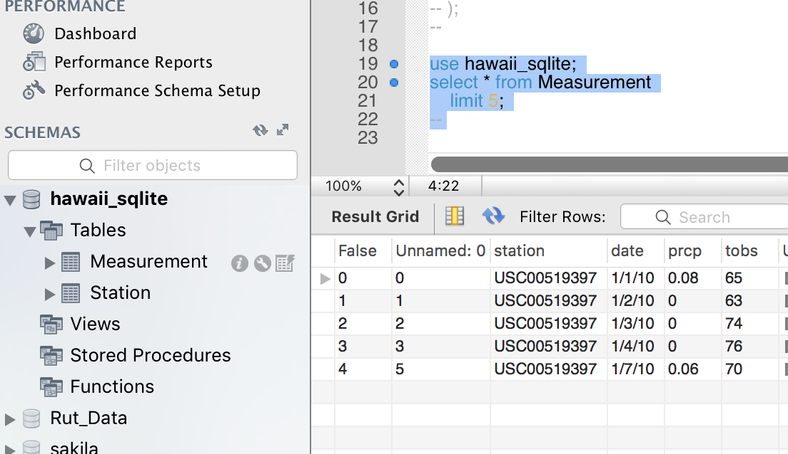

```python
# Dependencies
import pandas as pd
import os
import csv
from sqlalchemy import create_engine
from sqlalchemy.orm import Session
from sqlalchemy.ext.declarative import declarative_base
from sqlalchemy import Column, Integer, String, Float, Date

#hide google cloud SQL Server Info
from config import gle_sql_server_info
google_sql_server= gle_sql_server_info
```


```python
# Create station and measurement classes
# ----------------------------------
Base = declarative_base()

class stationclass(Base):
    __tablename__ = 'Station'
    stations = Column(String(255), primary_key=True)
    name = Column(String(255))
    latitude = Column(Float)
    longitude = Column(Float)
    elevation= Column(Float)


class measurementclass(Base):
    __tablename__ = 'Measurement'
    stations = Column(String(255), primary_key=True)
    date = Column(Date)
    prcp = Column(Float)
    tobs = Column(Integer)


```


```python
# Create Database Connection
# ----------------------------------
engine = create_engine(google_sql_server)

```


```python
# Import and drop "Unnnamed" columns from CSV Files; create dataframes
# ----------------------------------
Base.metadata.create_all(engine)
file_clean_stations = 'clean_hawaii_stations.csv'
file_clean_measurements = 'clean_hawaii_measurements.csv'
df_stations = pd.read_csv(file_clean_stations)
df_measurements = pd.read_csv(file_clean_measurements)

df_stations=df_stations.drop("Unnamed: 0", axis=1)
for col in df_measurements.columns:
    if 'Unnamed' in col:
        del df_measurements[col]

```


```python
df_stations.head()
```


<div>
<style>
    .dataframe thead tr:only-child th {
        text-align: right;
    }

    .dataframe thead th {
        text-align: left;
    }

    .dataframe tbody tr th {
        vertical-align: top;
    }
</style>
<table border="1" class="dataframe">
  <thead>
    <tr style="text-align: right;">
      <th></th>
      <th>station</th>
      <th>name</th>
      <th>latitude</th>
      <th>longitude</th>
      <th>elevation</th>
    </tr>
  </thead>
  <tbody>
    <tr>
      <th>0</th>
      <td>USC00519397</td>
      <td>WAIKIKI 717.2, HI US</td>
      <td>21.2716</td>
      <td>-157.8168</td>
      <td>3.0</td>
    </tr>
    <tr>
      <th>1</th>
      <td>USC00513117</td>
      <td>KANEOHE 838.1, HI US</td>
      <td>21.4234</td>
      <td>-157.8015</td>
      <td>14.6</td>
    </tr>
    <tr>
      <th>2</th>
      <td>USC00514830</td>
      <td>KUALOA RANCH HEADQUARTERS 886.9, HI US</td>
      <td>21.5213</td>
      <td>-157.8374</td>
      <td>7.0</td>
    </tr>
    <tr>
      <th>3</th>
      <td>USC00517948</td>
      <td>PEARL CITY, HI US</td>
      <td>21.3934</td>
      <td>-157.9751</td>
      <td>11.9</td>
    </tr>
    <tr>
      <th>4</th>
      <td>USC00518838</td>
      <td>UPPER WAHIAWA 874.3, HI US</td>
      <td>21.4992</td>
      <td>-158.0111</td>
      <td>306.6</td>
    </tr>
  </tbody>
</table>
</div>


```python
df_measurements.head()
```


<div>
<style>
    .dataframe thead tr:only-child th {
        text-align: right;
    }

    .dataframe thead th {
        text-align: left;
    }

    .dataframe tbody tr th {
        vertical-align: top;
    }
</style>
<table border="1" class="dataframe">
  <thead>
    <tr style="text-align: right;">
      <th></th>
      <th>station</th>
      <th>date</th>
      <th>prcp</th>
      <th>tobs</th>
    </tr>
  </thead>
  <tbody>
    <tr>
      <th>0</th>
      <td>USC00519397</td>
      <td>1/1/10</td>
      <td>0.08</td>
      <td>65</td>
    </tr>
    <tr>
      <th>1</th>
      <td>USC00519397</td>
      <td>1/2/10</td>
      <td>0.00</td>
      <td>63</td>
    </tr>
    <tr>
      <th>2</th>
      <td>USC00519397</td>
      <td>1/3/10</td>
      <td>0.00</td>
      <td>74</td>
    </tr>
    <tr>
      <th>3</th>
      <td>USC00519397</td>
      <td>1/4/10</td>
      <td>0.00</td>
      <td>76</td>
    </tr>
    <tr>
      <th>4</th>
      <td>USC00519397</td>
      <td>1/7/10</td>
      <td>0.06</td>
      <td>70</td>
    </tr>
  </tbody>
</table>
</div>


```python
#create tables in SQL; transfer csv data to SQL
df_stations.to_sql(con=engine, index_label='station', name=stationclass.__tablename__, if_exists='replace', index='False')
df_measurements.to_sql(con=engine, index_label='station', name=measurementclass.__tablename__, if_exists='replace', index='False')
```

<h3>Confirmation - Data transfered to Google Cloud SQL Server</h3>


