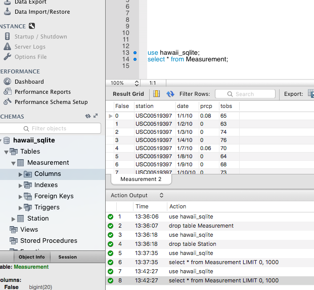

```python
# Dependencies
import pandas as pd
import os
import csv
from sqlalchemy import create_engine
from sqlalchemy.orm import Session
from sqlalchemy.ext.declarative import declarative_base
from sqlalchemy import Column, Integer, String, Float, Date
from config import gle_sql_server_info
google_sql_server= gle_sql_server_info
```


```python
# Create station and measurement classes
# ----------------------------------
Base = declarative_base()

class stationclass(Base):
    __tablename__ = 'Station'
    stations = Column(String(255), primary_key=True)
    name = Column(String(255))
    latitude = Column(Float)
    longitude = Column(Float)
    elevation= Column(Float)


class measurementclass(Base):
    __tablename__ = 'Measurement'
    stations = Column(String(255), primary_key=True)
    date = Column(Date)
    prcp = Column(Float)
    tobs = Column(Integer)


```


```python
# Create Database Connection
# ----------------------------------
engine = create_engine(google_sql_server)

# conn = engine.connect()

```


```python
# Create a "Metadata" Layer That Abstracts SQL Database
# ----------------------------------
Base.metadata.create_all(engine)
file_clean_stations = 'clean_hawaii_stations.csv'
file_clean_measurements = 'clean_hawaii_measurements.csv'
df_stations = pd.read_csv(file_clean_stations)
df_measurements = pd.read_csv(file_clean_measurements)

#create tables in SQL; transfer csv data to SQL
df_stations.to_sql(con=engine, index_label='station', name=stationclass.__tablename__, if_exists='replace', index='False')
df_measurements.to_sql(con=engine, index_label='station', name=measurementclass.__tablename__, if_exists='replace', index='False')
```

<h3>Confirmation - Data transfered to Google Cloud SQL Server</h3>




```python

```
