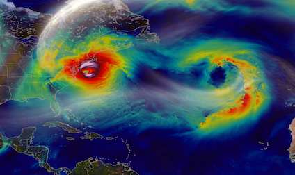
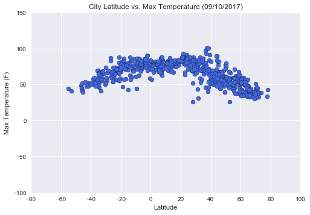
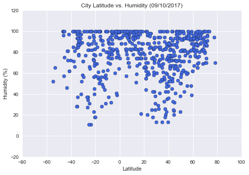
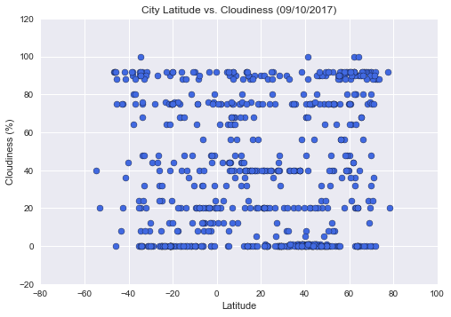
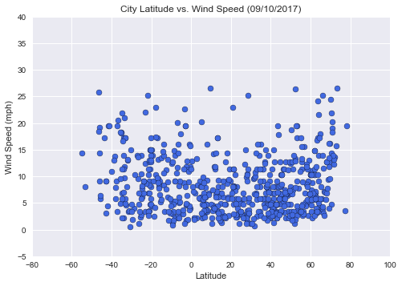

<h1>WeatherPy</h1>
<br><br><br><br><br><br><br><br><br><br><br><br><br>

<ul>
<li>The majority of cities are in enviornments that are humid(60%+).</li>
<li>Near the equator(0 latitude), cities are likely to have less cloudiness</li>
<li>Cities with max temperatures tend to located between -20 and 40 degrees latitude</li> 

</ul>


```python
#dependencies
import json
import requests as req
import random 
from citipy import citipy
import pandas as pd
import time
import datetime
import csv
import os
import matplotlib.pyplot as plt
import seaborn as sns

#create lists to store lat and lon
l1=[]
l2=[]
citipydata = []
cities=[]
cities2=[]
latitude=[]
longitude=[]
temperature=[]
humidity=[]
cloudiness=[]
windspeed=[]
date=[]
country=[]
maxtemp=[]
url_list=[]
recordcount=0
setcount=1

api_key = "#######################################"
url = "http://api.openweathermap.org/data/2.5/weather?"
```

<h2>Generate Cities List</h2>


```python
#while loops to append lists; zip lists
while len(l1) < 2000:
    l1a = random.uniform(-90,90)
    l1.append(l1a)
while len(l2) < 2000:
    l2a = random.uniform(-180,180)
    l2.append(l2a)

coordinates = zip(l1,l2)


#Use citipy to find cities and store city names
for coordinate_pair in coordinates:
    lat, lon = coordinate_pair
    citipydata.append(citipy.nearest_city(lat, lon))
    cities.append(citipy.nearest_city(lat, lon).city_name)
    
#remove duplicates and limit list to 650
for city in cities:
    if city not in cities2:
        if len(cities2)< 650:    
            cities2.append(city)
            
            
```

<h2>Perform API Calls</h2>


```python
#use API to retrieve data and append lists
cities_c=[]
print("Beginning Data Retrieval")
print("-----------------------------------------")

for city in cities2:
    try:
        response = req.get(url+"appid="+api_key+"&q="+city+"&units=imperial").json()
        cities_c.append(city)
        latitude.append(response["coord"]["lat"])
        longitude.append(response["coord"]["lon"])
        temperature.append(response["main"]["temp"])
        windspeed.append(response["wind"]["speed"])
        humidity.append(response["main"]["humidity"])
        cloudiness.append(response["clouds"]["all"])
        maxtemp.append(response["main"]["temp_max"])
        country.append(response["sys"]["country"])
        url_list.append(url+"appid="+api_key+"&q="+city+"&units=imperial")
        date.append(response["dt"])
        print("Processing Record "+str(recordcount)+" of Set "+str(setcount)+" | "+city)
        print(url+"appid="+api_key+"&q="+city+"&units=imperial")
        
        if recordcount < 50:
            recordcount=recordcount+1
        elif recordcount == 50:
            time.sleep(61)
            recordcount= 1
            setcount = setcount+1
            
            
    except:
        print("error")
        continue
        
        

print("-----------------------------------------")
print("Data Retrieval Complete")
print("-----------------------------------------")
```

    Beginning Data Retrieval
    -----------------------------------------
    Processing Record 0 of Set 1 | thompson
    http://api.openweathermap.org/data/2.5/weather?appid=fc44486eb35f3bcb68068442135a879b&q=thompson&units=imperial
    Processing Record 1 of Set 1 | avarua
    http://api.openweathermap.org/data/2.5/weather?appid=fc44486eb35f3bcb68068442135a879b&q=avarua&units=imperial
    Processing Record 2 of Set 1 | khatanga
    http://api.openweathermap.org/data/2.5/weather?appid=fc44486eb35f3bcb68068442135a879b&q=khatanga&units=imperial
    Processing Record 3 of Set 1 | mataura
    http://api.openweathermap.org/data/2.5/weather?appid=fc44486eb35f3bcb68068442135a879b&q=mataura&units=imperial
    Processing Record 4 of Set 1 | canavieiras
    http://api.openweathermap.org/data/2.5/weather?appid=fc44486eb35f3bcb68068442135a879b&q=canavieiras&units=imperial
    Processing Record 5 of Set 1 | hithadhoo
    http://api.openweathermap.org/data/2.5/weather?appid=fc44486eb35f3bcb68068442135a879b&q=hithadhoo&units=imperial
    Processing Record 6 of Set 1 | khotyn
    http://api.openweathermap.org/data/2.5/weather?appid=fc44486eb35f3bcb68068442135a879b&q=khotyn&units=imperial
    Processing Record 7 of Set 1 | itarema
    http://api.openweathermap.org/data/2.5/weather?appid=fc44486eb35f3bcb68068442135a879b&q=itarema&units=imperial
    Processing Record 8 of Set 1 | provideniya
    http://api.openweathermap.org/data/2.5/weather?appid=fc44486eb35f3bcb68068442135a879b&q=provideniya&units=imperial
    Processing Record 9 of Set 1 | hermanus
    http://api.openweathermap.org/data/2.5/weather?appid=fc44486eb35f3bcb68068442135a879b&q=hermanus&units=imperial
    Processing Record 10 of Set 1 | angoche
    http://api.openweathermap.org/data/2.5/weather?appid=fc44486eb35f3bcb68068442135a879b&q=angoche&units=imperial
    Processing Record 11 of Set 1 | busselton
    http://api.openweathermap.org/data/2.5/weather?appid=fc44486eb35f3bcb68068442135a879b&q=busselton&units=imperial
    Processing Record 12 of Set 1 | waipawa
    http://api.openweathermap.org/data/2.5/weather?appid=fc44486eb35f3bcb68068442135a879b&q=waipawa&units=imperial
    Processing Record 13 of Set 1 | mar del plata
    http://api.openweathermap.org/data/2.5/weather?appid=fc44486eb35f3bcb68068442135a879b&q=mar del plata&units=imperial
    Processing Record 14 of Set 1 | chapayeve
    http://api.openweathermap.org/data/2.5/weather?appid=fc44486eb35f3bcb68068442135a879b&q=chapayeve&units=imperial
    Processing Record 15 of Set 1 | kodiak
    http://api.openweathermap.org/data/2.5/weather?appid=fc44486eb35f3bcb68068442135a879b&q=kodiak&units=imperial
    Processing Record 16 of Set 1 | kavieng
    http://api.openweathermap.org/data/2.5/weather?appid=fc44486eb35f3bcb68068442135a879b&q=kavieng&units=imperial
    Processing Record 17 of Set 1 | yellowknife
    http://api.openweathermap.org/data/2.5/weather?appid=fc44486eb35f3bcb68068442135a879b&q=yellowknife&units=imperial
    Processing Record 18 of Set 1 | amderma
    http://api.openweathermap.org/data/2.5/weather?appid=fc44486eb35f3bcb68068442135a879b&q=amderma&units=imperial
    Processing Record 19 of Set 1 | ushuaia
    http://api.openweathermap.org/data/2.5/weather?appid=fc44486eb35f3bcb68068442135a879b&q=ushuaia&units=imperial
    Processing Record 20 of Set 1 | tura
    http://api.openweathermap.org/data/2.5/weather?appid=fc44486eb35f3bcb68068442135a879b&q=tura&units=imperial
    Processing Record 21 of Set 1 | namtsy
    http://api.openweathermap.org/data/2.5/weather?appid=fc44486eb35f3bcb68068442135a879b&q=namtsy&units=imperial
    Processing Record 22 of Set 1 | nanortalik
    http://api.openweathermap.org/data/2.5/weather?appid=fc44486eb35f3bcb68068442135a879b&q=nanortalik&units=imperial
    Processing Record 23 of Set 1 | mahebourg
    http://api.openweathermap.org/data/2.5/weather?appid=fc44486eb35f3bcb68068442135a879b&q=mahebourg&units=imperial
    Processing Record 24 of Set 1 | balikpapan
    http://api.openweathermap.org/data/2.5/weather?appid=fc44486eb35f3bcb68068442135a879b&q=balikpapan&units=imperial
    Processing Record 25 of Set 1 | lebu
    http://api.openweathermap.org/data/2.5/weather?appid=fc44486eb35f3bcb68068442135a879b&q=lebu&units=imperial
    Processing Record 26 of Set 1 | birjand
    http://api.openweathermap.org/data/2.5/weather?appid=fc44486eb35f3bcb68068442135a879b&q=birjand&units=imperial
    Processing Record 27 of Set 1 | camana
    http://api.openweathermap.org/data/2.5/weather?appid=fc44486eb35f3bcb68068442135a879b&q=camana&units=imperial
    Processing Record 28 of Set 1 | codrington
    http://api.openweathermap.org/data/2.5/weather?appid=fc44486eb35f3bcb68068442135a879b&q=codrington&units=imperial
    Processing Record 29 of Set 1 | sovetskaya gavan
    http://api.openweathermap.org/data/2.5/weather?appid=fc44486eb35f3bcb68068442135a879b&q=sovetskaya gavan&units=imperial
    Processing Record 30 of Set 1 | cap malheureux
    http://api.openweathermap.org/data/2.5/weather?appid=fc44486eb35f3bcb68068442135a879b&q=cap malheureux&units=imperial
    Processing Record 31 of Set 1 | esperance
    http://api.openweathermap.org/data/2.5/weather?appid=fc44486eb35f3bcb68068442135a879b&q=esperance&units=imperial
    Processing Record 32 of Set 1 | upernavik
    http://api.openweathermap.org/data/2.5/weather?appid=fc44486eb35f3bcb68068442135a879b&q=upernavik&units=imperial
    Processing Record 33 of Set 1 | soyo
    http://api.openweathermap.org/data/2.5/weather?appid=fc44486eb35f3bcb68068442135a879b&q=soyo&units=imperial
    Processing Record 34 of Set 1 | bathsheba
    http://api.openweathermap.org/data/2.5/weather?appid=fc44486eb35f3bcb68068442135a879b&q=bathsheba&units=imperial
    Processing Record 35 of Set 1 | samusu
    http://api.openweathermap.org/data/2.5/weather?appid=fc44486eb35f3bcb68068442135a879b&q=samusu&units=imperial
    Processing Record 36 of Set 1 | harper
    http://api.openweathermap.org/data/2.5/weather?appid=fc44486eb35f3bcb68068442135a879b&q=harper&units=imperial
    Processing Record 37 of Set 1 | cabo san lucas
    http://api.openweathermap.org/data/2.5/weather?appid=fc44486eb35f3bcb68068442135a879b&q=cabo san lucas&units=imperial
    Processing Record 38 of Set 1 | ayer itam
    http://api.openweathermap.org/data/2.5/weather?appid=fc44486eb35f3bcb68068442135a879b&q=ayer itam&units=imperial
    Processing Record 39 of Set 1 | faanui
    http://api.openweathermap.org/data/2.5/weather?appid=fc44486eb35f3bcb68068442135a879b&q=faanui&units=imperial
    Processing Record 40 of Set 1 | sentyabrskiy
    http://api.openweathermap.org/data/2.5/weather?appid=fc44486eb35f3bcb68068442135a879b&q=sentyabrskiy&units=imperial
    Processing Record 41 of Set 1 | sitka
    http://api.openweathermap.org/data/2.5/weather?appid=fc44486eb35f3bcb68068442135a879b&q=sitka&units=imperial
    Processing Record 42 of Set 1 | southbridge
    http://api.openweathermap.org/data/2.5/weather?appid=fc44486eb35f3bcb68068442135a879b&q=southbridge&units=imperial
    Processing Record 43 of Set 1 | hilo
    http://api.openweathermap.org/data/2.5/weather?appid=fc44486eb35f3bcb68068442135a879b&q=hilo&units=imperial
    Processing Record 44 of Set 1 | norman wells
    http://api.openweathermap.org/data/2.5/weather?appid=fc44486eb35f3bcb68068442135a879b&q=norman wells&units=imperial
    Processing Record 45 of Set 1 | mirnyy
    http://api.openweathermap.org/data/2.5/weather?appid=fc44486eb35f3bcb68068442135a879b&q=mirnyy&units=imperial
    Processing Record 46 of Set 1 | wiang sa
    http://api.openweathermap.org/data/2.5/weather?appid=fc44486eb35f3bcb68068442135a879b&q=wiang sa&units=imperial
    Processing Record 47 of Set 1 | tshikapa
    http://api.openweathermap.org/data/2.5/weather?appid=fc44486eb35f3bcb68068442135a879b&q=tshikapa&units=imperial
    Processing Record 48 of Set 1 | louisbourg
    http://api.openweathermap.org/data/2.5/weather?appid=fc44486eb35f3bcb68068442135a879b&q=louisbourg&units=imperial
    Processing Record 49 of Set 1 | chuy
    http://api.openweathermap.org/data/2.5/weather?appid=fc44486eb35f3bcb68068442135a879b&q=chuy&units=imperial
    Processing Record 50 of Set 1 | cape town
    http://api.openweathermap.org/data/2.5/weather?appid=fc44486eb35f3bcb68068442135a879b&q=cape town&units=imperial
    Processing Record 1 of Set 2 | olinda
    http://api.openweathermap.org/data/2.5/weather?appid=fc44486eb35f3bcb68068442135a879b&q=olinda&units=imperial
    Processing Record 2 of Set 2 | saint george
    http://api.openweathermap.org/data/2.5/weather?appid=fc44486eb35f3bcb68068442135a879b&q=saint george&units=imperial
    Processing Record 3 of Set 2 | kattivakkam
    http://api.openweathermap.org/data/2.5/weather?appid=fc44486eb35f3bcb68068442135a879b&q=kattivakkam&units=imperial
    Processing Record 4 of Set 2 | butaritari
    http://api.openweathermap.org/data/2.5/weather?appid=fc44486eb35f3bcb68068442135a879b&q=butaritari&units=imperial
    Processing Record 5 of Set 2 | longyearbyen
    http://api.openweathermap.org/data/2.5/weather?appid=fc44486eb35f3bcb68068442135a879b&q=longyearbyen&units=imperial
    Processing Record 6 of Set 2 | kelowna
    http://api.openweathermap.org/data/2.5/weather?appid=fc44486eb35f3bcb68068442135a879b&q=kelowna&units=imperial
    Processing Record 7 of Set 2 | pacific grove
    http://api.openweathermap.org/data/2.5/weather?appid=fc44486eb35f3bcb68068442135a879b&q=pacific grove&units=imperial
    Processing Record 8 of Set 2 | kuala krai
    http://api.openweathermap.org/data/2.5/weather?appid=fc44486eb35f3bcb68068442135a879b&q=kuala krai&units=imperial
    Processing Record 9 of Set 2 | rikitea
    http://api.openweathermap.org/data/2.5/weather?appid=fc44486eb35f3bcb68068442135a879b&q=rikitea&units=imperial
    Processing Record 10 of Set 2 | pevek
    http://api.openweathermap.org/data/2.5/weather?appid=fc44486eb35f3bcb68068442135a879b&q=pevek&units=imperial
    Processing Record 11 of Set 2 | severo-kurilsk
    http://api.openweathermap.org/data/2.5/weather?appid=fc44486eb35f3bcb68068442135a879b&q=severo-kurilsk&units=imperial
    Processing Record 12 of Set 2 | hofn
    http://api.openweathermap.org/data/2.5/weather?appid=fc44486eb35f3bcb68068442135a879b&q=hofn&units=imperial
    Processing Record 13 of Set 2 | nyeri
    http://api.openweathermap.org/data/2.5/weather?appid=fc44486eb35f3bcb68068442135a879b&q=nyeri&units=imperial
    Processing Record 14 of Set 2 | kegayli
    http://api.openweathermap.org/data/2.5/weather?appid=fc44486eb35f3bcb68068442135a879b&q=kegayli&units=imperial
    Processing Record 15 of Set 2 | touros
    http://api.openweathermap.org/data/2.5/weather?appid=fc44486eb35f3bcb68068442135a879b&q=touros&units=imperial
    Processing Record 16 of Set 2 | korla
    http://api.openweathermap.org/data/2.5/weather?appid=fc44486eb35f3bcb68068442135a879b&q=korla&units=imperial
    Processing Record 17 of Set 2 | kapaa
    http://api.openweathermap.org/data/2.5/weather?appid=fc44486eb35f3bcb68068442135a879b&q=kapaa&units=imperial
    Processing Record 18 of Set 2 | albany
    http://api.openweathermap.org/data/2.5/weather?appid=fc44486eb35f3bcb68068442135a879b&q=albany&units=imperial
    Processing Record 19 of Set 2 | klaksvik
    http://api.openweathermap.org/data/2.5/weather?appid=fc44486eb35f3bcb68068442135a879b&q=klaksvik&units=imperial
    Processing Record 20 of Set 2 | ponta do sol
    http://api.openweathermap.org/data/2.5/weather?appid=fc44486eb35f3bcb68068442135a879b&q=ponta do sol&units=imperial
    Processing Record 21 of Set 2 | puerto ayora
    http://api.openweathermap.org/data/2.5/weather?appid=fc44486eb35f3bcb68068442135a879b&q=puerto ayora&units=imperial
    Processing Record 22 of Set 2 | yarmouth
    http://api.openweathermap.org/data/2.5/weather?appid=fc44486eb35f3bcb68068442135a879b&q=yarmouth&units=imperial
    Processing Record 23 of Set 2 | bluff
    http://api.openweathermap.org/data/2.5/weather?appid=fc44486eb35f3bcb68068442135a879b&q=bluff&units=imperial
    Processing Record 24 of Set 2 | tasiilaq
    http://api.openweathermap.org/data/2.5/weather?appid=fc44486eb35f3bcb68068442135a879b&q=tasiilaq&units=imperial
    Processing Record 25 of Set 2 | nikolskoye
    http://api.openweathermap.org/data/2.5/weather?appid=fc44486eb35f3bcb68068442135a879b&q=nikolskoye&units=imperial
    Processing Record 26 of Set 2 | guerrero negro
    http://api.openweathermap.org/data/2.5/weather?appid=fc44486eb35f3bcb68068442135a879b&q=guerrero negro&units=imperial
    Processing Record 27 of Set 2 | new norfolk
    http://api.openweathermap.org/data/2.5/weather?appid=fc44486eb35f3bcb68068442135a879b&q=new norfolk&units=imperial
    Processing Record 28 of Set 2 | punta arenas
    http://api.openweathermap.org/data/2.5/weather?appid=fc44486eb35f3bcb68068442135a879b&q=punta arenas&units=imperial
    Processing Record 29 of Set 2 | victoria
    http://api.openweathermap.org/data/2.5/weather?appid=fc44486eb35f3bcb68068442135a879b&q=victoria&units=imperial
    Processing Record 30 of Set 2 | hamilton
    http://api.openweathermap.org/data/2.5/weather?appid=fc44486eb35f3bcb68068442135a879b&q=hamilton&units=imperial
    Processing Record 31 of Set 2 | dikson
    http://api.openweathermap.org/data/2.5/weather?appid=fc44486eb35f3bcb68068442135a879b&q=dikson&units=imperial
    Processing Record 32 of Set 2 | port alfred
    http://api.openweathermap.org/data/2.5/weather?appid=fc44486eb35f3bcb68068442135a879b&q=port alfred&units=imperial
    Processing Record 33 of Set 2 | saint anthony
    http://api.openweathermap.org/data/2.5/weather?appid=fc44486eb35f3bcb68068442135a879b&q=saint anthony&units=imperial
    Processing Record 34 of Set 2 | hasaki
    http://api.openweathermap.org/data/2.5/weather?appid=fc44486eb35f3bcb68068442135a879b&q=hasaki&units=imperial
    Processing Record 35 of Set 2 | lac du bonnet
    http://api.openweathermap.org/data/2.5/weather?appid=fc44486eb35f3bcb68068442135a879b&q=lac du bonnet&units=imperial
    Processing Record 36 of Set 2 | atuona
    http://api.openweathermap.org/data/2.5/weather?appid=fc44486eb35f3bcb68068442135a879b&q=atuona&units=imperial
    Processing Record 37 of Set 2 | soligalich
    http://api.openweathermap.org/data/2.5/weather?appid=fc44486eb35f3bcb68068442135a879b&q=soligalich&units=imperial
    Processing Record 38 of Set 2 | cherskiy
    http://api.openweathermap.org/data/2.5/weather?appid=fc44486eb35f3bcb68068442135a879b&q=cherskiy&units=imperial
    Processing Record 39 of Set 2 | taolanaro
    http://api.openweathermap.org/data/2.5/weather?appid=fc44486eb35f3bcb68068442135a879b&q=taolanaro&units=imperial
    Processing Record 40 of Set 2 | griffith
    http://api.openweathermap.org/data/2.5/weather?appid=fc44486eb35f3bcb68068442135a879b&q=griffith&units=imperial
    Processing Record 41 of Set 2 | saint-philippe
    http://api.openweathermap.org/data/2.5/weather?appid=fc44486eb35f3bcb68068442135a879b&q=saint-philippe&units=imperial
    Processing Record 42 of Set 2 | castro
    http://api.openweathermap.org/data/2.5/weather?appid=fc44486eb35f3bcb68068442135a879b&q=castro&units=imperial
    Processing Record 43 of Set 2 | kimbe
    http://api.openweathermap.org/data/2.5/weather?appid=fc44486eb35f3bcb68068442135a879b&q=kimbe&units=imperial
    Processing Record 44 of Set 2 | saint-leu
    http://api.openweathermap.org/data/2.5/weather?appid=fc44486eb35f3bcb68068442135a879b&q=saint-leu&units=imperial
    Processing Record 45 of Set 2 | jamestown
    http://api.openweathermap.org/data/2.5/weather?appid=fc44486eb35f3bcb68068442135a879b&q=jamestown&units=imperial
    Processing Record 46 of Set 2 | waingapu
    http://api.openweathermap.org/data/2.5/weather?appid=fc44486eb35f3bcb68068442135a879b&q=waingapu&units=imperial
    Processing Record 47 of Set 2 | sorvag
    http://api.openweathermap.org/data/2.5/weather?appid=fc44486eb35f3bcb68068442135a879b&q=sorvag&units=imperial
    Processing Record 48 of Set 2 | port macquarie
    http://api.openweathermap.org/data/2.5/weather?appid=fc44486eb35f3bcb68068442135a879b&q=port macquarie&units=imperial
    Processing Record 49 of Set 2 | ruthin
    http://api.openweathermap.org/data/2.5/weather?appid=fc44486eb35f3bcb68068442135a879b&q=ruthin&units=imperial
    Processing Record 50 of Set 2 | ribeira grande
    http://api.openweathermap.org/data/2.5/weather?appid=fc44486eb35f3bcb68068442135a879b&q=ribeira grande&units=imperial
    Processing Record 1 of Set 3 | douentza
    http://api.openweathermap.org/data/2.5/weather?appid=fc44486eb35f3bcb68068442135a879b&q=douentza&units=imperial
    Processing Record 2 of Set 3 | maanshan
    http://api.openweathermap.org/data/2.5/weather?appid=fc44486eb35f3bcb68068442135a879b&q=maanshan&units=imperial
    Processing Record 3 of Set 3 | hobart
    http://api.openweathermap.org/data/2.5/weather?appid=fc44486eb35f3bcb68068442135a879b&q=hobart&units=imperial
    Processing Record 4 of Set 3 | kysyl-syr
    http://api.openweathermap.org/data/2.5/weather?appid=fc44486eb35f3bcb68068442135a879b&q=kysyl-syr&units=imperial
    Processing Record 5 of Set 3 | katsuura
    http://api.openweathermap.org/data/2.5/weather?appid=fc44486eb35f3bcb68068442135a879b&q=katsuura&units=imperial
    Processing Record 6 of Set 3 | fuerte olimpo
    http://api.openweathermap.org/data/2.5/weather?appid=fc44486eb35f3bcb68068442135a879b&q=fuerte olimpo&units=imperial
    Processing Record 7 of Set 3 | fengcheng
    http://api.openweathermap.org/data/2.5/weather?appid=fc44486eb35f3bcb68068442135a879b&q=fengcheng&units=imperial
    Processing Record 8 of Set 3 | yasugi
    http://api.openweathermap.org/data/2.5/weather?appid=fc44486eb35f3bcb68068442135a879b&q=yasugi&units=imperial
    Processing Record 9 of Set 3 | takoradi
    http://api.openweathermap.org/data/2.5/weather?appid=fc44486eb35f3bcb68068442135a879b&q=takoradi&units=imperial
    Processing Record 10 of Set 3 | tommot
    http://api.openweathermap.org/data/2.5/weather?appid=fc44486eb35f3bcb68068442135a879b&q=tommot&units=imperial
    Processing Record 11 of Set 3 | aloleng
    http://api.openweathermap.org/data/2.5/weather?appid=fc44486eb35f3bcb68068442135a879b&q=aloleng&units=imperial
    Processing Record 12 of Set 3 | tonj
    http://api.openweathermap.org/data/2.5/weather?appid=fc44486eb35f3bcb68068442135a879b&q=tonj&units=imperial
    Processing Record 13 of Set 3 | waddan
    http://api.openweathermap.org/data/2.5/weather?appid=fc44486eb35f3bcb68068442135a879b&q=waddan&units=imperial
    Processing Record 14 of Set 3 | aklavik
    http://api.openweathermap.org/data/2.5/weather?appid=fc44486eb35f3bcb68068442135a879b&q=aklavik&units=imperial
    Processing Record 15 of Set 3 | cheremukhovo
    http://api.openweathermap.org/data/2.5/weather?appid=fc44486eb35f3bcb68068442135a879b&q=cheremukhovo&units=imperial
    Processing Record 16 of Set 3 | tuatapere
    http://api.openweathermap.org/data/2.5/weather?appid=fc44486eb35f3bcb68068442135a879b&q=tuatapere&units=imperial
    Processing Record 17 of Set 3 | fort nelson
    http://api.openweathermap.org/data/2.5/weather?appid=fc44486eb35f3bcb68068442135a879b&q=fort nelson&units=imperial
    Processing Record 18 of Set 3 | kaitangata
    http://api.openweathermap.org/data/2.5/weather?appid=fc44486eb35f3bcb68068442135a879b&q=kaitangata&units=imperial
    Processing Record 19 of Set 3 | baker city
    http://api.openweathermap.org/data/2.5/weather?appid=fc44486eb35f3bcb68068442135a879b&q=baker city&units=imperial
    Processing Record 20 of Set 3 | erzin
    http://api.openweathermap.org/data/2.5/weather?appid=fc44486eb35f3bcb68068442135a879b&q=erzin&units=imperial
    Processing Record 21 of Set 3 | buala
    http://api.openweathermap.org/data/2.5/weather?appid=fc44486eb35f3bcb68068442135a879b&q=buala&units=imperial
    Processing Record 22 of Set 3 | cidreira
    http://api.openweathermap.org/data/2.5/weather?appid=fc44486eb35f3bcb68068442135a879b&q=cidreira&units=imperial
    Processing Record 23 of Set 3 | najran
    http://api.openweathermap.org/data/2.5/weather?appid=fc44486eb35f3bcb68068442135a879b&q=najran&units=imperial
    Processing Record 24 of Set 3 | tacuarembo
    http://api.openweathermap.org/data/2.5/weather?appid=fc44486eb35f3bcb68068442135a879b&q=tacuarembo&units=imperial
    Processing Record 25 of Set 3 | illoqqortoormiut
    http://api.openweathermap.org/data/2.5/weather?appid=fc44486eb35f3bcb68068442135a879b&q=illoqqortoormiut&units=imperial
    Processing Record 26 of Set 3 | antalaha
    http://api.openweathermap.org/data/2.5/weather?appid=fc44486eb35f3bcb68068442135a879b&q=antalaha&units=imperial
    Processing Record 27 of Set 3 | qaanaaq
    http://api.openweathermap.org/data/2.5/weather?appid=fc44486eb35f3bcb68068442135a879b&q=qaanaaq&units=imperial
    Processing Record 28 of Set 3 | vaini
    http://api.openweathermap.org/data/2.5/weather?appid=fc44486eb35f3bcb68068442135a879b&q=vaini&units=imperial
    Processing Record 29 of Set 3 | thinadhoo
    http://api.openweathermap.org/data/2.5/weather?appid=fc44486eb35f3bcb68068442135a879b&q=thinadhoo&units=imperial
    Processing Record 30 of Set 3 | ancud
    http://api.openweathermap.org/data/2.5/weather?appid=fc44486eb35f3bcb68068442135a879b&q=ancud&units=imperial
    Processing Record 31 of Set 3 | tsihombe
    http://api.openweathermap.org/data/2.5/weather?appid=fc44486eb35f3bcb68068442135a879b&q=tsihombe&units=imperial
    Processing Record 32 of Set 3 | riihimaki
    http://api.openweathermap.org/data/2.5/weather?appid=fc44486eb35f3bcb68068442135a879b&q=riihimaki&units=imperial
    Processing Record 33 of Set 3 | sioux lookout
    http://api.openweathermap.org/data/2.5/weather?appid=fc44486eb35f3bcb68068442135a879b&q=sioux lookout&units=imperial
    Processing Record 34 of Set 3 | suoyarvi
    http://api.openweathermap.org/data/2.5/weather?appid=fc44486eb35f3bcb68068442135a879b&q=suoyarvi&units=imperial
    Processing Record 35 of Set 3 | marawi
    http://api.openweathermap.org/data/2.5/weather?appid=fc44486eb35f3bcb68068442135a879b&q=marawi&units=imperial
    Processing Record 36 of Set 3 | kharp
    http://api.openweathermap.org/data/2.5/weather?appid=fc44486eb35f3bcb68068442135a879b&q=kharp&units=imperial
    Processing Record 37 of Set 3 | kudahuvadhoo
    http://api.openweathermap.org/data/2.5/weather?appid=fc44486eb35f3bcb68068442135a879b&q=kudahuvadhoo&units=imperial
    Processing Record 38 of Set 3 | georgetown
    http://api.openweathermap.org/data/2.5/weather?appid=fc44486eb35f3bcb68068442135a879b&q=georgetown&units=imperial
    Processing Record 39 of Set 3 | saint-joseph
    http://api.openweathermap.org/data/2.5/weather?appid=fc44486eb35f3bcb68068442135a879b&q=saint-joseph&units=imperial
    Processing Record 40 of Set 3 | maldonado
    http://api.openweathermap.org/data/2.5/weather?appid=fc44486eb35f3bcb68068442135a879b&q=maldonado&units=imperial
    Processing Record 41 of Set 3 | la cruz
    http://api.openweathermap.org/data/2.5/weather?appid=fc44486eb35f3bcb68068442135a879b&q=la cruz&units=imperial
    Processing Record 42 of Set 3 | thunder bay
    http://api.openweathermap.org/data/2.5/weather?appid=fc44486eb35f3bcb68068442135a879b&q=thunder bay&units=imperial
    Processing Record 43 of Set 3 | naryan-mar
    http://api.openweathermap.org/data/2.5/weather?appid=fc44486eb35f3bcb68068442135a879b&q=naryan-mar&units=imperial
    Processing Record 44 of Set 3 | vardo
    http://api.openweathermap.org/data/2.5/weather?appid=fc44486eb35f3bcb68068442135a879b&q=vardo&units=imperial
    Processing Record 45 of Set 3 | bredasdorp
    http://api.openweathermap.org/data/2.5/weather?appid=fc44486eb35f3bcb68068442135a879b&q=bredasdorp&units=imperial
    Processing Record 46 of Set 3 | vinkovci
    http://api.openweathermap.org/data/2.5/weather?appid=fc44486eb35f3bcb68068442135a879b&q=vinkovci&units=imperial
    Processing Record 47 of Set 3 | whitianga
    http://api.openweathermap.org/data/2.5/weather?appid=fc44486eb35f3bcb68068442135a879b&q=whitianga&units=imperial
    Processing Record 48 of Set 3 | bata
    http://api.openweathermap.org/data/2.5/weather?appid=fc44486eb35f3bcb68068442135a879b&q=bata&units=imperial
    Processing Record 49 of Set 3 | umzimvubu
    http://api.openweathermap.org/data/2.5/weather?appid=fc44486eb35f3bcb68068442135a879b&q=umzimvubu&units=imperial
    Processing Record 50 of Set 3 | opochka
    http://api.openweathermap.org/data/2.5/weather?appid=fc44486eb35f3bcb68068442135a879b&q=opochka&units=imperial
    Processing Record 1 of Set 4 | wellington
    http://api.openweathermap.org/data/2.5/weather?appid=fc44486eb35f3bcb68068442135a879b&q=wellington&units=imperial
    Processing Record 2 of Set 4 | carnarvon
    http://api.openweathermap.org/data/2.5/weather?appid=fc44486eb35f3bcb68068442135a879b&q=carnarvon&units=imperial
    Processing Record 3 of Set 4 | honiara
    http://api.openweathermap.org/data/2.5/weather?appid=fc44486eb35f3bcb68068442135a879b&q=honiara&units=imperial
    Processing Record 4 of Set 4 | souillac
    http://api.openweathermap.org/data/2.5/weather?appid=fc44486eb35f3bcb68068442135a879b&q=souillac&units=imperial
    Processing Record 5 of Set 4 | isangel
    http://api.openweathermap.org/data/2.5/weather?appid=fc44486eb35f3bcb68068442135a879b&q=isangel&units=imperial
    Processing Record 6 of Set 4 | port elizabeth
    http://api.openweathermap.org/data/2.5/weather?appid=fc44486eb35f3bcb68068442135a879b&q=port elizabeth&units=imperial
    Processing Record 7 of Set 4 | saleaula
    http://api.openweathermap.org/data/2.5/weather?appid=fc44486eb35f3bcb68068442135a879b&q=saleaula&units=imperial
    Processing Record 8 of Set 4 | aripuana
    http://api.openweathermap.org/data/2.5/weather?appid=fc44486eb35f3bcb68068442135a879b&q=aripuana&units=imperial
    Processing Record 9 of Set 4 | chokurdakh
    http://api.openweathermap.org/data/2.5/weather?appid=fc44486eb35f3bcb68068442135a879b&q=chokurdakh&units=imperial
    Processing Record 10 of Set 4 | olafsvik
    http://api.openweathermap.org/data/2.5/weather?appid=fc44486eb35f3bcb68068442135a879b&q=olafsvik&units=imperial
    Processing Record 11 of Set 4 | selje
    http://api.openweathermap.org/data/2.5/weather?appid=fc44486eb35f3bcb68068442135a879b&q=selje&units=imperial
    Processing Record 12 of Set 4 | san patricio
    http://api.openweathermap.org/data/2.5/weather?appid=fc44486eb35f3bcb68068442135a879b&q=san patricio&units=imperial
    Processing Record 13 of Set 4 | slochteren
    http://api.openweathermap.org/data/2.5/weather?appid=fc44486eb35f3bcb68068442135a879b&q=slochteren&units=imperial
    Processing Record 14 of Set 4 | sabla
    http://api.openweathermap.org/data/2.5/weather?appid=fc44486eb35f3bcb68068442135a879b&q=sabla&units=imperial
    Processing Record 15 of Set 4 | tuktoyaktuk
    http://api.openweathermap.org/data/2.5/weather?appid=fc44486eb35f3bcb68068442135a879b&q=tuktoyaktuk&units=imperial
    Processing Record 16 of Set 4 | ust-kamchatsk
    http://api.openweathermap.org/data/2.5/weather?appid=fc44486eb35f3bcb68068442135a879b&q=ust-kamchatsk&units=imperial
    Processing Record 17 of Set 4 | belushya guba
    http://api.openweathermap.org/data/2.5/weather?appid=fc44486eb35f3bcb68068442135a879b&q=belushya guba&units=imperial
    Processing Record 18 of Set 4 | grindavik
    http://api.openweathermap.org/data/2.5/weather?appid=fc44486eb35f3bcb68068442135a879b&q=grindavik&units=imperial
    Processing Record 19 of Set 4 | srednekolymsk
    http://api.openweathermap.org/data/2.5/weather?appid=fc44486eb35f3bcb68068442135a879b&q=srednekolymsk&units=imperial
    Processing Record 20 of Set 4 | huntsville
    http://api.openweathermap.org/data/2.5/weather?appid=fc44486eb35f3bcb68068442135a879b&q=huntsville&units=imperial
    Processing Record 21 of Set 4 | tiksi
    http://api.openweathermap.org/data/2.5/weather?appid=fc44486eb35f3bcb68068442135a879b&q=tiksi&units=imperial
    Processing Record 22 of Set 4 | alofi
    http://api.openweathermap.org/data/2.5/weather?appid=fc44486eb35f3bcb68068442135a879b&q=alofi&units=imperial
    Processing Record 23 of Set 4 | mys shmidta
    http://api.openweathermap.org/data/2.5/weather?appid=fc44486eb35f3bcb68068442135a879b&q=mys shmidta&units=imperial
    Processing Record 24 of Set 4 | bandarbeyla
    http://api.openweathermap.org/data/2.5/weather?appid=fc44486eb35f3bcb68068442135a879b&q=bandarbeyla&units=imperial
    Processing Record 25 of Set 4 | mizdah
    http://api.openweathermap.org/data/2.5/weather?appid=fc44486eb35f3bcb68068442135a879b&q=mizdah&units=imperial
    Processing Record 26 of Set 4 | east london
    http://api.openweathermap.org/data/2.5/weather?appid=fc44486eb35f3bcb68068442135a879b&q=east london&units=imperial
    Processing Record 27 of Set 4 | arman
    http://api.openweathermap.org/data/2.5/weather?appid=fc44486eb35f3bcb68068442135a879b&q=arman&units=imperial
    Processing Record 28 of Set 4 | dingle
    http://api.openweathermap.org/data/2.5/weather?appid=fc44486eb35f3bcb68068442135a879b&q=dingle&units=imperial
    Processing Record 29 of Set 4 | deniliquin
    http://api.openweathermap.org/data/2.5/weather?appid=fc44486eb35f3bcb68068442135a879b&q=deniliquin&units=imperial
    Processing Record 30 of Set 4 | vaitupu
    http://api.openweathermap.org/data/2.5/weather?appid=fc44486eb35f3bcb68068442135a879b&q=vaitupu&units=imperial
    Processing Record 31 of Set 4 | constitucion
    http://api.openweathermap.org/data/2.5/weather?appid=fc44486eb35f3bcb68068442135a879b&q=constitucion&units=imperial
    Processing Record 32 of Set 4 | san cristobal
    http://api.openweathermap.org/data/2.5/weather?appid=fc44486eb35f3bcb68068442135a879b&q=san cristobal&units=imperial
    Processing Record 33 of Set 4 | la maddalena
    http://api.openweathermap.org/data/2.5/weather?appid=fc44486eb35f3bcb68068442135a879b&q=la maddalena&units=imperial
    Processing Record 34 of Set 4 | pacifica
    http://api.openweathermap.org/data/2.5/weather?appid=fc44486eb35f3bcb68068442135a879b&q=pacifica&units=imperial
    Processing Record 35 of Set 4 | cayenne
    http://api.openweathermap.org/data/2.5/weather?appid=fc44486eb35f3bcb68068442135a879b&q=cayenne&units=imperial
    Processing Record 36 of Set 4 | salinopolis
    http://api.openweathermap.org/data/2.5/weather?appid=fc44486eb35f3bcb68068442135a879b&q=salinopolis&units=imperial
    Processing Record 37 of Set 4 | san quintin
    http://api.openweathermap.org/data/2.5/weather?appid=fc44486eb35f3bcb68068442135a879b&q=san quintin&units=imperial
    Processing Record 38 of Set 4 | pangnirtung
    http://api.openweathermap.org/data/2.5/weather?appid=fc44486eb35f3bcb68068442135a879b&q=pangnirtung&units=imperial
    Processing Record 39 of Set 4 | galle
    http://api.openweathermap.org/data/2.5/weather?appid=fc44486eb35f3bcb68068442135a879b&q=galle&units=imperial
    Processing Record 40 of Set 4 | alice springs
    http://api.openweathermap.org/data/2.5/weather?appid=fc44486eb35f3bcb68068442135a879b&q=alice springs&units=imperial
    Processing Record 41 of Set 4 | khandyga
    http://api.openweathermap.org/data/2.5/weather?appid=fc44486eb35f3bcb68068442135a879b&q=khandyga&units=imperial
    Processing Record 42 of Set 4 | funtua
    http://api.openweathermap.org/data/2.5/weather?appid=fc44486eb35f3bcb68068442135a879b&q=funtua&units=imperial
    Processing Record 43 of Set 4 | skjervoy
    http://api.openweathermap.org/data/2.5/weather?appid=fc44486eb35f3bcb68068442135a879b&q=skjervoy&units=imperial
    Processing Record 44 of Set 4 | haibara
    http://api.openweathermap.org/data/2.5/weather?appid=fc44486eb35f3bcb68068442135a879b&q=haibara&units=imperial
    Processing Record 45 of Set 4 | along
    http://api.openweathermap.org/data/2.5/weather?appid=fc44486eb35f3bcb68068442135a879b&q=along&units=imperial
    Processing Record 46 of Set 4 | leningradskiy
    http://api.openweathermap.org/data/2.5/weather?appid=fc44486eb35f3bcb68068442135a879b&q=leningradskiy&units=imperial
    Processing Record 47 of Set 4 | awjilah
    http://api.openweathermap.org/data/2.5/weather?appid=fc44486eb35f3bcb68068442135a879b&q=awjilah&units=imperial
    Processing Record 48 of Set 4 | sao filipe
    http://api.openweathermap.org/data/2.5/weather?appid=fc44486eb35f3bcb68068442135a879b&q=sao filipe&units=imperial
    Processing Record 49 of Set 4 | wahiawa
    http://api.openweathermap.org/data/2.5/weather?appid=fc44486eb35f3bcb68068442135a879b&q=wahiawa&units=imperial
    Processing Record 50 of Set 4 | kralendijk
    http://api.openweathermap.org/data/2.5/weather?appid=fc44486eb35f3bcb68068442135a879b&q=kralendijk&units=imperial
    Processing Record 1 of Set 5 | pisco
    http://api.openweathermap.org/data/2.5/weather?appid=fc44486eb35f3bcb68068442135a879b&q=pisco&units=imperial
    Processing Record 2 of Set 5 | goundam
    http://api.openweathermap.org/data/2.5/weather?appid=fc44486eb35f3bcb68068442135a879b&q=goundam&units=imperial
    Processing Record 3 of Set 5 | sao joao da barra
    http://api.openweathermap.org/data/2.5/weather?appid=fc44486eb35f3bcb68068442135a879b&q=sao joao da barra&units=imperial
    Processing Record 4 of Set 5 | clyde
    http://api.openweathermap.org/data/2.5/weather?appid=fc44486eb35f3bcb68068442135a879b&q=clyde&units=imperial
    Processing Record 5 of Set 5 | bethel
    http://api.openweathermap.org/data/2.5/weather?appid=fc44486eb35f3bcb68068442135a879b&q=bethel&units=imperial
    Processing Record 6 of Set 5 | hendersonville
    http://api.openweathermap.org/data/2.5/weather?appid=fc44486eb35f3bcb68068442135a879b&q=hendersonville&units=imperial
    Processing Record 7 of Set 5 | pivijay
    http://api.openweathermap.org/data/2.5/weather?appid=fc44486eb35f3bcb68068442135a879b&q=pivijay&units=imperial
    Processing Record 8 of Set 5 | preobrazhenka
    http://api.openweathermap.org/data/2.5/weather?appid=fc44486eb35f3bcb68068442135a879b&q=preobrazhenka&units=imperial
    Processing Record 9 of Set 5 | bengkulu
    http://api.openweathermap.org/data/2.5/weather?appid=fc44486eb35f3bcb68068442135a879b&q=bengkulu&units=imperial
    Processing Record 10 of Set 5 | saskylakh
    http://api.openweathermap.org/data/2.5/weather?appid=fc44486eb35f3bcb68068442135a879b&q=saskylakh&units=imperial
    Processing Record 11 of Set 5 | acacoyagua
    http://api.openweathermap.org/data/2.5/weather?appid=fc44486eb35f3bcb68068442135a879b&q=acacoyagua&units=imperial
    Processing Record 12 of Set 5 | beloha
    http://api.openweathermap.org/data/2.5/weather?appid=fc44486eb35f3bcb68068442135a879b&q=beloha&units=imperial
    Processing Record 13 of Set 5 | xiuyan
    http://api.openweathermap.org/data/2.5/weather?appid=fc44486eb35f3bcb68068442135a879b&q=xiuyan&units=imperial
    Processing Record 14 of Set 5 | sampit
    http://api.openweathermap.org/data/2.5/weather?appid=fc44486eb35f3bcb68068442135a879b&q=sampit&units=imperial
    Processing Record 15 of Set 5 | isla mujeres
    http://api.openweathermap.org/data/2.5/weather?appid=fc44486eb35f3bcb68068442135a879b&q=isla mujeres&units=imperial
    Processing Record 16 of Set 5 | boiro
    http://api.openweathermap.org/data/2.5/weather?appid=fc44486eb35f3bcb68068442135a879b&q=boiro&units=imperial
    Processing Record 17 of Set 5 | kloulklubed
    http://api.openweathermap.org/data/2.5/weather?appid=fc44486eb35f3bcb68068442135a879b&q=kloulklubed&units=imperial
    Processing Record 18 of Set 5 | bani walid
    http://api.openweathermap.org/data/2.5/weather?appid=fc44486eb35f3bcb68068442135a879b&q=bani walid&units=imperial
    Processing Record 19 of Set 5 | sangar
    http://api.openweathermap.org/data/2.5/weather?appid=fc44486eb35f3bcb68068442135a879b&q=sangar&units=imperial
    Processing Record 20 of Set 5 | necochea
    http://api.openweathermap.org/data/2.5/weather?appid=fc44486eb35f3bcb68068442135a879b&q=necochea&units=imperial
    Processing Record 21 of Set 5 | hobyo
    http://api.openweathermap.org/data/2.5/weather?appid=fc44486eb35f3bcb68068442135a879b&q=hobyo&units=imperial
    Processing Record 22 of Set 5 | vila velha
    http://api.openweathermap.org/data/2.5/weather?appid=fc44486eb35f3bcb68068442135a879b&q=vila velha&units=imperial
    Processing Record 23 of Set 5 | bolobo
    http://api.openweathermap.org/data/2.5/weather?appid=fc44486eb35f3bcb68068442135a879b&q=bolobo&units=imperial
    Processing Record 24 of Set 5 | palabuhanratu
    http://api.openweathermap.org/data/2.5/weather?appid=fc44486eb35f3bcb68068442135a879b&q=palabuhanratu&units=imperial
    Processing Record 25 of Set 5 | umm lajj
    http://api.openweathermap.org/data/2.5/weather?appid=fc44486eb35f3bcb68068442135a879b&q=umm lajj&units=imperial
    Processing Record 26 of Set 5 | san pedro
    http://api.openweathermap.org/data/2.5/weather?appid=fc44486eb35f3bcb68068442135a879b&q=san pedro&units=imperial
    Processing Record 27 of Set 5 | airai
    http://api.openweathermap.org/data/2.5/weather?appid=fc44486eb35f3bcb68068442135a879b&q=airai&units=imperial
    Processing Record 28 of Set 5 | cockburn town
    http://api.openweathermap.org/data/2.5/weather?appid=fc44486eb35f3bcb68068442135a879b&q=cockburn town&units=imperial
    Processing Record 29 of Set 5 | saint-augustin
    http://api.openweathermap.org/data/2.5/weather?appid=fc44486eb35f3bcb68068442135a879b&q=saint-augustin&units=imperial
    Processing Record 30 of Set 5 | narsaq
    http://api.openweathermap.org/data/2.5/weather?appid=fc44486eb35f3bcb68068442135a879b&q=narsaq&units=imperial
    Processing Record 31 of Set 5 | ust-omchug
    http://api.openweathermap.org/data/2.5/weather?appid=fc44486eb35f3bcb68068442135a879b&q=ust-omchug&units=imperial
    Processing Record 32 of Set 5 | vyartsilya
    http://api.openweathermap.org/data/2.5/weather?appid=fc44486eb35f3bcb68068442135a879b&q=vyartsilya&units=imperial
    Processing Record 33 of Set 5 | cafarnaum
    http://api.openweathermap.org/data/2.5/weather?appid=fc44486eb35f3bcb68068442135a879b&q=cafarnaum&units=imperial
    Processing Record 34 of Set 5 | falealupo
    http://api.openweathermap.org/data/2.5/weather?appid=fc44486eb35f3bcb68068442135a879b&q=falealupo&units=imperial
    Processing Record 35 of Set 5 | misratah
    http://api.openweathermap.org/data/2.5/weather?appid=fc44486eb35f3bcb68068442135a879b&q=misratah&units=imperial
    Processing Record 36 of Set 5 | lata
    http://api.openweathermap.org/data/2.5/weather?appid=fc44486eb35f3bcb68068442135a879b&q=lata&units=imperial
    Processing Record 37 of Set 5 | svoge
    http://api.openweathermap.org/data/2.5/weather?appid=fc44486eb35f3bcb68068442135a879b&q=svoge&units=imperial
    Processing Record 38 of Set 5 | nuuk
    http://api.openweathermap.org/data/2.5/weather?appid=fc44486eb35f3bcb68068442135a879b&q=nuuk&units=imperial
    Processing Record 39 of Set 5 | barrow
    http://api.openweathermap.org/data/2.5/weather?appid=fc44486eb35f3bcb68068442135a879b&q=barrow&units=imperial
    Processing Record 40 of Set 5 | danane
    http://api.openweathermap.org/data/2.5/weather?appid=fc44486eb35f3bcb68068442135a879b&q=danane&units=imperial
    Processing Record 41 of Set 5 | padang
    http://api.openweathermap.org/data/2.5/weather?appid=fc44486eb35f3bcb68068442135a879b&q=padang&units=imperial
    Processing Record 42 of Set 5 | dwarka
    http://api.openweathermap.org/data/2.5/weather?appid=fc44486eb35f3bcb68068442135a879b&q=dwarka&units=imperial
    Processing Record 43 of Set 5 | aksarka
    http://api.openweathermap.org/data/2.5/weather?appid=fc44486eb35f3bcb68068442135a879b&q=aksarka&units=imperial
    Processing Record 44 of Set 5 | arraial do cabo
    http://api.openweathermap.org/data/2.5/weather?appid=fc44486eb35f3bcb68068442135a879b&q=arraial do cabo&units=imperial
    Processing Record 45 of Set 5 | guanica
    http://api.openweathermap.org/data/2.5/weather?appid=fc44486eb35f3bcb68068442135a879b&q=guanica&units=imperial
    Processing Record 46 of Set 5 | otjiwarongo
    http://api.openweathermap.org/data/2.5/weather?appid=fc44486eb35f3bcb68068442135a879b&q=otjiwarongo&units=imperial
    Processing Record 47 of Set 5 | half moon bay
    http://api.openweathermap.org/data/2.5/weather?appid=fc44486eb35f3bcb68068442135a879b&q=half moon bay&units=imperial
    Processing Record 48 of Set 5 | severnyy
    http://api.openweathermap.org/data/2.5/weather?appid=fc44486eb35f3bcb68068442135a879b&q=severnyy&units=imperial
    Processing Record 49 of Set 5 | hambantota
    http://api.openweathermap.org/data/2.5/weather?appid=fc44486eb35f3bcb68068442135a879b&q=hambantota&units=imperial
    Processing Record 50 of Set 5 | negele
    http://api.openweathermap.org/data/2.5/weather?appid=fc44486eb35f3bcb68068442135a879b&q=negele&units=imperial
    Processing Record 1 of Set 6 | kandrian
    http://api.openweathermap.org/data/2.5/weather?appid=fc44486eb35f3bcb68068442135a879b&q=kandrian&units=imperial
    Processing Record 2 of Set 6 | hauterive
    http://api.openweathermap.org/data/2.5/weather?appid=fc44486eb35f3bcb68068442135a879b&q=hauterive&units=imperial
    Processing Record 3 of Set 6 | bitung
    http://api.openweathermap.org/data/2.5/weather?appid=fc44486eb35f3bcb68068442135a879b&q=bitung&units=imperial
    Processing Record 4 of Set 6 | fram
    http://api.openweathermap.org/data/2.5/weather?appid=fc44486eb35f3bcb68068442135a879b&q=fram&units=imperial
    Processing Record 5 of Set 6 | mount barker
    http://api.openweathermap.org/data/2.5/weather?appid=fc44486eb35f3bcb68068442135a879b&q=mount barker&units=imperial
    Processing Record 6 of Set 6 | spring hill
    http://api.openweathermap.org/data/2.5/weather?appid=fc44486eb35f3bcb68068442135a879b&q=spring hill&units=imperial
    Processing Record 7 of Set 6 | sakakah
    http://api.openweathermap.org/data/2.5/weather?appid=fc44486eb35f3bcb68068442135a879b&q=sakakah&units=imperial
    Processing Record 8 of Set 6 | sola
    http://api.openweathermap.org/data/2.5/weather?appid=fc44486eb35f3bcb68068442135a879b&q=sola&units=imperial
    Processing Record 9 of Set 6 | yumen
    http://api.openweathermap.org/data/2.5/weather?appid=fc44486eb35f3bcb68068442135a879b&q=yumen&units=imperial
    Processing Record 10 of Set 6 | tukrah
    http://api.openweathermap.org/data/2.5/weather?appid=fc44486eb35f3bcb68068442135a879b&q=tukrah&units=imperial
    Processing Record 11 of Set 6 | belmonte
    http://api.openweathermap.org/data/2.5/weather?appid=fc44486eb35f3bcb68068442135a879b&q=belmonte&units=imperial
    Processing Record 12 of Set 6 | kahului
    http://api.openweathermap.org/data/2.5/weather?appid=fc44486eb35f3bcb68068442135a879b&q=kahului&units=imperial
    Processing Record 13 of Set 6 | parva
    http://api.openweathermap.org/data/2.5/weather?appid=fc44486eb35f3bcb68068442135a879b&q=parva&units=imperial
    Processing Record 14 of Set 6 | miri
    http://api.openweathermap.org/data/2.5/weather?appid=fc44486eb35f3bcb68068442135a879b&q=miri&units=imperial
    Processing Record 15 of Set 6 | mamallapuram
    http://api.openweathermap.org/data/2.5/weather?appid=fc44486eb35f3bcb68068442135a879b&q=mamallapuram&units=imperial
    Processing Record 16 of Set 6 | bud
    http://api.openweathermap.org/data/2.5/weather?appid=fc44486eb35f3bcb68068442135a879b&q=bud&units=imperial
    Processing Record 17 of Set 6 | port hedland
    http://api.openweathermap.org/data/2.5/weather?appid=fc44486eb35f3bcb68068442135a879b&q=port hedland&units=imperial
    Processing Record 18 of Set 6 | jinchang
    http://api.openweathermap.org/data/2.5/weather?appid=fc44486eb35f3bcb68068442135a879b&q=jinchang&units=imperial
    Processing Record 19 of Set 6 | saint john
    http://api.openweathermap.org/data/2.5/weather?appid=fc44486eb35f3bcb68068442135a879b&q=saint john&units=imperial
    Processing Record 20 of Set 6 | kruisfontein
    http://api.openweathermap.org/data/2.5/weather?appid=fc44486eb35f3bcb68068442135a879b&q=kruisfontein&units=imperial
    Processing Record 21 of Set 6 | jozefow
    http://api.openweathermap.org/data/2.5/weather?appid=fc44486eb35f3bcb68068442135a879b&q=jozefow&units=imperial
    Processing Record 22 of Set 6 | myaundzha
    http://api.openweathermap.org/data/2.5/weather?appid=fc44486eb35f3bcb68068442135a879b&q=myaundzha&units=imperial
    Processing Record 23 of Set 6 | oktyabrskoye
    http://api.openweathermap.org/data/2.5/weather?appid=fc44486eb35f3bcb68068442135a879b&q=oktyabrskoye&units=imperial
    Processing Record 24 of Set 6 | northam
    http://api.openweathermap.org/data/2.5/weather?appid=fc44486eb35f3bcb68068442135a879b&q=northam&units=imperial
    Processing Record 25 of Set 6 | gillette
    http://api.openweathermap.org/data/2.5/weather?appid=fc44486eb35f3bcb68068442135a879b&q=gillette&units=imperial
    Processing Record 26 of Set 6 | encinitas
    http://api.openweathermap.org/data/2.5/weather?appid=fc44486eb35f3bcb68068442135a879b&q=encinitas&units=imperial
    Processing Record 27 of Set 6 | gataivai
    http://api.openweathermap.org/data/2.5/weather?appid=fc44486eb35f3bcb68068442135a879b&q=gataivai&units=imperial
    Processing Record 28 of Set 6 | port blair
    http://api.openweathermap.org/data/2.5/weather?appid=fc44486eb35f3bcb68068442135a879b&q=port blair&units=imperial
    Processing Record 29 of Set 6 | la romana
    http://api.openweathermap.org/data/2.5/weather?appid=fc44486eb35f3bcb68068442135a879b&q=la romana&units=imperial
    Processing Record 30 of Set 6 | mocambique
    http://api.openweathermap.org/data/2.5/weather?appid=fc44486eb35f3bcb68068442135a879b&q=mocambique&units=imperial
    Processing Record 31 of Set 6 | hyeres
    http://api.openweathermap.org/data/2.5/weather?appid=fc44486eb35f3bcb68068442135a879b&q=hyeres&units=imperial
    Processing Record 32 of Set 6 | porto velho
    http://api.openweathermap.org/data/2.5/weather?appid=fc44486eb35f3bcb68068442135a879b&q=porto velho&units=imperial
    Processing Record 33 of Set 6 | kieta
    http://api.openweathermap.org/data/2.5/weather?appid=fc44486eb35f3bcb68068442135a879b&q=kieta&units=imperial
    Processing Record 34 of Set 6 | tashigang
    http://api.openweathermap.org/data/2.5/weather?appid=fc44486eb35f3bcb68068442135a879b&q=tashigang&units=imperial
    Processing Record 35 of Set 6 | maunabo
    http://api.openweathermap.org/data/2.5/weather?appid=fc44486eb35f3bcb68068442135a879b&q=maunabo&units=imperial
    Processing Record 36 of Set 6 | progreso
    http://api.openweathermap.org/data/2.5/weather?appid=fc44486eb35f3bcb68068442135a879b&q=progreso&units=imperial
    Processing Record 37 of Set 6 | vestmanna
    http://api.openweathermap.org/data/2.5/weather?appid=fc44486eb35f3bcb68068442135a879b&q=vestmanna&units=imperial
    Processing Record 38 of Set 6 | perdoes
    http://api.openweathermap.org/data/2.5/weather?appid=fc44486eb35f3bcb68068442135a879b&q=perdoes&units=imperial
    Processing Record 39 of Set 6 | coihaique
    http://api.openweathermap.org/data/2.5/weather?appid=fc44486eb35f3bcb68068442135a879b&q=coihaique&units=imperial
    Processing Record 40 of Set 6 | jaru
    http://api.openweathermap.org/data/2.5/weather?appid=fc44486eb35f3bcb68068442135a879b&q=jaru&units=imperial
    Processing Record 41 of Set 6 | nizwa
    http://api.openweathermap.org/data/2.5/weather?appid=fc44486eb35f3bcb68068442135a879b&q=nizwa&units=imperial
    Processing Record 42 of Set 6 | wankaner
    http://api.openweathermap.org/data/2.5/weather?appid=fc44486eb35f3bcb68068442135a879b&q=wankaner&units=imperial
    Processing Record 43 of Set 6 | sabaudia
    http://api.openweathermap.org/data/2.5/weather?appid=fc44486eb35f3bcb68068442135a879b&q=sabaudia&units=imperial
    Processing Record 44 of Set 6 | mayo
    http://api.openweathermap.org/data/2.5/weather?appid=fc44486eb35f3bcb68068442135a879b&q=mayo&units=imperial
    Processing Record 45 of Set 6 | iquique
    http://api.openweathermap.org/data/2.5/weather?appid=fc44486eb35f3bcb68068442135a879b&q=iquique&units=imperial
    Processing Record 46 of Set 6 | grand river south east
    http://api.openweathermap.org/data/2.5/weather?appid=fc44486eb35f3bcb68068442135a879b&q=grand river south east&units=imperial
    Processing Record 47 of Set 6 | rusape
    http://api.openweathermap.org/data/2.5/weather?appid=fc44486eb35f3bcb68068442135a879b&q=rusape&units=imperial
    Processing Record 48 of Set 6 | hirara
    http://api.openweathermap.org/data/2.5/weather?appid=fc44486eb35f3bcb68068442135a879b&q=hirara&units=imperial
    Processing Record 49 of Set 6 | lavrentiya
    http://api.openweathermap.org/data/2.5/weather?appid=fc44486eb35f3bcb68068442135a879b&q=lavrentiya&units=imperial
    Processing Record 50 of Set 6 | kailua
    http://api.openweathermap.org/data/2.5/weather?appid=fc44486eb35f3bcb68068442135a879b&q=kailua&units=imperial
    Processing Record 1 of Set 7 | natal
    http://api.openweathermap.org/data/2.5/weather?appid=fc44486eb35f3bcb68068442135a879b&q=natal&units=imperial
    Processing Record 2 of Set 7 | banda aceh
    http://api.openweathermap.org/data/2.5/weather?appid=fc44486eb35f3bcb68068442135a879b&q=banda aceh&units=imperial
    Processing Record 3 of Set 7 | barentsburg
    http://api.openweathermap.org/data/2.5/weather?appid=fc44486eb35f3bcb68068442135a879b&q=barentsburg&units=imperial
    Processing Record 4 of Set 7 | kempsey
    http://api.openweathermap.org/data/2.5/weather?appid=fc44486eb35f3bcb68068442135a879b&q=kempsey&units=imperial
    Processing Record 5 of Set 7 | perugia
    http://api.openweathermap.org/data/2.5/weather?appid=fc44486eb35f3bcb68068442135a879b&q=perugia&units=imperial
    Processing Record 6 of Set 7 | beringovskiy
    http://api.openweathermap.org/data/2.5/weather?appid=fc44486eb35f3bcb68068442135a879b&q=beringovskiy&units=imperial
    Processing Record 7 of Set 7 | walvis bay
    http://api.openweathermap.org/data/2.5/weather?appid=fc44486eb35f3bcb68068442135a879b&q=walvis bay&units=imperial
    Processing Record 8 of Set 7 | barrhead
    http://api.openweathermap.org/data/2.5/weather?appid=fc44486eb35f3bcb68068442135a879b&q=barrhead&units=imperial
    Processing Record 9 of Set 7 | tautira
    http://api.openweathermap.org/data/2.5/weather?appid=fc44486eb35f3bcb68068442135a879b&q=tautira&units=imperial
    Processing Record 10 of Set 7 | mareeba
    http://api.openweathermap.org/data/2.5/weather?appid=fc44486eb35f3bcb68068442135a879b&q=mareeba&units=imperial
    Processing Record 11 of Set 7 | weiser
    http://api.openweathermap.org/data/2.5/weather?appid=fc44486eb35f3bcb68068442135a879b&q=weiser&units=imperial
    Processing Record 12 of Set 7 | laguna
    http://api.openweathermap.org/data/2.5/weather?appid=fc44486eb35f3bcb68068442135a879b&q=laguna&units=imperial
    Processing Record 13 of Set 7 | eyl
    http://api.openweathermap.org/data/2.5/weather?appid=fc44486eb35f3bcb68068442135a879b&q=eyl&units=imperial
    Processing Record 14 of Set 7 | meadow lake
    http://api.openweathermap.org/data/2.5/weather?appid=fc44486eb35f3bcb68068442135a879b&q=meadow lake&units=imperial
    Processing Record 15 of Set 7 | gazojak
    http://api.openweathermap.org/data/2.5/weather?appid=fc44486eb35f3bcb68068442135a879b&q=gazojak&units=imperial
    Processing Record 16 of Set 7 | fortuna
    http://api.openweathermap.org/data/2.5/weather?appid=fc44486eb35f3bcb68068442135a879b&q=fortuna&units=imperial
    Processing Record 17 of Set 7 | paamiut
    http://api.openweathermap.org/data/2.5/weather?appid=fc44486eb35f3bcb68068442135a879b&q=paamiut&units=imperial
    Processing Record 18 of Set 7 | kerema
    http://api.openweathermap.org/data/2.5/weather?appid=fc44486eb35f3bcb68068442135a879b&q=kerema&units=imperial
    Processing Record 19 of Set 7 | kaeo
    http://api.openweathermap.org/data/2.5/weather?appid=fc44486eb35f3bcb68068442135a879b&q=kaeo&units=imperial
    Processing Record 20 of Set 7 | hellvik
    http://api.openweathermap.org/data/2.5/weather?appid=fc44486eb35f3bcb68068442135a879b&q=hellvik&units=imperial
    Processing Record 21 of Set 7 | vila franca do campo
    http://api.openweathermap.org/data/2.5/weather?appid=fc44486eb35f3bcb68068442135a879b&q=vila franca do campo&units=imperial
    Processing Record 22 of Set 7 | tecpatan
    http://api.openweathermap.org/data/2.5/weather?appid=fc44486eb35f3bcb68068442135a879b&q=tecpatan&units=imperial
    Processing Record 23 of Set 7 | artyk
    http://api.openweathermap.org/data/2.5/weather?appid=fc44486eb35f3bcb68068442135a879b&q=artyk&units=imperial
    Processing Record 24 of Set 7 | ibra
    http://api.openweathermap.org/data/2.5/weather?appid=fc44486eb35f3bcb68068442135a879b&q=ibra&units=imperial
    Processing Record 25 of Set 7 | buta
    http://api.openweathermap.org/data/2.5/weather?appid=fc44486eb35f3bcb68068442135a879b&q=buta&units=imperial
    Processing Record 26 of Set 7 | kleive
    http://api.openweathermap.org/data/2.5/weather?appid=fc44486eb35f3bcb68068442135a879b&q=kleive&units=imperial
    Processing Record 27 of Set 7 | bilibino
    http://api.openweathermap.org/data/2.5/weather?appid=fc44486eb35f3bcb68068442135a879b&q=bilibino&units=imperial
    Processing Record 28 of Set 7 | sulangan
    http://api.openweathermap.org/data/2.5/weather?appid=fc44486eb35f3bcb68068442135a879b&q=sulangan&units=imperial
    Processing Record 29 of Set 7 | punganuru
    http://api.openweathermap.org/data/2.5/weather?appid=fc44486eb35f3bcb68068442135a879b&q=punganuru&units=imperial
    Processing Record 30 of Set 7 | ambodifototra
    http://api.openweathermap.org/data/2.5/weather?appid=fc44486eb35f3bcb68068442135a879b&q=ambodifototra&units=imperial
    Processing Record 31 of Set 7 | galiwinku
    http://api.openweathermap.org/data/2.5/weather?appid=fc44486eb35f3bcb68068442135a879b&q=galiwinku&units=imperial
    Processing Record 32 of Set 7 | pahalgam
    http://api.openweathermap.org/data/2.5/weather?appid=fc44486eb35f3bcb68068442135a879b&q=pahalgam&units=imperial
    Processing Record 33 of Set 7 | emirdag
    http://api.openweathermap.org/data/2.5/weather?appid=fc44486eb35f3bcb68068442135a879b&q=emirdag&units=imperial
    Processing Record 34 of Set 7 | balabac
    http://api.openweathermap.org/data/2.5/weather?appid=fc44486eb35f3bcb68068442135a879b&q=balabac&units=imperial
    Processing Record 35 of Set 7 | sandwick
    http://api.openweathermap.org/data/2.5/weather?appid=fc44486eb35f3bcb68068442135a879b&q=sandwick&units=imperial
    Processing Record 36 of Set 7 | asau
    http://api.openweathermap.org/data/2.5/weather?appid=fc44486eb35f3bcb68068442135a879b&q=asau&units=imperial
    Processing Record 37 of Set 7 | salina
    http://api.openweathermap.org/data/2.5/weather?appid=fc44486eb35f3bcb68068442135a879b&q=salina&units=imperial
    Processing Record 38 of Set 7 | igrim
    http://api.openweathermap.org/data/2.5/weather?appid=fc44486eb35f3bcb68068442135a879b&q=igrim&units=imperial
    Processing Record 39 of Set 7 | bombay
    http://api.openweathermap.org/data/2.5/weather?appid=fc44486eb35f3bcb68068442135a879b&q=bombay&units=imperial
    Processing Record 40 of Set 7 | komsomolskiy
    http://api.openweathermap.org/data/2.5/weather?appid=fc44486eb35f3bcb68068442135a879b&q=komsomolskiy&units=imperial
    Processing Record 41 of Set 7 | kantunilkin
    http://api.openweathermap.org/data/2.5/weather?appid=fc44486eb35f3bcb68068442135a879b&q=kantunilkin&units=imperial
    Processing Record 42 of Set 7 | formosa
    http://api.openweathermap.org/data/2.5/weather?appid=fc44486eb35f3bcb68068442135a879b&q=formosa&units=imperial
    Processing Record 43 of Set 7 | puerto ayacucho
    http://api.openweathermap.org/data/2.5/weather?appid=fc44486eb35f3bcb68068442135a879b&q=puerto ayacucho&units=imperial
    Processing Record 44 of Set 7 | forestville
    http://api.openweathermap.org/data/2.5/weather?appid=fc44486eb35f3bcb68068442135a879b&q=forestville&units=imperial
    Processing Record 45 of Set 7 | barda
    http://api.openweathermap.org/data/2.5/weather?appid=fc44486eb35f3bcb68068442135a879b&q=barda&units=imperial
    Processing Record 46 of Set 7 | sur
    http://api.openweathermap.org/data/2.5/weather?appid=fc44486eb35f3bcb68068442135a879b&q=sur&units=imperial
    Processing Record 47 of Set 7 | dunedin
    http://api.openweathermap.org/data/2.5/weather?appid=fc44486eb35f3bcb68068442135a879b&q=dunedin&units=imperial
    Processing Record 48 of Set 7 | buluang
    http://api.openweathermap.org/data/2.5/weather?appid=fc44486eb35f3bcb68068442135a879b&q=buluang&units=imperial
    Processing Record 49 of Set 7 | beira
    http://api.openweathermap.org/data/2.5/weather?appid=fc44486eb35f3bcb68068442135a879b&q=beira&units=imperial
    Processing Record 50 of Set 7 | agirish
    http://api.openweathermap.org/data/2.5/weather?appid=fc44486eb35f3bcb68068442135a879b&q=agirish&units=imperial
    Processing Record 1 of Set 8 | quesnel
    http://api.openweathermap.org/data/2.5/weather?appid=fc44486eb35f3bcb68068442135a879b&q=quesnel&units=imperial
    Processing Record 2 of Set 8 | aksu
    http://api.openweathermap.org/data/2.5/weather?appid=fc44486eb35f3bcb68068442135a879b&q=aksu&units=imperial
    Processing Record 3 of Set 8 | vung tau
    http://api.openweathermap.org/data/2.5/weather?appid=fc44486eb35f3bcb68068442135a879b&q=vung tau&units=imperial
    Processing Record 4 of Set 8 | khash
    http://api.openweathermap.org/data/2.5/weather?appid=fc44486eb35f3bcb68068442135a879b&q=khash&units=imperial
    Processing Record 5 of Set 8 | san policarpo
    http://api.openweathermap.org/data/2.5/weather?appid=fc44486eb35f3bcb68068442135a879b&q=san policarpo&units=imperial
    Processing Record 6 of Set 8 | zeya
    http://api.openweathermap.org/data/2.5/weather?appid=fc44486eb35f3bcb68068442135a879b&q=zeya&units=imperial
    Processing Record 7 of Set 8 | salalah
    http://api.openweathermap.org/data/2.5/weather?appid=fc44486eb35f3bcb68068442135a879b&q=salalah&units=imperial
    Processing Record 8 of Set 8 | mrirt
    http://api.openweathermap.org/data/2.5/weather?appid=fc44486eb35f3bcb68068442135a879b&q=mrirt&units=imperial
    Processing Record 9 of Set 8 | yulara
    http://api.openweathermap.org/data/2.5/weather?appid=fc44486eb35f3bcb68068442135a879b&q=yulara&units=imperial
    Processing Record 10 of Set 8 | caravelas
    http://api.openweathermap.org/data/2.5/weather?appid=fc44486eb35f3bcb68068442135a879b&q=caravelas&units=imperial
    Processing Record 11 of Set 8 | pemberton
    http://api.openweathermap.org/data/2.5/weather?appid=fc44486eb35f3bcb68068442135a879b&q=pemberton&units=imperial
    Processing Record 12 of Set 8 | goderich
    http://api.openweathermap.org/data/2.5/weather?appid=fc44486eb35f3bcb68068442135a879b&q=goderich&units=imperial
    Processing Record 13 of Set 8 | pottsville
    http://api.openweathermap.org/data/2.5/weather?appid=fc44486eb35f3bcb68068442135a879b&q=pottsville&units=imperial
    Processing Record 14 of Set 8 | kendari
    http://api.openweathermap.org/data/2.5/weather?appid=fc44486eb35f3bcb68068442135a879b&q=kendari&units=imperial
    Processing Record 15 of Set 8 | berezovyy
    http://api.openweathermap.org/data/2.5/weather?appid=fc44486eb35f3bcb68068442135a879b&q=berezovyy&units=imperial
    Processing Record 16 of Set 8 | inta
    http://api.openweathermap.org/data/2.5/weather?appid=fc44486eb35f3bcb68068442135a879b&q=inta&units=imperial
    Processing Record 17 of Set 8 | jinji
    http://api.openweathermap.org/data/2.5/weather?appid=fc44486eb35f3bcb68068442135a879b&q=jinji&units=imperial
    Processing Record 18 of Set 8 | tete
    http://api.openweathermap.org/data/2.5/weather?appid=fc44486eb35f3bcb68068442135a879b&q=tete&units=imperial
    Processing Record 19 of Set 8 | valleyview
    http://api.openweathermap.org/data/2.5/weather?appid=fc44486eb35f3bcb68068442135a879b&q=valleyview&units=imperial
    Processing Record 20 of Set 8 | comodoro rivadavia
    http://api.openweathermap.org/data/2.5/weather?appid=fc44486eb35f3bcb68068442135a879b&q=comodoro rivadavia&units=imperial
    Processing Record 21 of Set 8 | umm ruwabah
    http://api.openweathermap.org/data/2.5/weather?appid=fc44486eb35f3bcb68068442135a879b&q=umm ruwabah&units=imperial
    Processing Record 22 of Set 8 | nouakchott
    http://api.openweathermap.org/data/2.5/weather?appid=fc44486eb35f3bcb68068442135a879b&q=nouakchott&units=imperial
    Processing Record 23 of Set 8 | hami
    http://api.openweathermap.org/data/2.5/weather?appid=fc44486eb35f3bcb68068442135a879b&q=hami&units=imperial
    Processing Record 24 of Set 8 | iqaluit
    http://api.openweathermap.org/data/2.5/weather?appid=fc44486eb35f3bcb68068442135a879b&q=iqaluit&units=imperial
    Processing Record 25 of Set 8 | sorkjosen
    http://api.openweathermap.org/data/2.5/weather?appid=fc44486eb35f3bcb68068442135a879b&q=sorkjosen&units=imperial
    Processing Record 26 of Set 8 | superior
    http://api.openweathermap.org/data/2.5/weather?appid=fc44486eb35f3bcb68068442135a879b&q=superior&units=imperial
    Processing Record 27 of Set 8 | broken hill
    http://api.openweathermap.org/data/2.5/weather?appid=fc44486eb35f3bcb68068442135a879b&q=broken hill&units=imperial
    Processing Record 28 of Set 8 | esso
    http://api.openweathermap.org/data/2.5/weather?appid=fc44486eb35f3bcb68068442135a879b&q=esso&units=imperial
    Processing Record 29 of Set 8 | sayansk
    http://api.openweathermap.org/data/2.5/weather?appid=fc44486eb35f3bcb68068442135a879b&q=sayansk&units=imperial
    Processing Record 30 of Set 8 | north bend
    http://api.openweathermap.org/data/2.5/weather?appid=fc44486eb35f3bcb68068442135a879b&q=north bend&units=imperial
    Processing Record 31 of Set 8 | fonte boa
    http://api.openweathermap.org/data/2.5/weather?appid=fc44486eb35f3bcb68068442135a879b&q=fonte boa&units=imperial
    Processing Record 32 of Set 8 | kuching
    http://api.openweathermap.org/data/2.5/weather?appid=fc44486eb35f3bcb68068442135a879b&q=kuching&units=imperial
    Processing Record 33 of Set 8 | chokwe
    http://api.openweathermap.org/data/2.5/weather?appid=fc44486eb35f3bcb68068442135a879b&q=chokwe&units=imperial
    Processing Record 34 of Set 8 | woodward
    http://api.openweathermap.org/data/2.5/weather?appid=fc44486eb35f3bcb68068442135a879b&q=woodward&units=imperial
    Processing Record 35 of Set 8 | kokoda
    http://api.openweathermap.org/data/2.5/weather?appid=fc44486eb35f3bcb68068442135a879b&q=kokoda&units=imperial
    Processing Record 36 of Set 8 | portland
    http://api.openweathermap.org/data/2.5/weather?appid=fc44486eb35f3bcb68068442135a879b&q=portland&units=imperial
    Processing Record 37 of Set 8 | semirom
    http://api.openweathermap.org/data/2.5/weather?appid=fc44486eb35f3bcb68068442135a879b&q=semirom&units=imperial
    Processing Record 38 of Set 8 | kargasok
    http://api.openweathermap.org/data/2.5/weather?appid=fc44486eb35f3bcb68068442135a879b&q=kargasok&units=imperial
    Processing Record 39 of Set 8 | victor harbor
    http://api.openweathermap.org/data/2.5/weather?appid=fc44486eb35f3bcb68068442135a879b&q=victor harbor&units=imperial
    Processing Record 40 of Set 8 | safwah
    http://api.openweathermap.org/data/2.5/weather?appid=fc44486eb35f3bcb68068442135a879b&q=safwah&units=imperial
    Processing Record 41 of Set 8 | flinders
    http://api.openweathermap.org/data/2.5/weather?appid=fc44486eb35f3bcb68068442135a879b&q=flinders&units=imperial
    Processing Record 42 of Set 8 | meulaboh
    http://api.openweathermap.org/data/2.5/weather?appid=fc44486eb35f3bcb68068442135a879b&q=meulaboh&units=imperial
    Processing Record 43 of Set 8 | fare
    http://api.openweathermap.org/data/2.5/weather?appid=fc44486eb35f3bcb68068442135a879b&q=fare&units=imperial
    Processing Record 44 of Set 8 | ouallam
    http://api.openweathermap.org/data/2.5/weather?appid=fc44486eb35f3bcb68068442135a879b&q=ouallam&units=imperial
    Processing Record 45 of Set 8 | champerico
    http://api.openweathermap.org/data/2.5/weather?appid=fc44486eb35f3bcb68068442135a879b&q=champerico&units=imperial
    Processing Record 46 of Set 8 | praia
    http://api.openweathermap.org/data/2.5/weather?appid=fc44486eb35f3bcb68068442135a879b&q=praia&units=imperial
    Processing Record 47 of Set 8 | lafiagi
    http://api.openweathermap.org/data/2.5/weather?appid=fc44486eb35f3bcb68068442135a879b&q=lafiagi&units=imperial
    Processing Record 48 of Set 8 | mount gambier
    http://api.openweathermap.org/data/2.5/weather?appid=fc44486eb35f3bcb68068442135a879b&q=mount gambier&units=imperial
    Processing Record 49 of Set 8 | attawapiskat
    http://api.openweathermap.org/data/2.5/weather?appid=fc44486eb35f3bcb68068442135a879b&q=attawapiskat&units=imperial
    Processing Record 50 of Set 8 | hetauda
    http://api.openweathermap.org/data/2.5/weather?appid=fc44486eb35f3bcb68068442135a879b&q=hetauda&units=imperial
    Processing Record 1 of Set 9 | mehamn
    http://api.openweathermap.org/data/2.5/weather?appid=fc44486eb35f3bcb68068442135a879b&q=mehamn&units=imperial
    Processing Record 2 of Set 9 | kriel
    http://api.openweathermap.org/data/2.5/weather?appid=fc44486eb35f3bcb68068442135a879b&q=kriel&units=imperial
    Processing Record 3 of Set 9 | muros
    http://api.openweathermap.org/data/2.5/weather?appid=fc44486eb35f3bcb68068442135a879b&q=muros&units=imperial
    Processing Record 4 of Set 9 | luena
    http://api.openweathermap.org/data/2.5/weather?appid=fc44486eb35f3bcb68068442135a879b&q=luena&units=imperial
    Processing Record 5 of Set 9 | algeciras
    http://api.openweathermap.org/data/2.5/weather?appid=fc44486eb35f3bcb68068442135a879b&q=algeciras&units=imperial
    Processing Record 6 of Set 9 | omboue
    http://api.openweathermap.org/data/2.5/weather?appid=fc44486eb35f3bcb68068442135a879b&q=omboue&units=imperial
    Processing Record 7 of Set 9 | ostrovnoy
    http://api.openweathermap.org/data/2.5/weather?appid=fc44486eb35f3bcb68068442135a879b&q=ostrovnoy&units=imperial
    Processing Record 8 of Set 9 | tigbao
    http://api.openweathermap.org/data/2.5/weather?appid=fc44486eb35f3bcb68068442135a879b&q=tigbao&units=imperial
    Processing Record 9 of Set 9 | clyde river
    http://api.openweathermap.org/data/2.5/weather?appid=fc44486eb35f3bcb68068442135a879b&q=clyde river&units=imperial
    Processing Record 10 of Set 9 | sabha
    http://api.openweathermap.org/data/2.5/weather?appid=fc44486eb35f3bcb68068442135a879b&q=sabha&units=imperial
    Processing Record 11 of Set 9 | moussoro
    http://api.openweathermap.org/data/2.5/weather?appid=fc44486eb35f3bcb68068442135a879b&q=moussoro&units=imperial
    Processing Record 12 of Set 9 | plyussa
    http://api.openweathermap.org/data/2.5/weather?appid=fc44486eb35f3bcb68068442135a879b&q=plyussa&units=imperial
    Processing Record 13 of Set 9 | nicoya
    http://api.openweathermap.org/data/2.5/weather?appid=fc44486eb35f3bcb68068442135a879b&q=nicoya&units=imperial
    Processing Record 14 of Set 9 | rungata
    http://api.openweathermap.org/data/2.5/weather?appid=fc44486eb35f3bcb68068442135a879b&q=rungata&units=imperial
    Processing Record 15 of Set 9 | fray bentos
    http://api.openweathermap.org/data/2.5/weather?appid=fc44486eb35f3bcb68068442135a879b&q=fray bentos&units=imperial
    Processing Record 16 of Set 9 | gravelbourg
    http://api.openweathermap.org/data/2.5/weather?appid=fc44486eb35f3bcb68068442135a879b&q=gravelbourg&units=imperial
    Processing Record 17 of Set 9 | chiredzi
    http://api.openweathermap.org/data/2.5/weather?appid=fc44486eb35f3bcb68068442135a879b&q=chiredzi&units=imperial
    Processing Record 18 of Set 9 | belaya gora
    http://api.openweathermap.org/data/2.5/weather?appid=fc44486eb35f3bcb68068442135a879b&q=belaya gora&units=imperial
    Processing Record 19 of Set 9 | karratha
    http://api.openweathermap.org/data/2.5/weather?appid=fc44486eb35f3bcb68068442135a879b&q=karratha&units=imperial
    Processing Record 20 of Set 9 | takapau
    http://api.openweathermap.org/data/2.5/weather?appid=fc44486eb35f3bcb68068442135a879b&q=takapau&units=imperial
    Processing Record 21 of Set 9 | tadine
    http://api.openweathermap.org/data/2.5/weather?appid=fc44486eb35f3bcb68068442135a879b&q=tadine&units=imperial
    Processing Record 22 of Set 9 | tahe
    http://api.openweathermap.org/data/2.5/weather?appid=fc44486eb35f3bcb68068442135a879b&q=tahe&units=imperial
    Processing Record 23 of Set 9 | san vicente
    http://api.openweathermap.org/data/2.5/weather?appid=fc44486eb35f3bcb68068442135a879b&q=san vicente&units=imperial
    Processing Record 24 of Set 9 | bethanien
    http://api.openweathermap.org/data/2.5/weather?appid=fc44486eb35f3bcb68068442135a879b&q=bethanien&units=imperial
    Processing Record 25 of Set 9 | elmadag
    http://api.openweathermap.org/data/2.5/weather?appid=fc44486eb35f3bcb68068442135a879b&q=elmadag&units=imperial
    Processing Record 26 of Set 9 | ous
    http://api.openweathermap.org/data/2.5/weather?appid=fc44486eb35f3bcb68068442135a879b&q=ous&units=imperial
    Processing Record 27 of Set 9 | diebougou
    http://api.openweathermap.org/data/2.5/weather?appid=fc44486eb35f3bcb68068442135a879b&q=diebougou&units=imperial
    Processing Record 28 of Set 9 | gwadar
    http://api.openweathermap.org/data/2.5/weather?appid=fc44486eb35f3bcb68068442135a879b&q=gwadar&units=imperial
    Processing Record 29 of Set 9 | high prairie
    http://api.openweathermap.org/data/2.5/weather?appid=fc44486eb35f3bcb68068442135a879b&q=high prairie&units=imperial
    Processing Record 30 of Set 9 | stiuca
    http://api.openweathermap.org/data/2.5/weather?appid=fc44486eb35f3bcb68068442135a879b&q=stiuca&units=imperial
    Processing Record 31 of Set 9 | sansai
    http://api.openweathermap.org/data/2.5/weather?appid=fc44486eb35f3bcb68068442135a879b&q=sansai&units=imperial
    Processing Record 32 of Set 9 | malwan
    http://api.openweathermap.org/data/2.5/weather?appid=fc44486eb35f3bcb68068442135a879b&q=malwan&units=imperial
    Processing Record 33 of Set 9 | dujuma
    http://api.openweathermap.org/data/2.5/weather?appid=fc44486eb35f3bcb68068442135a879b&q=dujuma&units=imperial
    Processing Record 34 of Set 9 | petropavlovsk-kamchatskiy
    http://api.openweathermap.org/data/2.5/weather?appid=fc44486eb35f3bcb68068442135a879b&q=petropavlovsk-kamchatskiy&units=imperial
    Processing Record 35 of Set 9 | lewisporte
    http://api.openweathermap.org/data/2.5/weather?appid=fc44486eb35f3bcb68068442135a879b&q=lewisporte&units=imperial
    Processing Record 36 of Set 9 | mudgee
    http://api.openweathermap.org/data/2.5/weather?appid=fc44486eb35f3bcb68068442135a879b&q=mudgee&units=imperial
    Processing Record 37 of Set 9 | oistins
    http://api.openweathermap.org/data/2.5/weather?appid=fc44486eb35f3bcb68068442135a879b&q=oistins&units=imperial
    Processing Record 38 of Set 9 | maraa
    http://api.openweathermap.org/data/2.5/weather?appid=fc44486eb35f3bcb68068442135a879b&q=maraa&units=imperial
    Processing Record 39 of Set 9 | vila do maio
    http://api.openweathermap.org/data/2.5/weather?appid=fc44486eb35f3bcb68068442135a879b&q=vila do maio&units=imperial
    Processing Record 40 of Set 9 | chirawa
    http://api.openweathermap.org/data/2.5/weather?appid=fc44486eb35f3bcb68068442135a879b&q=chirawa&units=imperial
    Processing Record 41 of Set 9 | carinhanha
    http://api.openweathermap.org/data/2.5/weather?appid=fc44486eb35f3bcb68068442135a879b&q=carinhanha&units=imperial
    Processing Record 42 of Set 9 | margate
    http://api.openweathermap.org/data/2.5/weather?appid=fc44486eb35f3bcb68068442135a879b&q=margate&units=imperial
    Processing Record 43 of Set 9 | deputatskiy
    http://api.openweathermap.org/data/2.5/weather?appid=fc44486eb35f3bcb68068442135a879b&q=deputatskiy&units=imperial
    Processing Record 44 of Set 9 | egvekinot
    http://api.openweathermap.org/data/2.5/weather?appid=fc44486eb35f3bcb68068442135a879b&q=egvekinot&units=imperial
    Processing Record 45 of Set 9 | vila
    http://api.openweathermap.org/data/2.5/weather?appid=fc44486eb35f3bcb68068442135a879b&q=vila&units=imperial
    Processing Record 46 of Set 9 | eirunepe
    http://api.openweathermap.org/data/2.5/weather?appid=fc44486eb35f3bcb68068442135a879b&q=eirunepe&units=imperial
    Processing Record 47 of Set 9 | nyzhni sirohozy
    http://api.openweathermap.org/data/2.5/weather?appid=fc44486eb35f3bcb68068442135a879b&q=nyzhni sirohozy&units=imperial
    Processing Record 48 of Set 9 | faya
    http://api.openweathermap.org/data/2.5/weather?appid=fc44486eb35f3bcb68068442135a879b&q=faya&units=imperial
    Processing Record 49 of Set 9 | moroni
    http://api.openweathermap.org/data/2.5/weather?appid=fc44486eb35f3bcb68068442135a879b&q=moroni&units=imperial
    Processing Record 50 of Set 9 | indian head
    http://api.openweathermap.org/data/2.5/weather?appid=fc44486eb35f3bcb68068442135a879b&q=indian head&units=imperial
    Processing Record 1 of Set 10 | merauke
    http://api.openweathermap.org/data/2.5/weather?appid=fc44486eb35f3bcb68068442135a879b&q=merauke&units=imperial
    Processing Record 2 of Set 10 | nhamunda
    http://api.openweathermap.org/data/2.5/weather?appid=fc44486eb35f3bcb68068442135a879b&q=nhamunda&units=imperial
    Processing Record 3 of Set 10 | novyy nekouz
    http://api.openweathermap.org/data/2.5/weather?appid=fc44486eb35f3bcb68068442135a879b&q=novyy nekouz&units=imperial
    Processing Record 4 of Set 10 | zhigansk
    http://api.openweathermap.org/data/2.5/weather?appid=fc44486eb35f3bcb68068442135a879b&q=zhigansk&units=imperial
    Processing Record 5 of Set 10 | tigil
    http://api.openweathermap.org/data/2.5/weather?appid=fc44486eb35f3bcb68068442135a879b&q=tigil&units=imperial
    Processing Record 6 of Set 10 | safakulevo
    http://api.openweathermap.org/data/2.5/weather?appid=fc44486eb35f3bcb68068442135a879b&q=safakulevo&units=imperial
    Processing Record 7 of Set 10 | acarau
    http://api.openweathermap.org/data/2.5/weather?appid=fc44486eb35f3bcb68068442135a879b&q=acarau&units=imperial
    Processing Record 8 of Set 10 | chingola
    http://api.openweathermap.org/data/2.5/weather?appid=fc44486eb35f3bcb68068442135a879b&q=chingola&units=imperial
    Processing Record 9 of Set 10 | port moresby
    http://api.openweathermap.org/data/2.5/weather?appid=fc44486eb35f3bcb68068442135a879b&q=port moresby&units=imperial
    Processing Record 10 of Set 10 | mago
    http://api.openweathermap.org/data/2.5/weather?appid=fc44486eb35f3bcb68068442135a879b&q=mago&units=imperial
    Processing Record 11 of Set 10 | jinchengjiang
    http://api.openweathermap.org/data/2.5/weather?appid=fc44486eb35f3bcb68068442135a879b&q=jinchengjiang&units=imperial
    Processing Record 12 of Set 10 | puerto madryn
    http://api.openweathermap.org/data/2.5/weather?appid=fc44486eb35f3bcb68068442135a879b&q=puerto madryn&units=imperial
    Processing Record 13 of Set 10 | alyangula
    http://api.openweathermap.org/data/2.5/weather?appid=fc44486eb35f3bcb68068442135a879b&q=alyangula&units=imperial
    Processing Record 14 of Set 10 | tubalan
    http://api.openweathermap.org/data/2.5/weather?appid=fc44486eb35f3bcb68068442135a879b&q=tubalan&units=imperial
    Processing Record 15 of Set 10 | tabalosos
    http://api.openweathermap.org/data/2.5/weather?appid=fc44486eb35f3bcb68068442135a879b&q=tabalosos&units=imperial
    Processing Record 16 of Set 10 | akyab
    http://api.openweathermap.org/data/2.5/weather?appid=fc44486eb35f3bcb68068442135a879b&q=akyab&units=imperial
    Processing Record 17 of Set 10 | palmer
    http://api.openweathermap.org/data/2.5/weather?appid=fc44486eb35f3bcb68068442135a879b&q=palmer&units=imperial
    Processing Record 18 of Set 10 | mogochin
    http://api.openweathermap.org/data/2.5/weather?appid=fc44486eb35f3bcb68068442135a879b&q=mogochin&units=imperial
    Processing Record 19 of Set 10 | aykhal
    http://api.openweathermap.org/data/2.5/weather?appid=fc44486eb35f3bcb68068442135a879b&q=aykhal&units=imperial
    Processing Record 20 of Set 10 | luwuk
    http://api.openweathermap.org/data/2.5/weather?appid=fc44486eb35f3bcb68068442135a879b&q=luwuk&units=imperial
    Processing Record 21 of Set 10 | webuye
    http://api.openweathermap.org/data/2.5/weather?appid=fc44486eb35f3bcb68068442135a879b&q=webuye&units=imperial
    Processing Record 22 of Set 10 | talavera de la reina
    http://api.openweathermap.org/data/2.5/weather?appid=fc44486eb35f3bcb68068442135a879b&q=talavera de la reina&units=imperial
    Processing Record 23 of Set 10 | kathmandu
    http://api.openweathermap.org/data/2.5/weather?appid=fc44486eb35f3bcb68068442135a879b&q=kathmandu&units=imperial
    Processing Record 24 of Set 10 | karlskrona
    http://api.openweathermap.org/data/2.5/weather?appid=fc44486eb35f3bcb68068442135a879b&q=karlskrona&units=imperial
    Processing Record 25 of Set 10 | berlevag
    http://api.openweathermap.org/data/2.5/weather?appid=fc44486eb35f3bcb68068442135a879b&q=berlevag&units=imperial
    Processing Record 26 of Set 10 | tumannyy
    http://api.openweathermap.org/data/2.5/weather?appid=fc44486eb35f3bcb68068442135a879b&q=tumannyy&units=imperial
    Processing Record 27 of Set 10 | torbay
    http://api.openweathermap.org/data/2.5/weather?appid=fc44486eb35f3bcb68068442135a879b&q=torbay&units=imperial
    Processing Record 28 of Set 10 | wenling
    http://api.openweathermap.org/data/2.5/weather?appid=fc44486eb35f3bcb68068442135a879b&q=wenling&units=imperial
    Processing Record 29 of Set 10 | vestmannaeyjar
    http://api.openweathermap.org/data/2.5/weather?appid=fc44486eb35f3bcb68068442135a879b&q=vestmannaeyjar&units=imperial
    Processing Record 30 of Set 10 | amahai
    http://api.openweathermap.org/data/2.5/weather?appid=fc44486eb35f3bcb68068442135a879b&q=amahai&units=imperial
    Processing Record 31 of Set 10 | ola
    http://api.openweathermap.org/data/2.5/weather?appid=fc44486eb35f3bcb68068442135a879b&q=ola&units=imperial
    Processing Record 32 of Set 10 | saint-pierre
    http://api.openweathermap.org/data/2.5/weather?appid=fc44486eb35f3bcb68068442135a879b&q=saint-pierre&units=imperial
    Processing Record 33 of Set 10 | coaticook
    http://api.openweathermap.org/data/2.5/weather?appid=fc44486eb35f3bcb68068442135a879b&q=coaticook&units=imperial
    Processing Record 34 of Set 10 | farafangana
    http://api.openweathermap.org/data/2.5/weather?appid=fc44486eb35f3bcb68068442135a879b&q=farafangana&units=imperial
    Processing Record 35 of Set 10 | vostok
    http://api.openweathermap.org/data/2.5/weather?appid=fc44486eb35f3bcb68068442135a879b&q=vostok&units=imperial
    Processing Record 36 of Set 10 | tatarka
    http://api.openweathermap.org/data/2.5/weather?appid=fc44486eb35f3bcb68068442135a879b&q=tatarka&units=imperial
    Processing Record 37 of Set 10 | nizhneyansk
    http://api.openweathermap.org/data/2.5/weather?appid=fc44486eb35f3bcb68068442135a879b&q=nizhneyansk&units=imperial
    Processing Record 38 of Set 10 | paucartambo
    http://api.openweathermap.org/data/2.5/weather?appid=fc44486eb35f3bcb68068442135a879b&q=paucartambo&units=imperial
    Processing Record 39 of Set 10 | lasa
    http://api.openweathermap.org/data/2.5/weather?appid=fc44486eb35f3bcb68068442135a879b&q=lasa&units=imperial
    Processing Record 40 of Set 10 | soltsy
    http://api.openweathermap.org/data/2.5/weather?appid=fc44486eb35f3bcb68068442135a879b&q=soltsy&units=imperial
    Processing Record 41 of Set 10 | samarai
    http://api.openweathermap.org/data/2.5/weather?appid=fc44486eb35f3bcb68068442135a879b&q=samarai&units=imperial
    Processing Record 42 of Set 10 | smithers
    http://api.openweathermap.org/data/2.5/weather?appid=fc44486eb35f3bcb68068442135a879b&q=smithers&units=imperial
    Processing Record 43 of Set 10 | boysun
    http://api.openweathermap.org/data/2.5/weather?appid=fc44486eb35f3bcb68068442135a879b&q=boysun&units=imperial
    Processing Record 44 of Set 10 | ishigaki
    http://api.openweathermap.org/data/2.5/weather?appid=fc44486eb35f3bcb68068442135a879b&q=ishigaki&units=imperial
    Processing Record 45 of Set 10 | orlik
    http://api.openweathermap.org/data/2.5/weather?appid=fc44486eb35f3bcb68068442135a879b&q=orlik&units=imperial
    Processing Record 46 of Set 10 | nome
    http://api.openweathermap.org/data/2.5/weather?appid=fc44486eb35f3bcb68068442135a879b&q=nome&units=imperial
    Processing Record 47 of Set 10 | ngukurr
    http://api.openweathermap.org/data/2.5/weather?appid=fc44486eb35f3bcb68068442135a879b&q=ngukurr&units=imperial
    Processing Record 48 of Set 10 | ixtapa
    http://api.openweathermap.org/data/2.5/weather?appid=fc44486eb35f3bcb68068442135a879b&q=ixtapa&units=imperial
    Processing Record 49 of Set 10 | saint-georges
    http://api.openweathermap.org/data/2.5/weather?appid=fc44486eb35f3bcb68068442135a879b&q=saint-georges&units=imperial
    Processing Record 50 of Set 10 | singaraja
    http://api.openweathermap.org/data/2.5/weather?appid=fc44486eb35f3bcb68068442135a879b&q=singaraja&units=imperial
    Processing Record 1 of Set 11 | torrevieja
    http://api.openweathermap.org/data/2.5/weather?appid=fc44486eb35f3bcb68068442135a879b&q=torrevieja&units=imperial
    Processing Record 2 of Set 11 | mopipi
    http://api.openweathermap.org/data/2.5/weather?appid=fc44486eb35f3bcb68068442135a879b&q=mopipi&units=imperial
    Processing Record 3 of Set 11 | ballina
    http://api.openweathermap.org/data/2.5/weather?appid=fc44486eb35f3bcb68068442135a879b&q=ballina&units=imperial
    Processing Record 4 of Set 11 | inverell
    http://api.openweathermap.org/data/2.5/weather?appid=fc44486eb35f3bcb68068442135a879b&q=inverell&units=imperial
    Processing Record 5 of Set 11 | beyneu
    http://api.openweathermap.org/data/2.5/weather?appid=fc44486eb35f3bcb68068442135a879b&q=beyneu&units=imperial
    Processing Record 6 of Set 11 | wilmington
    http://api.openweathermap.org/data/2.5/weather?appid=fc44486eb35f3bcb68068442135a879b&q=wilmington&units=imperial
    Processing Record 7 of Set 11 | benghazi
    http://api.openweathermap.org/data/2.5/weather?appid=fc44486eb35f3bcb68068442135a879b&q=benghazi&units=imperial
    Processing Record 8 of Set 11 | palembang
    http://api.openweathermap.org/data/2.5/weather?appid=fc44486eb35f3bcb68068442135a879b&q=palembang&units=imperial
    Processing Record 9 of Set 11 | iberia
    http://api.openweathermap.org/data/2.5/weather?appid=fc44486eb35f3bcb68068442135a879b&q=iberia&units=imperial
    Processing Record 10 of Set 11 | aden
    http://api.openweathermap.org/data/2.5/weather?appid=fc44486eb35f3bcb68068442135a879b&q=aden&units=imperial
    Processing Record 11 of Set 11 | saint-louis
    http://api.openweathermap.org/data/2.5/weather?appid=fc44486eb35f3bcb68068442135a879b&q=saint-louis&units=imperial
    Processing Record 12 of Set 11 | sataua
    http://api.openweathermap.org/data/2.5/weather?appid=fc44486eb35f3bcb68068442135a879b&q=sataua&units=imperial
    Processing Record 13 of Set 11 | trairi
    http://api.openweathermap.org/data/2.5/weather?appid=fc44486eb35f3bcb68068442135a879b&q=trairi&units=imperial
    Processing Record 14 of Set 11 | taoudenni
    http://api.openweathermap.org/data/2.5/weather?appid=fc44486eb35f3bcb68068442135a879b&q=taoudenni&units=imperial
    Processing Record 15 of Set 11 | bowen
    http://api.openweathermap.org/data/2.5/weather?appid=fc44486eb35f3bcb68068442135a879b&q=bowen&units=imperial
    Processing Record 16 of Set 11 | camacha
    http://api.openweathermap.org/data/2.5/weather?appid=fc44486eb35f3bcb68068442135a879b&q=camacha&units=imperial
    Processing Record 17 of Set 11 | carutapera
    http://api.openweathermap.org/data/2.5/weather?appid=fc44486eb35f3bcb68068442135a879b&q=carutapera&units=imperial
    Processing Record 18 of Set 11 | labuan
    http://api.openweathermap.org/data/2.5/weather?appid=fc44486eb35f3bcb68068442135a879b&q=labuan&units=imperial
    Processing Record 19 of Set 11 | tirumullaivasal
    http://api.openweathermap.org/data/2.5/weather?appid=fc44486eb35f3bcb68068442135a879b&q=tirumullaivasal&units=imperial
    Processing Record 20 of Set 11 | gigmoto
    http://api.openweathermap.org/data/2.5/weather?appid=fc44486eb35f3bcb68068442135a879b&q=gigmoto&units=imperial
    Processing Record 21 of Set 11 | mecca
    http://api.openweathermap.org/data/2.5/weather?appid=fc44486eb35f3bcb68068442135a879b&q=mecca&units=imperial
    Processing Record 22 of Set 11 | santo domingo
    http://api.openweathermap.org/data/2.5/weather?appid=fc44486eb35f3bcb68068442135a879b&q=santo domingo&units=imperial
    Processing Record 23 of Set 11 | dong xoai
    http://api.openweathermap.org/data/2.5/weather?appid=fc44486eb35f3bcb68068442135a879b&q=dong xoai&units=imperial
    Processing Record 24 of Set 11 | naze
    http://api.openweathermap.org/data/2.5/weather?appid=fc44486eb35f3bcb68068442135a879b&q=naze&units=imperial
    Processing Record 25 of Set 11 | teya
    http://api.openweathermap.org/data/2.5/weather?appid=fc44486eb35f3bcb68068442135a879b&q=teya&units=imperial
    Processing Record 26 of Set 11 | hurghada
    http://api.openweathermap.org/data/2.5/weather?appid=fc44486eb35f3bcb68068442135a879b&q=hurghada&units=imperial
    Processing Record 27 of Set 11 | te anau
    http://api.openweathermap.org/data/2.5/weather?appid=fc44486eb35f3bcb68068442135a879b&q=te anau&units=imperial
    Processing Record 28 of Set 11 | sinegorye
    http://api.openweathermap.org/data/2.5/weather?appid=fc44486eb35f3bcb68068442135a879b&q=sinegorye&units=imperial
    Processing Record 29 of Set 11 | itoman
    http://api.openweathermap.org/data/2.5/weather?appid=fc44486eb35f3bcb68068442135a879b&q=itoman&units=imperial
    Processing Record 30 of Set 11 | deh rawud
    http://api.openweathermap.org/data/2.5/weather?appid=fc44486eb35f3bcb68068442135a879b&q=deh rawud&units=imperial
    Processing Record 31 of Set 11 | si sa ket
    http://api.openweathermap.org/data/2.5/weather?appid=fc44486eb35f3bcb68068442135a879b&q=si sa ket&units=imperial
    Processing Record 32 of Set 11 | urdzhar
    http://api.openweathermap.org/data/2.5/weather?appid=fc44486eb35f3bcb68068442135a879b&q=urdzhar&units=imperial
    Processing Record 33 of Set 11 | salmon arm
    http://api.openweathermap.org/data/2.5/weather?appid=fc44486eb35f3bcb68068442135a879b&q=salmon arm&units=imperial
    Processing Record 34 of Set 11 | tabiauea
    http://api.openweathermap.org/data/2.5/weather?appid=fc44486eb35f3bcb68068442135a879b&q=tabiauea&units=imperial
    Processing Record 35 of Set 11 | umm kaddadah
    http://api.openweathermap.org/data/2.5/weather?appid=fc44486eb35f3bcb68068442135a879b&q=umm kaddadah&units=imperial
    Processing Record 36 of Set 11 | xixiang
    http://api.openweathermap.org/data/2.5/weather?appid=fc44486eb35f3bcb68068442135a879b&q=xixiang&units=imperial
    Processing Record 37 of Set 11 | apollonia
    http://api.openweathermap.org/data/2.5/weather?appid=fc44486eb35f3bcb68068442135a879b&q=apollonia&units=imperial
    Processing Record 38 of Set 11 | meyungs
    http://api.openweathermap.org/data/2.5/weather?appid=fc44486eb35f3bcb68068442135a879b&q=meyungs&units=imperial
    Processing Record 39 of Set 11 | satipo
    http://api.openweathermap.org/data/2.5/weather?appid=fc44486eb35f3bcb68068442135a879b&q=satipo&units=imperial
    Processing Record 40 of Set 11 | arrifes
    http://api.openweathermap.org/data/2.5/weather?appid=fc44486eb35f3bcb68068442135a879b&q=arrifes&units=imperial
    Processing Record 41 of Set 11 | krasnoznamensk
    http://api.openweathermap.org/data/2.5/weather?appid=fc44486eb35f3bcb68068442135a879b&q=krasnoznamensk&units=imperial
    Processing Record 42 of Set 11 | sibolga
    http://api.openweathermap.org/data/2.5/weather?appid=fc44486eb35f3bcb68068442135a879b&q=sibolga&units=imperial
    Processing Record 43 of Set 11 | tilichiki
    http://api.openweathermap.org/data/2.5/weather?appid=fc44486eb35f3bcb68068442135a879b&q=tilichiki&units=imperial
    Processing Record 44 of Set 11 | kwinana
    http://api.openweathermap.org/data/2.5/weather?appid=fc44486eb35f3bcb68068442135a879b&q=kwinana&units=imperial
    Processing Record 45 of Set 11 | achisay
    http://api.openweathermap.org/data/2.5/weather?appid=fc44486eb35f3bcb68068442135a879b&q=achisay&units=imperial
    Processing Record 46 of Set 11 | sistranda
    http://api.openweathermap.org/data/2.5/weather?appid=fc44486eb35f3bcb68068442135a879b&q=sistranda&units=imperial
    Processing Record 47 of Set 11 | leninsk
    http://api.openweathermap.org/data/2.5/weather?appid=fc44486eb35f3bcb68068442135a879b&q=leninsk&units=imperial
    Processing Record 48 of Set 11 | rockport
    http://api.openweathermap.org/data/2.5/weather?appid=fc44486eb35f3bcb68068442135a879b&q=rockport&units=imperial
    Processing Record 49 of Set 11 | selfoss
    http://api.openweathermap.org/data/2.5/weather?appid=fc44486eb35f3bcb68068442135a879b&q=selfoss&units=imperial
    Processing Record 50 of Set 11 | poum
    http://api.openweathermap.org/data/2.5/weather?appid=fc44486eb35f3bcb68068442135a879b&q=poum&units=imperial
    Processing Record 1 of Set 12 | maltahohe
    http://api.openweathermap.org/data/2.5/weather?appid=fc44486eb35f3bcb68068442135a879b&q=maltahohe&units=imperial
    Processing Record 2 of Set 12 | bam
    http://api.openweathermap.org/data/2.5/weather?appid=fc44486eb35f3bcb68068442135a879b&q=bam&units=imperial
    Processing Record 3 of Set 12 | san luis
    http://api.openweathermap.org/data/2.5/weather?appid=fc44486eb35f3bcb68068442135a879b&q=san luis&units=imperial
    Processing Record 4 of Set 12 | gaoyou
    http://api.openweathermap.org/data/2.5/weather?appid=fc44486eb35f3bcb68068442135a879b&q=gaoyou&units=imperial
    Processing Record 5 of Set 12 | amapa
    http://api.openweathermap.org/data/2.5/weather?appid=fc44486eb35f3bcb68068442135a879b&q=amapa&units=imperial
    Processing Record 6 of Set 12 | lorengau
    http://api.openweathermap.org/data/2.5/weather?appid=fc44486eb35f3bcb68068442135a879b&q=lorengau&units=imperial
    Processing Record 7 of Set 12 | gasa
    http://api.openweathermap.org/data/2.5/weather?appid=fc44486eb35f3bcb68068442135a879b&q=gasa&units=imperial
    Processing Record 8 of Set 12 | xuanhua
    http://api.openweathermap.org/data/2.5/weather?appid=fc44486eb35f3bcb68068442135a879b&q=xuanhua&units=imperial
    Processing Record 9 of Set 12 | ayaviri
    http://api.openweathermap.org/data/2.5/weather?appid=fc44486eb35f3bcb68068442135a879b&q=ayaviri&units=imperial
    Processing Record 10 of Set 12 | agua caliente de linaca
    http://api.openweathermap.org/data/2.5/weather?appid=fc44486eb35f3bcb68068442135a879b&q=agua caliente de linaca&units=imperial
    Processing Record 11 of Set 12 | lagoa
    http://api.openweathermap.org/data/2.5/weather?appid=fc44486eb35f3bcb68068442135a879b&q=lagoa&units=imperial
    Processing Record 12 of Set 12 | bar harbor
    http://api.openweathermap.org/data/2.5/weather?appid=fc44486eb35f3bcb68068442135a879b&q=bar harbor&units=imperial
    Processing Record 13 of Set 12 | agadir
    http://api.openweathermap.org/data/2.5/weather?appid=fc44486eb35f3bcb68068442135a879b&q=agadir&units=imperial
    Processing Record 14 of Set 12 | lompoc
    http://api.openweathermap.org/data/2.5/weather?appid=fc44486eb35f3bcb68068442135a879b&q=lompoc&units=imperial
    Processing Record 15 of Set 12 | outjo
    http://api.openweathermap.org/data/2.5/weather?appid=fc44486eb35f3bcb68068442135a879b&q=outjo&units=imperial
    Processing Record 16 of Set 12 | coquimbo
    http://api.openweathermap.org/data/2.5/weather?appid=fc44486eb35f3bcb68068442135a879b&q=coquimbo&units=imperial
    Processing Record 17 of Set 12 | matara
    http://api.openweathermap.org/data/2.5/weather?appid=fc44486eb35f3bcb68068442135a879b&q=matara&units=imperial
    Processing Record 18 of Set 12 | fallon
    http://api.openweathermap.org/data/2.5/weather?appid=fc44486eb35f3bcb68068442135a879b&q=fallon&units=imperial
    Processing Record 19 of Set 12 | emmett
    http://api.openweathermap.org/data/2.5/weather?appid=fc44486eb35f3bcb68068442135a879b&q=emmett&units=imperial
    Processing Record 20 of Set 12 | karkaralinsk
    http://api.openweathermap.org/data/2.5/weather?appid=fc44486eb35f3bcb68068442135a879b&q=karkaralinsk&units=imperial
    Processing Record 21 of Set 12 | kyra
    http://api.openweathermap.org/data/2.5/weather?appid=fc44486eb35f3bcb68068442135a879b&q=kyra&units=imperial
    Processing Record 22 of Set 12 | grand-bourg
    http://api.openweathermap.org/data/2.5/weather?appid=fc44486eb35f3bcb68068442135a879b&q=grand-bourg&units=imperial
    Processing Record 23 of Set 12 | labuhan
    http://api.openweathermap.org/data/2.5/weather?appid=fc44486eb35f3bcb68068442135a879b&q=labuhan&units=imperial
    Processing Record 24 of Set 12 | talnakh
    http://api.openweathermap.org/data/2.5/weather?appid=fc44486eb35f3bcb68068442135a879b&q=talnakh&units=imperial
    Processing Record 25 of Set 12 | college
    http://api.openweathermap.org/data/2.5/weather?appid=fc44486eb35f3bcb68068442135a879b&q=college&units=imperial
    Processing Record 26 of Set 12 | rocha
    http://api.openweathermap.org/data/2.5/weather?appid=fc44486eb35f3bcb68068442135a879b&q=rocha&units=imperial
    Processing Record 27 of Set 12 | bargal
    http://api.openweathermap.org/data/2.5/weather?appid=fc44486eb35f3bcb68068442135a879b&q=bargal&units=imperial
    Processing Record 28 of Set 12 | mercedes
    http://api.openweathermap.org/data/2.5/weather?appid=fc44486eb35f3bcb68068442135a879b&q=mercedes&units=imperial
    Processing Record 29 of Set 12 | maxixe
    http://api.openweathermap.org/data/2.5/weather?appid=fc44486eb35f3bcb68068442135a879b&q=maxixe&units=imperial
    Processing Record 30 of Set 12 | bayamo
    http://api.openweathermap.org/data/2.5/weather?appid=fc44486eb35f3bcb68068442135a879b&q=bayamo&units=imperial
    Processing Record 31 of Set 12 | urucara
    http://api.openweathermap.org/data/2.5/weather?appid=fc44486eb35f3bcb68068442135a879b&q=urucara&units=imperial
    Processing Record 32 of Set 12 | huari
    http://api.openweathermap.org/data/2.5/weather?appid=fc44486eb35f3bcb68068442135a879b&q=huari&units=imperial
    Processing Record 33 of Set 12 | pakozd
    http://api.openweathermap.org/data/2.5/weather?appid=fc44486eb35f3bcb68068442135a879b&q=pakozd&units=imperial
    Processing Record 34 of Set 12 | digby
    http://api.openweathermap.org/data/2.5/weather?appid=fc44486eb35f3bcb68068442135a879b&q=digby&units=imperial
    Processing Record 35 of Set 12 | saldanha
    http://api.openweathermap.org/data/2.5/weather?appid=fc44486eb35f3bcb68068442135a879b&q=saldanha&units=imperial
    Processing Record 36 of Set 12 | ornskoldsvik
    http://api.openweathermap.org/data/2.5/weather?appid=fc44486eb35f3bcb68068442135a879b&q=ornskoldsvik&units=imperial
    Processing Record 37 of Set 12 | kourou
    http://api.openweathermap.org/data/2.5/weather?appid=fc44486eb35f3bcb68068442135a879b&q=kourou&units=imperial
    Processing Record 38 of Set 12 | avera
    http://api.openweathermap.org/data/2.5/weather?appid=fc44486eb35f3bcb68068442135a879b&q=avera&units=imperial
    Processing Record 39 of Set 12 | wanning
    http://api.openweathermap.org/data/2.5/weather?appid=fc44486eb35f3bcb68068442135a879b&q=wanning&units=imperial
    Processing Record 40 of Set 12 | havoysund
    http://api.openweathermap.org/data/2.5/weather?appid=fc44486eb35f3bcb68068442135a879b&q=havoysund&units=imperial
    Processing Record 41 of Set 12 | inhambane
    http://api.openweathermap.org/data/2.5/weather?appid=fc44486eb35f3bcb68068442135a879b&q=inhambane&units=imperial
    Processing Record 42 of Set 12 | zatyshshya
    http://api.openweathermap.org/data/2.5/weather?appid=fc44486eb35f3bcb68068442135a879b&q=zatyshshya&units=imperial
    Processing Record 43 of Set 12 | christchurch
    http://api.openweathermap.org/data/2.5/weather?appid=fc44486eb35f3bcb68068442135a879b&q=christchurch&units=imperial
    Processing Record 44 of Set 12 | zanjan
    http://api.openweathermap.org/data/2.5/weather?appid=fc44486eb35f3bcb68068442135a879b&q=zanjan&units=imperial
    Processing Record 45 of Set 12 | chengzihe
    http://api.openweathermap.org/data/2.5/weather?appid=fc44486eb35f3bcb68068442135a879b&q=chengzihe&units=imperial
    Processing Record 46 of Set 12 | siuna
    http://api.openweathermap.org/data/2.5/weather?appid=fc44486eb35f3bcb68068442135a879b&q=siuna&units=imperial
    Processing Record 47 of Set 12 | ifanadiana
    http://api.openweathermap.org/data/2.5/weather?appid=fc44486eb35f3bcb68068442135a879b&q=ifanadiana&units=imperial
    Processing Record 48 of Set 12 | payson
    http://api.openweathermap.org/data/2.5/weather?appid=fc44486eb35f3bcb68068442135a879b&q=payson&units=imperial
    Processing Record 49 of Set 12 | luanda
    http://api.openweathermap.org/data/2.5/weather?appid=fc44486eb35f3bcb68068442135a879b&q=luanda&units=imperial
    Processing Record 50 of Set 12 | artyom
    http://api.openweathermap.org/data/2.5/weather?appid=fc44486eb35f3bcb68068442135a879b&q=artyom&units=imperial
    Processing Record 1 of Set 13 | badulla
    http://api.openweathermap.org/data/2.5/weather?appid=fc44486eb35f3bcb68068442135a879b&q=badulla&units=imperial
    Processing Record 2 of Set 13 | eha amufu
    http://api.openweathermap.org/data/2.5/weather?appid=fc44486eb35f3bcb68068442135a879b&q=eha amufu&units=imperial
    Processing Record 3 of Set 13 | plettenberg bay
    http://api.openweathermap.org/data/2.5/weather?appid=fc44486eb35f3bcb68068442135a879b&q=plettenberg bay&units=imperial
    Processing Record 4 of Set 13 | van
    http://api.openweathermap.org/data/2.5/weather?appid=fc44486eb35f3bcb68068442135a879b&q=van&units=imperial
    Processing Record 5 of Set 13 | nishihara
    http://api.openweathermap.org/data/2.5/weather?appid=fc44486eb35f3bcb68068442135a879b&q=nishihara&units=imperial
    Processing Record 6 of Set 13 | kedougou
    http://api.openweathermap.org/data/2.5/weather?appid=fc44486eb35f3bcb68068442135a879b&q=kedougou&units=imperial
    Processing Record 7 of Set 13 | sokoni
    http://api.openweathermap.org/data/2.5/weather?appid=fc44486eb35f3bcb68068442135a879b&q=sokoni&units=imperial
    Processing Record 8 of Set 13 | lakatoro
    http://api.openweathermap.org/data/2.5/weather?appid=fc44486eb35f3bcb68068442135a879b&q=lakatoro&units=imperial
    Processing Record 9 of Set 13 | buraydah
    http://api.openweathermap.org/data/2.5/weather?appid=fc44486eb35f3bcb68068442135a879b&q=buraydah&units=imperial
    Processing Record 10 of Set 13 | santiago de cao
    http://api.openweathermap.org/data/2.5/weather?appid=fc44486eb35f3bcb68068442135a879b&q=santiago de cao&units=imperial
    Processing Record 11 of Set 13 | tignere
    http://api.openweathermap.org/data/2.5/weather?appid=fc44486eb35f3bcb68068442135a879b&q=tignere&units=imperial
    Processing Record 12 of Set 13 | ayan
    http://api.openweathermap.org/data/2.5/weather?appid=fc44486eb35f3bcb68068442135a879b&q=ayan&units=imperial
    Processing Record 13 of Set 13 | vestnes
    http://api.openweathermap.org/data/2.5/weather?appid=fc44486eb35f3bcb68068442135a879b&q=vestnes&units=imperial
    Processing Record 14 of Set 13 | lagos
    http://api.openweathermap.org/data/2.5/weather?appid=fc44486eb35f3bcb68068442135a879b&q=lagos&units=imperial
    Processing Record 15 of Set 13 | santa cruz de la palma
    http://api.openweathermap.org/data/2.5/weather?appid=fc44486eb35f3bcb68068442135a879b&q=santa cruz de la palma&units=imperial
    Processing Record 16 of Set 13 | mae sot
    http://api.openweathermap.org/data/2.5/weather?appid=fc44486eb35f3bcb68068442135a879b&q=mae sot&units=imperial
    Processing Record 17 of Set 13 | port hardy
    http://api.openweathermap.org/data/2.5/weather?appid=fc44486eb35f3bcb68068442135a879b&q=port hardy&units=imperial
    Processing Record 18 of Set 13 | bonthe
    http://api.openweathermap.org/data/2.5/weather?appid=fc44486eb35f3bcb68068442135a879b&q=bonthe&units=imperial
    Processing Record 19 of Set 13 | guiglo
    http://api.openweathermap.org/data/2.5/weather?appid=fc44486eb35f3bcb68068442135a879b&q=guiglo&units=imperial
    Processing Record 20 of Set 13 | semenivka
    http://api.openweathermap.org/data/2.5/weather?appid=fc44486eb35f3bcb68068442135a879b&q=semenivka&units=imperial
    Processing Record 21 of Set 13 | grand gaube
    http://api.openweathermap.org/data/2.5/weather?appid=fc44486eb35f3bcb68068442135a879b&q=grand gaube&units=imperial
    Processing Record 22 of Set 13 | westport
    http://api.openweathermap.org/data/2.5/weather?appid=fc44486eb35f3bcb68068442135a879b&q=westport&units=imperial
    Processing Record 23 of Set 13 | shimoda
    http://api.openweathermap.org/data/2.5/weather?appid=fc44486eb35f3bcb68068442135a879b&q=shimoda&units=imperial
    Processing Record 24 of Set 13 | coari
    http://api.openweathermap.org/data/2.5/weather?appid=fc44486eb35f3bcb68068442135a879b&q=coari&units=imperial
    Processing Record 25 of Set 13 | urucui
    http://api.openweathermap.org/data/2.5/weather?appid=fc44486eb35f3bcb68068442135a879b&q=urucui&units=imperial
    Processing Record 26 of Set 13 | ketchikan
    http://api.openweathermap.org/data/2.5/weather?appid=fc44486eb35f3bcb68068442135a879b&q=ketchikan&units=imperial
    Processing Record 27 of Set 13 | darhan
    http://api.openweathermap.org/data/2.5/weather?appid=fc44486eb35f3bcb68068442135a879b&q=darhan&units=imperial
    Processing Record 28 of Set 13 | warqla
    http://api.openweathermap.org/data/2.5/weather?appid=fc44486eb35f3bcb68068442135a879b&q=warqla&units=imperial
    Processing Record 29 of Set 13 | coronel
    http://api.openweathermap.org/data/2.5/weather?appid=fc44486eb35f3bcb68068442135a879b&q=coronel&units=imperial
    Processing Record 30 of Set 13 | urumqi
    http://api.openweathermap.org/data/2.5/weather?appid=fc44486eb35f3bcb68068442135a879b&q=urumqi&units=imperial
    Processing Record 31 of Set 13 | azimur
    http://api.openweathermap.org/data/2.5/weather?appid=fc44486eb35f3bcb68068442135a879b&q=azimur&units=imperial
    Processing Record 32 of Set 13 | namatanai
    http://api.openweathermap.org/data/2.5/weather?appid=fc44486eb35f3bcb68068442135a879b&q=namatanai&units=imperial
    Processing Record 33 of Set 13 | ewa beach
    http://api.openweathermap.org/data/2.5/weather?appid=fc44486eb35f3bcb68068442135a879b&q=ewa beach&units=imperial
    Processing Record 34 of Set 13 | mahanje
    http://api.openweathermap.org/data/2.5/weather?appid=fc44486eb35f3bcb68068442135a879b&q=mahanje&units=imperial
    Processing Record 35 of Set 13 | high level
    http://api.openweathermap.org/data/2.5/weather?appid=fc44486eb35f3bcb68068442135a879b&q=high level&units=imperial
    Processing Record 36 of Set 13 | opole
    http://api.openweathermap.org/data/2.5/weather?appid=fc44486eb35f3bcb68068442135a879b&q=opole&units=imperial
    Processing Record 37 of Set 13 | sao miguel do oeste
    http://api.openweathermap.org/data/2.5/weather?appid=fc44486eb35f3bcb68068442135a879b&q=sao miguel do oeste&units=imperial
    Processing Record 38 of Set 13 | avila
    http://api.openweathermap.org/data/2.5/weather?appid=fc44486eb35f3bcb68068442135a879b&q=avila&units=imperial
    Processing Record 39 of Set 13 | makakilo city
    http://api.openweathermap.org/data/2.5/weather?appid=fc44486eb35f3bcb68068442135a879b&q=makakilo city&units=imperial
    Processing Record 40 of Set 13 | shache
    http://api.openweathermap.org/data/2.5/weather?appid=fc44486eb35f3bcb68068442135a879b&q=shache&units=imperial
    Processing Record 41 of Set 13 | bratsk
    http://api.openweathermap.org/data/2.5/weather?appid=fc44486eb35f3bcb68068442135a879b&q=bratsk&units=imperial
    Processing Record 42 of Set 13 | moron
    http://api.openweathermap.org/data/2.5/weather?appid=fc44486eb35f3bcb68068442135a879b&q=moron&units=imperial
    Processing Record 43 of Set 13 | imbituba
    http://api.openweathermap.org/data/2.5/weather?appid=fc44486eb35f3bcb68068442135a879b&q=imbituba&units=imperial
    Processing Record 44 of Set 13 | jacareacanga
    http://api.openweathermap.org/data/2.5/weather?appid=fc44486eb35f3bcb68068442135a879b&q=jacareacanga&units=imperial
    Processing Record 45 of Set 13 | ippy
    http://api.openweathermap.org/data/2.5/weather?appid=fc44486eb35f3bcb68068442135a879b&q=ippy&units=imperial
    Processing Record 46 of Set 13 | husavik
    http://api.openweathermap.org/data/2.5/weather?appid=fc44486eb35f3bcb68068442135a879b&q=husavik&units=imperial
    Processing Record 47 of Set 13 | zharkent
    http://api.openweathermap.org/data/2.5/weather?appid=fc44486eb35f3bcb68068442135a879b&q=zharkent&units=imperial
    Processing Record 48 of Set 13 | obo
    http://api.openweathermap.org/data/2.5/weather?appid=fc44486eb35f3bcb68068442135a879b&q=obo&units=imperial
    Processing Record 49 of Set 13 | opuwo
    http://api.openweathermap.org/data/2.5/weather?appid=fc44486eb35f3bcb68068442135a879b&q=opuwo&units=imperial
    -----------------------------------------
    Data Retrieval Complete
    -----------------------------------------


```python
# print(len(cities_c))
# print(len(cloudiness))
# print(len(maxtemp))
# print(len(windspeed))
# print(len(date))
# print(len(country))
# print(len(latitude))
# print(len(longitude))
# print(len(temperature))

##use API to retrieve data and append lists
# print("Beginning Data Retrieval")
# print("-----------------------------------------")

# for city in cities2:
#     response = req.get(url+"appid="+api_key+"&q="+city+"&units=metric").json()
#     latitude.append(response["coord"]["lat"])
#     longitude.append(response["coord"]["lon"])
#     temperature.append(response["main"]["temp"])
#     windspeed.append(response["wind"]["speed"])
#     humidity.append(response["main"]["humidity"])
#     cloudiness.append(response["clouds"]["all"])
#     maxtemp.append(response["main"]["temp_max"])
#     country.append(response["sys"]["country"])
#     url_list.append(url+"appid="+api_key+"&q="+city+"&units=metric")
#     date.append(response["dt"])
#     print("Processing Record "+str(recordcount)+" of Set "+str(setcount)+" | "+city)
#     print(url+"appid="+api_key+"&q="+city+"&units=metric")
#     if recordcount < 60:
#         recordcount=recordcount+1
#     elif recordcount == 60:
#         recordcount= 1
#         setcount = setcount+1
#     time.sleep(1)

# print("-----------------------------------------")
# print("Data Retrieval Complete")
# print("-----------------------------------------")
```

<h2>Count of Imported Weather Values</h2>


```python
#use simple count to verify totals are all aligned
weather_df_count = pd.DataFrame(
{"City": cities_c ,"Cloudiness":cloudiness, "Country":country, "Date":date, 
"Humidity":humidity,"Lat":latitude,"Lng": longitude,
"Max Temp": maxtemp,"Wind Speed":windspeed})

weather_df_count.count()
```


    City          650
    Cloudiness    650
    Country       650
    Date          650
    Humidity      650
    Lat           650
    Lng           650
    Max Temp      650
    Wind Speed    650
    dtype: int64


<h2>Imported Weather Data of Randomly Selected Cities</h2>


```python
dates_c=[]

#convert unix timestamp
for unixdate in date:
    value = datetime.datetime.fromtimestamp(unixdate)
    unixdate=value.strftime('%m/%d/%Y %H:%M:%S')
    dates_c.append(unixdate)

#show dataframe
weather_df = pd.DataFrame(
{"City": cities_c ,"Cloudiness":cloudiness, "Country":country, "Date":dates_c, 
"Humidity":humidity,"Lat":latitude,"Lng": longitude,
"Max Temp": maxtemp,"Wind Speed":windspeed})

weather_df.head()
```


<div>
<style>
    .dataframe thead tr:only-child th {
        text-align: right;
    }

    .dataframe thead th {
        text-align: left;
    }

    .dataframe tbody tr th {
        vertical-align: top;
    }
</style>
<table border="1" class="dataframe">
  <thead>
    <tr style="text-align: right;">
      <th></th>
      <th>City</th>
      <th>Cloudiness</th>
      <th>Country</th>
      <th>Date</th>
      <th>Humidity</th>
      <th>Lat</th>
      <th>Lng</th>
      <th>Max Temp</th>
      <th>Wind Speed</th>
    </tr>
  </thead>
  <tbody>
    <tr>
      <th>0</th>
      <td>thompson</td>
      <td>75</td>
      <td>CA</td>
      <td>09/10/2017 20:00:00</td>
      <td>60</td>
      <td>55.74</td>
      <td>-97.86</td>
      <td>71.60</td>
      <td>12.75</td>
    </tr>
    <tr>
      <th>1</th>
      <td>avarua</td>
      <td>40</td>
      <td>CK</td>
      <td>09/10/2017 20:00:00</td>
      <td>78</td>
      <td>-21.21</td>
      <td>-159.78</td>
      <td>80.60</td>
      <td>10.29</td>
    </tr>
    <tr>
      <th>2</th>
      <td>khatanga</td>
      <td>88</td>
      <td>RU</td>
      <td>09/10/2017 20:25:39</td>
      <td>96</td>
      <td>71.97</td>
      <td>102.50</td>
      <td>37.75</td>
      <td>13.56</td>
    </tr>
    <tr>
      <th>3</th>
      <td>mataura</td>
      <td>0</td>
      <td>IN</td>
      <td>09/10/2017 20:25:39</td>
      <td>75</td>
      <td>27.50</td>
      <td>77.68</td>
      <td>79.69</td>
      <td>2.82</td>
    </tr>
    <tr>
      <th>4</th>
      <td>canavieiras</td>
      <td>88</td>
      <td>BR</td>
      <td>09/10/2017 20:25:39</td>
      <td>92</td>
      <td>-15.68</td>
      <td>-38.95</td>
      <td>71.50</td>
      <td>6.51</td>
    </tr>
  </tbody>
</table>
</div>


<h2>Latitude vs. Max Temperature</h2>


```python
# Create a Scatter plot - City Latitude vs Max Temperature
plt.scatter(weather_df["Lat"], weather_df["Max Temp"], marker="o", color="#4169e1", edgecolors="black")

# adjust graph properties
plt.title("City Latitude vs. Max Temperature (09/10/2017)")
plt.ylabel("Max Temperature (F)")
plt.xlabel("Latitude")
plt.grid(True)
plt.ylim(-100,150)
plt.xlim(-80,100)

# export png
plt.savefig("Output/WA_MaxTemperature.png")

plt.show()

```





<h2>Latitude vs. Humidity</h2>


```python
# Create a Scatter plot - City Latitude vs Humidity
plt.scatter(weather_df["Lat"], weather_df["Humidity"], marker="o", color="#4169e1", edgecolors="black")

# adjust graph properties
plt.title("City Latitude vs. Humidity (09/10/2017)")
plt.ylabel("Humidity (%)")
plt.xlabel("Latitude")
plt.grid(True)
plt.xlim(-80,100)
plt.ylim(-20,120)

#export png
plt.savefig("Output/WA_Humidity.png")

# Show plot
plt.show()


```





<h2>Latitude vs. Cloudiness</h2>


```python
# Create a Scatter plot -  City Latitude vs Cloudiness
plt.scatter(weather_df["Lat"], weather_df["Cloudiness"], marker="o", color="#4169e1", edgecolors="black")

# adjust graph properties
plt.title("City Latitude vs. Cloudiness (09/10/2017)")
plt.ylabel("Cloudiness (%)")
plt.xlabel("Latitude")
plt.grid(True)
plt.xlim(-80,100)
plt.ylim(-20,120)

#export png
plt.savefig("Output/WA_Cloudiness.png")

# Show plot
plt.show()


```





<h2>Latitude vs. Wind Speed</h2>


```python
# Create a Scatter plot - City Latitude vs Wind Speed
plt.scatter(weather_df["Lat"], weather_df["Wind Speed"], marker="o", color="#4169e1", edgecolors="black")

# adjust graph properties
plt.title("City Latitude vs. Wind Speed (09/10/2017)")
plt.ylabel("Wind Speed (mph)")
plt.xlabel("Latitude")
plt.grid(True)
plt.xlim(-80,100)
plt.ylim(-5,40)

#export png
plt.savefig("Output/WA_WindSpeed.png")

# Show plot
plt.show()


```





```python
#export zipped data along with corresponding urls in a csv file.
zip_data=zip(url_list,cities_c ,cloudiness,country,date, 
humidity,latitude,longitude, maxtemp,windspeed)


output_file = os.path.join('Output','pyweather.csv')

#write data
with open(output_file, "w", newline="") as datafile:
    writer = csv.writer(datafile)
    writer.writerow(["URL","City","Cloudiness", "Country","Date","Humidity",
                      "Latitude","Longtitude","Max Temperature","Wind Speed"])
    writer.writerows(zip_data)
  


```


```python

```


```python

```
