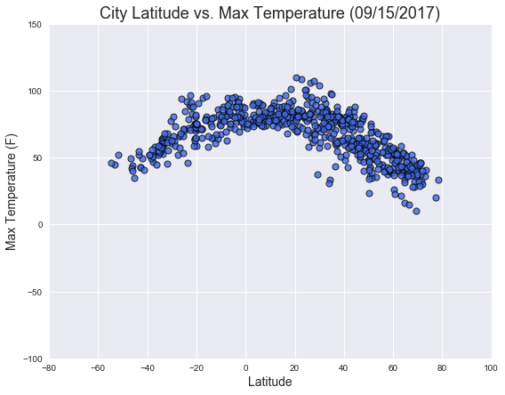
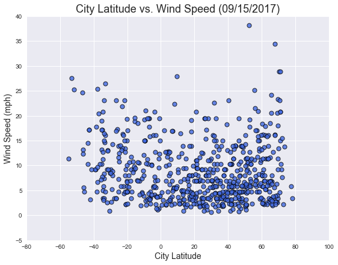

<h1>WeatherPy</h1>
<br><br><br><br><br><br><br><br><br><br><br><br><br><br>

<h3>Trends</h3>
<ul>
<li>Cities with max temperatures tend to located between -20 and 40 degrees latitude.</li> 
<li>Near the equator <i>(0 latitude)</i>, cities are likely to have less cloud coverage.</li>
<li>The majority of cities are in environments that are humid <i>(60%+)</i>.</li>

</ul>


```python
#dependencies
import json
import requests as req
import random 
from citipy import citipy
import pandas as pd
import time
import datetime
import csv
import os
import matplotlib.pyplot as plt
import seaborn as sns

#create lists to store lat and lon
l1=[]
l2=[]
citipydata = []
cities=[]
cities2=[]
latitude=[]
longitude=[]
temperature=[]
humidity=[]
cloudiness=[]
windspeed=[]
date=[]
country=[]
maxtemp=[]
url_list=[]
recordcount=0
setcount=1

api_key = "######################"
url = "http://api.openweathermap.org/data/2.5/weather?"
```

<h2>Generate Cities List</h2>


```python
#while loops to append lists; zip lists
while len(l1) < 2000:
    l1a = random.uniform(-90,90)
    l1.append(l1a)
while len(l2) < 2000:
    l2a = random.uniform(-180,180)
    l2.append(l2a)

coordinates = zip(l1,l2)


#Use citipy to find cities and store city names
for coordinate_pair in coordinates:
    lat, lon = coordinate_pair
    citipydata.append(citipy.nearest_city(lat, lon))
    cities.append(citipy.nearest_city(lat, lon).city_name)
    
#remove duplicates and limit list to 650
for city in cities:
    if city not in cities2:
        if len(cities2)< 650:    
            cities2.append(city)
            
            
```

<h2>Perform API Calls</h2>


```python
#use API to retrieve data and append lists
cities_c=[]
print("Beginning Data Retrieval")
print("-----------------------------------------")

for city in cities2:
    try:
        response = req.get(url+"appid="+api_key+"&q="+city+"&units=imperial").json()
        cities_c.append(city)
        latitude.append(response["coord"]["lat"])
        longitude.append(response["coord"]["lon"])
        temperature.append(response["main"]["temp"])
        windspeed.append(response["wind"]["speed"])
        humidity.append(response["main"]["humidity"])
        cloudiness.append(response["clouds"]["all"])
        maxtemp.append(response["main"]["temp_max"])
        country.append(response["sys"]["country"])
        url_list.append(url+"appid="+api_key+"&q="+city+"&units=imperial")
        date.append(response["dt"])
        print("Processing Record "+str(recordcount)+" of Set "+str(setcount)+" | "+city)
        print(url+"appid="+api_key+"&q="+city+"&units=imperial")
        
        if recordcount < 50:
            recordcount=recordcount+1
        elif recordcount == 50:
            time.sleep(61)
            recordcount= 1
            setcount = setcount+1
            
            
    except:
        print("error")
        continue
        
        

print("-----------------------------------------")
print("Data Retrieval Complete")
print("-----------------------------------------")
```

    Beginning Data Retrieval
    -----------------------------------------
    Processing Record 0 of Set 1 | taolanaro
    http://api.openweathermap.org/data/2.5/weather?appid=bc982a6944deb93291f24dca61c487b9&q=taolanaro&units=imperial
    Processing Record 1 of Set 1 | calamar
    http://api.openweathermap.org/data/2.5/weather?appid=bc982a6944deb93291f24dca61c487b9&q=calamar&units=imperial
    Processing Record 2 of Set 1 | busselton
    http://api.openweathermap.org/data/2.5/weather?appid=bc982a6944deb93291f24dca61c487b9&q=busselton&units=imperial
    Processing Record 3 of Set 1 | puerto ayora
    http://api.openweathermap.org/data/2.5/weather?appid=bc982a6944deb93291f24dca61c487b9&q=puerto ayora&units=imperial
    Processing Record 4 of Set 1 | yellowknife
    http://api.openweathermap.org/data/2.5/weather?appid=bc982a6944deb93291f24dca61c487b9&q=yellowknife&units=imperial
    Processing Record 5 of Set 1 | seoul
    http://api.openweathermap.org/data/2.5/weather?appid=bc982a6944deb93291f24dca61c487b9&q=seoul&units=imperial
    Processing Record 6 of Set 1 | sao sebastiao
    http://api.openweathermap.org/data/2.5/weather?appid=bc982a6944deb93291f24dca61c487b9&q=sao sebastiao&units=imperial
    Processing Record 7 of Set 1 | pisco
    http://api.openweathermap.org/data/2.5/weather?appid=bc982a6944deb93291f24dca61c487b9&q=pisco&units=imperial
    Processing Record 8 of Set 1 | puerto carreno
    http://api.openweathermap.org/data/2.5/weather?appid=bc982a6944deb93291f24dca61c487b9&q=puerto carreno&units=imperial
    Processing Record 9 of Set 1 | vaini
    http://api.openweathermap.org/data/2.5/weather?appid=bc982a6944deb93291f24dca61c487b9&q=vaini&units=imperial
    Processing Record 10 of Set 1 | bambous virieux
    http://api.openweathermap.org/data/2.5/weather?appid=bc982a6944deb93291f24dca61c487b9&q=bambous virieux&units=imperial
    Processing Record 11 of Set 1 | palmas bellas
    http://api.openweathermap.org/data/2.5/weather?appid=bc982a6944deb93291f24dca61c487b9&q=palmas bellas&units=imperial
    Processing Record 12 of Set 1 | la paz
    http://api.openweathermap.org/data/2.5/weather?appid=bc982a6944deb93291f24dca61c487b9&q=la paz&units=imperial
    Processing Record 13 of Set 1 | ponta delgada
    http://api.openweathermap.org/data/2.5/weather?appid=bc982a6944deb93291f24dca61c487b9&q=ponta delgada&units=imperial
    Processing Record 14 of Set 1 | mar del plata
    http://api.openweathermap.org/data/2.5/weather?appid=bc982a6944deb93291f24dca61c487b9&q=mar del plata&units=imperial
    Processing Record 15 of Set 1 | kruisfontein
    http://api.openweathermap.org/data/2.5/weather?appid=bc982a6944deb93291f24dca61c487b9&q=kruisfontein&units=imperial
    Processing Record 16 of Set 1 | punta arenas
    http://api.openweathermap.org/data/2.5/weather?appid=bc982a6944deb93291f24dca61c487b9&q=punta arenas&units=imperial
    Processing Record 17 of Set 1 | barrow
    http://api.openweathermap.org/data/2.5/weather?appid=bc982a6944deb93291f24dca61c487b9&q=barrow&units=imperial
    Processing Record 18 of Set 1 | komsomolskiy
    http://api.openweathermap.org/data/2.5/weather?appid=bc982a6944deb93291f24dca61c487b9&q=komsomolskiy&units=imperial
    Processing Record 19 of Set 1 | illoqqortoormiut
    http://api.openweathermap.org/data/2.5/weather?appid=bc982a6944deb93291f24dca61c487b9&q=illoqqortoormiut&units=imperial
    Processing Record 20 of Set 1 | bluff
    http://api.openweathermap.org/data/2.5/weather?appid=bc982a6944deb93291f24dca61c487b9&q=bluff&units=imperial
    Processing Record 21 of Set 1 | vaitupu
    http://api.openweathermap.org/data/2.5/weather?appid=bc982a6944deb93291f24dca61c487b9&q=vaitupu&units=imperial
    Processing Record 22 of Set 1 | tuktoyaktuk
    http://api.openweathermap.org/data/2.5/weather?appid=bc982a6944deb93291f24dca61c487b9&q=tuktoyaktuk&units=imperial
    Processing Record 23 of Set 1 | ushuaia
    http://api.openweathermap.org/data/2.5/weather?appid=bc982a6944deb93291f24dca61c487b9&q=ushuaia&units=imperial
    Processing Record 24 of Set 1 | arraial do cabo
    http://api.openweathermap.org/data/2.5/weather?appid=bc982a6944deb93291f24dca61c487b9&q=arraial do cabo&units=imperial
    Processing Record 25 of Set 1 | akdepe
    http://api.openweathermap.org/data/2.5/weather?appid=bc982a6944deb93291f24dca61c487b9&q=akdepe&units=imperial
    Processing Record 26 of Set 1 | fortuna
    http://api.openweathermap.org/data/2.5/weather?appid=bc982a6944deb93291f24dca61c487b9&q=fortuna&units=imperial
    Processing Record 27 of Set 1 | skalistyy
    http://api.openweathermap.org/data/2.5/weather?appid=bc982a6944deb93291f24dca61c487b9&q=skalistyy&units=imperial
    Processing Record 28 of Set 1 | alofi
    http://api.openweathermap.org/data/2.5/weather?appid=bc982a6944deb93291f24dca61c487b9&q=alofi&units=imperial
    Processing Record 29 of Set 1 | northam
    http://api.openweathermap.org/data/2.5/weather?appid=bc982a6944deb93291f24dca61c487b9&q=northam&units=imperial
    Processing Record 30 of Set 1 | tibagi
    http://api.openweathermap.org/data/2.5/weather?appid=bc982a6944deb93291f24dca61c487b9&q=tibagi&units=imperial
    Processing Record 31 of Set 1 | balkhash
    http://api.openweathermap.org/data/2.5/weather?appid=bc982a6944deb93291f24dca61c487b9&q=balkhash&units=imperial
    Processing Record 32 of Set 1 | victoria
    http://api.openweathermap.org/data/2.5/weather?appid=bc982a6944deb93291f24dca61c487b9&q=victoria&units=imperial
    Processing Record 33 of Set 1 | santa ana
    http://api.openweathermap.org/data/2.5/weather?appid=bc982a6944deb93291f24dca61c487b9&q=santa ana&units=imperial
    Processing Record 34 of Set 1 | igarka
    http://api.openweathermap.org/data/2.5/weather?appid=bc982a6944deb93291f24dca61c487b9&q=igarka&units=imperial
    Processing Record 35 of Set 1 | chokurdakh
    http://api.openweathermap.org/data/2.5/weather?appid=bc982a6944deb93291f24dca61c487b9&q=chokurdakh&units=imperial
    Processing Record 36 of Set 1 | scarborough
    http://api.openweathermap.org/data/2.5/weather?appid=bc982a6944deb93291f24dca61c487b9&q=scarborough&units=imperial
    Processing Record 37 of Set 1 | hermanus
    http://api.openweathermap.org/data/2.5/weather?appid=bc982a6944deb93291f24dca61c487b9&q=hermanus&units=imperial
    Processing Record 38 of Set 1 | hithadhoo
    http://api.openweathermap.org/data/2.5/weather?appid=bc982a6944deb93291f24dca61c487b9&q=hithadhoo&units=imperial
    Processing Record 39 of Set 1 | marsa matruh
    http://api.openweathermap.org/data/2.5/weather?appid=bc982a6944deb93291f24dca61c487b9&q=marsa matruh&units=imperial
    Processing Record 40 of Set 1 | mataura
    http://api.openweathermap.org/data/2.5/weather?appid=bc982a6944deb93291f24dca61c487b9&q=mataura&units=imperial
    Processing Record 41 of Set 1 | monte patria
    http://api.openweathermap.org/data/2.5/weather?appid=bc982a6944deb93291f24dca61c487b9&q=monte patria&units=imperial
    Processing Record 42 of Set 1 | olinda
    http://api.openweathermap.org/data/2.5/weather?appid=bc982a6944deb93291f24dca61c487b9&q=olinda&units=imperial
    Processing Record 43 of Set 1 | caravelas
    http://api.openweathermap.org/data/2.5/weather?appid=bc982a6944deb93291f24dca61c487b9&q=caravelas&units=imperial
    Processing Record 44 of Set 1 | clyde river
    http://api.openweathermap.org/data/2.5/weather?appid=bc982a6944deb93291f24dca61c487b9&q=clyde river&units=imperial
    Processing Record 45 of Set 1 | la ronge
    http://api.openweathermap.org/data/2.5/weather?appid=bc982a6944deb93291f24dca61c487b9&q=la ronge&units=imperial
    Processing Record 46 of Set 1 | thompson
    http://api.openweathermap.org/data/2.5/weather?appid=bc982a6944deb93291f24dca61c487b9&q=thompson&units=imperial
    Processing Record 47 of Set 1 | trebinje
    http://api.openweathermap.org/data/2.5/weather?appid=bc982a6944deb93291f24dca61c487b9&q=trebinje&units=imperial
    Processing Record 48 of Set 1 | dayong
    http://api.openweathermap.org/data/2.5/weather?appid=bc982a6944deb93291f24dca61c487b9&q=dayong&units=imperial
    Processing Record 49 of Set 1 | tiksi
    http://api.openweathermap.org/data/2.5/weather?appid=bc982a6944deb93291f24dca61c487b9&q=tiksi&units=imperial
    Processing Record 50 of Set 1 | celestun
    http://api.openweathermap.org/data/2.5/weather?appid=bc982a6944deb93291f24dca61c487b9&q=celestun&units=imperial
    Processing Record 1 of Set 2 | avarua
    http://api.openweathermap.org/data/2.5/weather?appid=bc982a6944deb93291f24dca61c487b9&q=avarua&units=imperial
    Processing Record 2 of Set 2 | port elizabeth
    http://api.openweathermap.org/data/2.5/weather?appid=bc982a6944deb93291f24dca61c487b9&q=port elizabeth&units=imperial
    Processing Record 3 of Set 2 | atambua
    http://api.openweathermap.org/data/2.5/weather?appid=bc982a6944deb93291f24dca61c487b9&q=atambua&units=imperial
    Processing Record 4 of Set 2 | marzuq
    http://api.openweathermap.org/data/2.5/weather?appid=bc982a6944deb93291f24dca61c487b9&q=marzuq&units=imperial
    Processing Record 5 of Set 2 | albany
    http://api.openweathermap.org/data/2.5/weather?appid=bc982a6944deb93291f24dca61c487b9&q=albany&units=imperial
    Processing Record 6 of Set 2 | rikitea
    http://api.openweathermap.org/data/2.5/weather?appid=bc982a6944deb93291f24dca61c487b9&q=rikitea&units=imperial
    Processing Record 7 of Set 2 | kapaa
    http://api.openweathermap.org/data/2.5/weather?appid=bc982a6944deb93291f24dca61c487b9&q=kapaa&units=imperial
    Processing Record 8 of Set 2 | coquimbo
    http://api.openweathermap.org/data/2.5/weather?appid=bc982a6944deb93291f24dca61c487b9&q=coquimbo&units=imperial
    Processing Record 9 of Set 2 | kloulklubed
    http://api.openweathermap.org/data/2.5/weather?appid=bc982a6944deb93291f24dca61c487b9&q=kloulklubed&units=imperial
    Processing Record 10 of Set 2 | dodge city
    http://api.openweathermap.org/data/2.5/weather?appid=bc982a6944deb93291f24dca61c487b9&q=dodge city&units=imperial
    Processing Record 11 of Set 2 | saint-francois
    http://api.openweathermap.org/data/2.5/weather?appid=bc982a6944deb93291f24dca61c487b9&q=saint-francois&units=imperial
    Processing Record 12 of Set 2 | laguna
    http://api.openweathermap.org/data/2.5/weather?appid=bc982a6944deb93291f24dca61c487b9&q=laguna&units=imperial
    Processing Record 13 of Set 2 | voi
    http://api.openweathermap.org/data/2.5/weather?appid=bc982a6944deb93291f24dca61c487b9&q=voi&units=imperial
    Processing Record 14 of Set 2 | port macquarie
    http://api.openweathermap.org/data/2.5/weather?appid=bc982a6944deb93291f24dca61c487b9&q=port macquarie&units=imperial
    Processing Record 15 of Set 2 | cape town
    http://api.openweathermap.org/data/2.5/weather?appid=bc982a6944deb93291f24dca61c487b9&q=cape town&units=imperial
    Processing Record 16 of Set 2 | vaitape
    http://api.openweathermap.org/data/2.5/weather?appid=bc982a6944deb93291f24dca61c487b9&q=vaitape&units=imperial
    Processing Record 17 of Set 2 | nailsea
    http://api.openweathermap.org/data/2.5/weather?appid=bc982a6944deb93291f24dca61c487b9&q=nailsea&units=imperial
    Processing Record 18 of Set 2 | pevek
    http://api.openweathermap.org/data/2.5/weather?appid=bc982a6944deb93291f24dca61c487b9&q=pevek&units=imperial
    Processing Record 19 of Set 2 | luderitz
    http://api.openweathermap.org/data/2.5/weather?appid=bc982a6944deb93291f24dca61c487b9&q=luderitz&units=imperial
    Processing Record 20 of Set 2 | castro
    http://api.openweathermap.org/data/2.5/weather?appid=bc982a6944deb93291f24dca61c487b9&q=castro&units=imperial
    Processing Record 21 of Set 2 | longkou
    http://api.openweathermap.org/data/2.5/weather?appid=bc982a6944deb93291f24dca61c487b9&q=longkou&units=imperial
    Processing Record 22 of Set 2 | sao filipe
    http://api.openweathermap.org/data/2.5/weather?appid=bc982a6944deb93291f24dca61c487b9&q=sao filipe&units=imperial
    Processing Record 23 of Set 2 | leirvik
    http://api.openweathermap.org/data/2.5/weather?appid=bc982a6944deb93291f24dca61c487b9&q=leirvik&units=imperial
    Processing Record 24 of Set 2 | mozarlandia
    http://api.openweathermap.org/data/2.5/weather?appid=bc982a6944deb93291f24dca61c487b9&q=mozarlandia&units=imperial
    Processing Record 25 of Set 2 | sur
    http://api.openweathermap.org/data/2.5/weather?appid=bc982a6944deb93291f24dca61c487b9&q=sur&units=imperial
    Processing Record 26 of Set 2 | buala
    http://api.openweathermap.org/data/2.5/weather?appid=bc982a6944deb93291f24dca61c487b9&q=buala&units=imperial
    Processing Record 27 of Set 2 | ostrovnoy
    http://api.openweathermap.org/data/2.5/weather?appid=bc982a6944deb93291f24dca61c487b9&q=ostrovnoy&units=imperial
    Processing Record 28 of Set 2 | svetlaya
    http://api.openweathermap.org/data/2.5/weather?appid=bc982a6944deb93291f24dca61c487b9&q=svetlaya&units=imperial
    Processing Record 29 of Set 2 | faanui
    http://api.openweathermap.org/data/2.5/weather?appid=bc982a6944deb93291f24dca61c487b9&q=faanui&units=imperial
    Processing Record 30 of Set 2 | prudyanka
    http://api.openweathermap.org/data/2.5/weather?appid=bc982a6944deb93291f24dca61c487b9&q=prudyanka&units=imperial
    Processing Record 31 of Set 2 | sioux lookout
    http://api.openweathermap.org/data/2.5/weather?appid=bc982a6944deb93291f24dca61c487b9&q=sioux lookout&units=imperial
    Processing Record 32 of Set 2 | tezu
    http://api.openweathermap.org/data/2.5/weather?appid=bc982a6944deb93291f24dca61c487b9&q=tezu&units=imperial
    Processing Record 33 of Set 2 | santa isabel do rio negro
    http://api.openweathermap.org/data/2.5/weather?appid=bc982a6944deb93291f24dca61c487b9&q=santa isabel do rio negro&units=imperial
    Processing Record 34 of Set 2 | hohhot
    http://api.openweathermap.org/data/2.5/weather?appid=bc982a6944deb93291f24dca61c487b9&q=hohhot&units=imperial
    Processing Record 35 of Set 2 | tasiilaq
    http://api.openweathermap.org/data/2.5/weather?appid=bc982a6944deb93291f24dca61c487b9&q=tasiilaq&units=imperial
    Processing Record 36 of Set 2 | sitka
    http://api.openweathermap.org/data/2.5/weather?appid=bc982a6944deb93291f24dca61c487b9&q=sitka&units=imperial
    Processing Record 37 of Set 2 | hofn
    http://api.openweathermap.org/data/2.5/weather?appid=bc982a6944deb93291f24dca61c487b9&q=hofn&units=imperial
    Processing Record 38 of Set 2 | itarema
    http://api.openweathermap.org/data/2.5/weather?appid=bc982a6944deb93291f24dca61c487b9&q=itarema&units=imperial
    Processing Record 39 of Set 2 | coihaique
    http://api.openweathermap.org/data/2.5/weather?appid=bc982a6944deb93291f24dca61c487b9&q=coihaique&units=imperial
    Processing Record 40 of Set 2 | saint-philippe
    http://api.openweathermap.org/data/2.5/weather?appid=bc982a6944deb93291f24dca61c487b9&q=saint-philippe&units=imperial
    Processing Record 41 of Set 2 | aklavik
    http://api.openweathermap.org/data/2.5/weather?appid=bc982a6944deb93291f24dca61c487b9&q=aklavik&units=imperial
    Processing Record 42 of Set 2 | lorengau
    http://api.openweathermap.org/data/2.5/weather?appid=bc982a6944deb93291f24dca61c487b9&q=lorengau&units=imperial
    Processing Record 43 of Set 2 | sao jose da coroa grande
    http://api.openweathermap.org/data/2.5/weather?appid=bc982a6944deb93291f24dca61c487b9&q=sao jose da coroa grande&units=imperial
    Processing Record 44 of Set 2 | kaitangata
    http://api.openweathermap.org/data/2.5/weather?appid=bc982a6944deb93291f24dca61c487b9&q=kaitangata&units=imperial
    Processing Record 45 of Set 2 | cabedelo
    http://api.openweathermap.org/data/2.5/weather?appid=bc982a6944deb93291f24dca61c487b9&q=cabedelo&units=imperial
    Processing Record 46 of Set 2 | dingle
    http://api.openweathermap.org/data/2.5/weather?appid=bc982a6944deb93291f24dca61c487b9&q=dingle&units=imperial
    Processing Record 47 of Set 2 | atuona
    http://api.openweathermap.org/data/2.5/weather?appid=bc982a6944deb93291f24dca61c487b9&q=atuona&units=imperial
    Processing Record 48 of Set 2 | toliary
    http://api.openweathermap.org/data/2.5/weather?appid=bc982a6944deb93291f24dca61c487b9&q=toliary&units=imperial
    Processing Record 49 of Set 2 | pampierstad
    http://api.openweathermap.org/data/2.5/weather?appid=bc982a6944deb93291f24dca61c487b9&q=pampierstad&units=imperial
    Processing Record 50 of Set 2 | katsuura
    http://api.openweathermap.org/data/2.5/weather?appid=bc982a6944deb93291f24dca61c487b9&q=katsuura&units=imperial
    Processing Record 1 of Set 3 | norman wells
    http://api.openweathermap.org/data/2.5/weather?appid=bc982a6944deb93291f24dca61c487b9&q=norman wells&units=imperial
    Processing Record 2 of Set 3 | kusye-aleksandrovskiy
    http://api.openweathermap.org/data/2.5/weather?appid=bc982a6944deb93291f24dca61c487b9&q=kusye-aleksandrovskiy&units=imperial
    Processing Record 3 of Set 3 | mangai
    http://api.openweathermap.org/data/2.5/weather?appid=bc982a6944deb93291f24dca61c487b9&q=mangai&units=imperial
    Processing Record 4 of Set 3 | xuddur
    http://api.openweathermap.org/data/2.5/weather?appid=bc982a6944deb93291f24dca61c487b9&q=xuddur&units=imperial
    Processing Record 5 of Set 3 | kavieng
    http://api.openweathermap.org/data/2.5/weather?appid=bc982a6944deb93291f24dca61c487b9&q=kavieng&units=imperial
    Processing Record 6 of Set 3 | shirokiy
    http://api.openweathermap.org/data/2.5/weather?appid=bc982a6944deb93291f24dca61c487b9&q=shirokiy&units=imperial
    Processing Record 7 of Set 3 | yeppoon
    http://api.openweathermap.org/data/2.5/weather?appid=bc982a6944deb93291f24dca61c487b9&q=yeppoon&units=imperial
    Processing Record 8 of Set 3 | saquena
    http://api.openweathermap.org/data/2.5/weather?appid=bc982a6944deb93291f24dca61c487b9&q=saquena&units=imperial
    Processing Record 9 of Set 3 | kamenskoye
    http://api.openweathermap.org/data/2.5/weather?appid=bc982a6944deb93291f24dca61c487b9&q=kamenskoye&units=imperial
    Processing Record 10 of Set 3 | ancud
    http://api.openweathermap.org/data/2.5/weather?appid=bc982a6944deb93291f24dca61c487b9&q=ancud&units=imperial
    Processing Record 11 of Set 3 | bathsheba
    http://api.openweathermap.org/data/2.5/weather?appid=bc982a6944deb93291f24dca61c487b9&q=bathsheba&units=imperial
    Processing Record 12 of Set 3 | cascais
    http://api.openweathermap.org/data/2.5/weather?appid=bc982a6944deb93291f24dca61c487b9&q=cascais&units=imperial
    Processing Record 13 of Set 3 | kerki
    http://api.openweathermap.org/data/2.5/weather?appid=bc982a6944deb93291f24dca61c487b9&q=kerki&units=imperial
    Processing Record 14 of Set 3 | tilichiki
    http://api.openweathermap.org/data/2.5/weather?appid=bc982a6944deb93291f24dca61c487b9&q=tilichiki&units=imperial
    Processing Record 15 of Set 3 | bilma
    http://api.openweathermap.org/data/2.5/weather?appid=bc982a6944deb93291f24dca61c487b9&q=bilma&units=imperial
    Processing Record 16 of Set 3 | umzimvubu
    http://api.openweathermap.org/data/2.5/weather?appid=bc982a6944deb93291f24dca61c487b9&q=umzimvubu&units=imperial
    Processing Record 17 of Set 3 | esso
    http://api.openweathermap.org/data/2.5/weather?appid=bc982a6944deb93291f24dca61c487b9&q=esso&units=imperial
    Processing Record 18 of Set 3 | maun
    http://api.openweathermap.org/data/2.5/weather?appid=bc982a6944deb93291f24dca61c487b9&q=maun&units=imperial
    Processing Record 19 of Set 3 | liman
    http://api.openweathermap.org/data/2.5/weather?appid=bc982a6944deb93291f24dca61c487b9&q=liman&units=imperial
    Processing Record 20 of Set 3 | kodiak
    http://api.openweathermap.org/data/2.5/weather?appid=bc982a6944deb93291f24dca61c487b9&q=kodiak&units=imperial
    Processing Record 21 of Set 3 | ponta do sol
    http://api.openweathermap.org/data/2.5/weather?appid=bc982a6944deb93291f24dca61c487b9&q=ponta do sol&units=imperial
    Processing Record 22 of Set 3 | port alfred
    http://api.openweathermap.org/data/2.5/weather?appid=bc982a6944deb93291f24dca61c487b9&q=port alfred&units=imperial
    Processing Record 23 of Set 3 | chitipa
    http://api.openweathermap.org/data/2.5/weather?appid=bc982a6944deb93291f24dca61c487b9&q=chitipa&units=imperial
    Processing Record 24 of Set 3 | ahipara
    http://api.openweathermap.org/data/2.5/weather?appid=bc982a6944deb93291f24dca61c487b9&q=ahipara&units=imperial
    Processing Record 25 of Set 3 | sisimiut
    http://api.openweathermap.org/data/2.5/weather?appid=bc982a6944deb93291f24dca61c487b9&q=sisimiut&units=imperial
    Processing Record 26 of Set 3 | nizhniy tsasuchey
    http://api.openweathermap.org/data/2.5/weather?appid=bc982a6944deb93291f24dca61c487b9&q=nizhniy tsasuchey&units=imperial
    Processing Record 27 of Set 3 | sol-iletsk
    http://api.openweathermap.org/data/2.5/weather?appid=bc982a6944deb93291f24dca61c487b9&q=sol-iletsk&units=imperial
    Processing Record 28 of Set 3 | mahajanga
    http://api.openweathermap.org/data/2.5/weather?appid=bc982a6944deb93291f24dca61c487b9&q=mahajanga&units=imperial
    Processing Record 29 of Set 3 | shieli
    http://api.openweathermap.org/data/2.5/weather?appid=bc982a6944deb93291f24dca61c487b9&q=shieli&units=imperial
    Processing Record 30 of Set 3 | naze
    http://api.openweathermap.org/data/2.5/weather?appid=bc982a6944deb93291f24dca61c487b9&q=naze&units=imperial
    Processing Record 31 of Set 3 | sambava
    http://api.openweathermap.org/data/2.5/weather?appid=bc982a6944deb93291f24dca61c487b9&q=sambava&units=imperial
    Processing Record 32 of Set 3 | necochea
    http://api.openweathermap.org/data/2.5/weather?appid=bc982a6944deb93291f24dca61c487b9&q=necochea&units=imperial
    Processing Record 33 of Set 3 | samalaeulu
    http://api.openweathermap.org/data/2.5/weather?appid=bc982a6944deb93291f24dca61c487b9&q=samalaeulu&units=imperial
    Processing Record 34 of Set 3 | nikolskoye
    http://api.openweathermap.org/data/2.5/weather?appid=bc982a6944deb93291f24dca61c487b9&q=nikolskoye&units=imperial
    Processing Record 35 of Set 3 | guatavita
    http://api.openweathermap.org/data/2.5/weather?appid=bc982a6944deb93291f24dca61c487b9&q=guatavita&units=imperial
    Processing Record 36 of Set 3 | bara
    http://api.openweathermap.org/data/2.5/weather?appid=bc982a6944deb93291f24dca61c487b9&q=bara&units=imperial
    Processing Record 37 of Set 3 | bardiyah
    http://api.openweathermap.org/data/2.5/weather?appid=bc982a6944deb93291f24dca61c487b9&q=bardiyah&units=imperial
    Processing Record 38 of Set 3 | belushya guba
    http://api.openweathermap.org/data/2.5/weather?appid=bc982a6944deb93291f24dca61c487b9&q=belushya guba&units=imperial
    Processing Record 39 of Set 3 | yialos
    http://api.openweathermap.org/data/2.5/weather?appid=bc982a6944deb93291f24dca61c487b9&q=yialos&units=imperial
    Processing Record 40 of Set 3 | port keats
    http://api.openweathermap.org/data/2.5/weather?appid=bc982a6944deb93291f24dca61c487b9&q=port keats&units=imperial
    Processing Record 41 of Set 3 | barentsburg
    http://api.openweathermap.org/data/2.5/weather?appid=bc982a6944deb93291f24dca61c487b9&q=barentsburg&units=imperial
    Processing Record 42 of Set 3 | manali
    http://api.openweathermap.org/data/2.5/weather?appid=bc982a6944deb93291f24dca61c487b9&q=manali&units=imperial
    Processing Record 43 of Set 3 | saldanha
    http://api.openweathermap.org/data/2.5/weather?appid=bc982a6944deb93291f24dca61c487b9&q=saldanha&units=imperial
    Processing Record 44 of Set 3 | hasaki
    http://api.openweathermap.org/data/2.5/weather?appid=bc982a6944deb93291f24dca61c487b9&q=hasaki&units=imperial
    Processing Record 45 of Set 3 | burnie
    http://api.openweathermap.org/data/2.5/weather?appid=bc982a6944deb93291f24dca61c487b9&q=burnie&units=imperial
    Processing Record 46 of Set 3 | tagusao
    http://api.openweathermap.org/data/2.5/weather?appid=bc982a6944deb93291f24dca61c487b9&q=tagusao&units=imperial
    Processing Record 47 of Set 3 | butaritari
    http://api.openweathermap.org/data/2.5/weather?appid=bc982a6944deb93291f24dca61c487b9&q=butaritari&units=imperial
    Processing Record 48 of Set 3 | khatanga
    http://api.openweathermap.org/data/2.5/weather?appid=bc982a6944deb93291f24dca61c487b9&q=khatanga&units=imperial
    Processing Record 49 of Set 3 | peleduy
    http://api.openweathermap.org/data/2.5/weather?appid=bc982a6944deb93291f24dca61c487b9&q=peleduy&units=imperial
    Processing Record 50 of Set 3 | saint george
    http://api.openweathermap.org/data/2.5/weather?appid=bc982a6944deb93291f24dca61c487b9&q=saint george&units=imperial
    Processing Record 1 of Set 4 | lavrentiya
    http://api.openweathermap.org/data/2.5/weather?appid=bc982a6944deb93291f24dca61c487b9&q=lavrentiya&units=imperial
    Processing Record 2 of Set 4 | erenhot
    http://api.openweathermap.org/data/2.5/weather?appid=bc982a6944deb93291f24dca61c487b9&q=erenhot&units=imperial
    Processing Record 3 of Set 4 | puksoozero
    http://api.openweathermap.org/data/2.5/weather?appid=bc982a6944deb93291f24dca61c487b9&q=puksoozero&units=imperial
    Processing Record 4 of Set 4 | kysyl-syr
    http://api.openweathermap.org/data/2.5/weather?appid=bc982a6944deb93291f24dca61c487b9&q=kysyl-syr&units=imperial
    Processing Record 5 of Set 4 | tual
    http://api.openweathermap.org/data/2.5/weather?appid=bc982a6944deb93291f24dca61c487b9&q=tual&units=imperial
    Processing Record 6 of Set 4 | amderma
    http://api.openweathermap.org/data/2.5/weather?appid=bc982a6944deb93291f24dca61c487b9&q=amderma&units=imperial
    Processing Record 7 of Set 4 | bitkine
    http://api.openweathermap.org/data/2.5/weather?appid=bc982a6944deb93291f24dca61c487b9&q=bitkine&units=imperial
    Processing Record 8 of Set 4 | axixa do tocantins
    http://api.openweathermap.org/data/2.5/weather?appid=bc982a6944deb93291f24dca61c487b9&q=axixa do tocantins&units=imperial
    Processing Record 9 of Set 4 | mitsamiouli
    http://api.openweathermap.org/data/2.5/weather?appid=bc982a6944deb93291f24dca61c487b9&q=mitsamiouli&units=imperial
    Processing Record 10 of Set 4 | phan rang
    http://api.openweathermap.org/data/2.5/weather?appid=bc982a6944deb93291f24dca61c487b9&q=phan rang&units=imperial
    Processing Record 11 of Set 4 | asfi
    http://api.openweathermap.org/data/2.5/weather?appid=bc982a6944deb93291f24dca61c487b9&q=asfi&units=imperial
    Processing Record 12 of Set 4 | qaanaaq
    http://api.openweathermap.org/data/2.5/weather?appid=bc982a6944deb93291f24dca61c487b9&q=qaanaaq&units=imperial
    Processing Record 13 of Set 4 | tsihombe
    http://api.openweathermap.org/data/2.5/weather?appid=bc982a6944deb93291f24dca61c487b9&q=tsihombe&units=imperial
    Processing Record 14 of Set 4 | weiser
    http://api.openweathermap.org/data/2.5/weather?appid=bc982a6944deb93291f24dca61c487b9&q=weiser&units=imperial
    Processing Record 15 of Set 4 | chopinzinho
    http://api.openweathermap.org/data/2.5/weather?appid=bc982a6944deb93291f24dca61c487b9&q=chopinzinho&units=imperial
    Processing Record 16 of Set 4 | rawson
    http://api.openweathermap.org/data/2.5/weather?appid=bc982a6944deb93291f24dca61c487b9&q=rawson&units=imperial
    Processing Record 17 of Set 4 | vila franca do campo
    http://api.openweathermap.org/data/2.5/weather?appid=bc982a6944deb93291f24dca61c487b9&q=vila franca do campo&units=imperial
    Processing Record 18 of Set 4 | leningradskiy
    http://api.openweathermap.org/data/2.5/weather?appid=bc982a6944deb93291f24dca61c487b9&q=leningradskiy&units=imperial
    Processing Record 19 of Set 4 | hilo
    http://api.openweathermap.org/data/2.5/weather?appid=bc982a6944deb93291f24dca61c487b9&q=hilo&units=imperial
    Processing Record 20 of Set 4 | airai
    http://api.openweathermap.org/data/2.5/weather?appid=bc982a6944deb93291f24dca61c487b9&q=airai&units=imperial
    Processing Record 21 of Set 4 | tumannyy
    http://api.openweathermap.org/data/2.5/weather?appid=bc982a6944deb93291f24dca61c487b9&q=tumannyy&units=imperial
    Processing Record 22 of Set 4 | fevralsk
    http://api.openweathermap.org/data/2.5/weather?appid=bc982a6944deb93291f24dca61c487b9&q=fevralsk&units=imperial
    Processing Record 23 of Set 4 | port moresby
    http://api.openweathermap.org/data/2.5/weather?appid=bc982a6944deb93291f24dca61c487b9&q=port moresby&units=imperial
    Processing Record 24 of Set 4 | jamestown
    http://api.openweathermap.org/data/2.5/weather?appid=bc982a6944deb93291f24dca61c487b9&q=jamestown&units=imperial
    Processing Record 25 of Set 4 | esperance
    http://api.openweathermap.org/data/2.5/weather?appid=bc982a6944deb93291f24dca61c487b9&q=esperance&units=imperial
    Processing Record 26 of Set 4 | teya
    http://api.openweathermap.org/data/2.5/weather?appid=bc982a6944deb93291f24dca61c487b9&q=teya&units=imperial
    Processing Record 27 of Set 4 | hobart
    http://api.openweathermap.org/data/2.5/weather?appid=bc982a6944deb93291f24dca61c487b9&q=hobart&units=imperial
    Processing Record 28 of Set 4 | roma
    http://api.openweathermap.org/data/2.5/weather?appid=bc982a6944deb93291f24dca61c487b9&q=roma&units=imperial
    Processing Record 29 of Set 4 | lebu
    http://api.openweathermap.org/data/2.5/weather?appid=bc982a6944deb93291f24dca61c487b9&q=lebu&units=imperial
    Processing Record 30 of Set 4 | phalombe
    http://api.openweathermap.org/data/2.5/weather?appid=bc982a6944deb93291f24dca61c487b9&q=phalombe&units=imperial
    Processing Record 31 of Set 4 | riviere-au-renard
    http://api.openweathermap.org/data/2.5/weather?appid=bc982a6944deb93291f24dca61c487b9&q=riviere-au-renard&units=imperial
    Processing Record 32 of Set 4 | kiama
    http://api.openweathermap.org/data/2.5/weather?appid=bc982a6944deb93291f24dca61c487b9&q=kiama&units=imperial
    Processing Record 33 of Set 4 | lagoa
    http://api.openweathermap.org/data/2.5/weather?appid=bc982a6944deb93291f24dca61c487b9&q=lagoa&units=imperial
    Processing Record 34 of Set 4 | bengkulu
    http://api.openweathermap.org/data/2.5/weather?appid=bc982a6944deb93291f24dca61c487b9&q=bengkulu&units=imperial
    Processing Record 35 of Set 4 | grand gaube
    http://api.openweathermap.org/data/2.5/weather?appid=bc982a6944deb93291f24dca61c487b9&q=grand gaube&units=imperial
    Processing Record 36 of Set 4 | itacare
    http://api.openweathermap.org/data/2.5/weather?appid=bc982a6944deb93291f24dca61c487b9&q=itacare&units=imperial
    Processing Record 37 of Set 4 | bereda
    http://api.openweathermap.org/data/2.5/weather?appid=bc982a6944deb93291f24dca61c487b9&q=bereda&units=imperial
    Processing Record 38 of Set 4 | georgetown
    http://api.openweathermap.org/data/2.5/weather?appid=bc982a6944deb93291f24dca61c487b9&q=georgetown&units=imperial
    Processing Record 39 of Set 4 | hamilton
    http://api.openweathermap.org/data/2.5/weather?appid=bc982a6944deb93291f24dca61c487b9&q=hamilton&units=imperial
    Processing Record 40 of Set 4 | waingapu
    http://api.openweathermap.org/data/2.5/weather?appid=bc982a6944deb93291f24dca61c487b9&q=waingapu&units=imperial
    Processing Record 41 of Set 4 | calama
    http://api.openweathermap.org/data/2.5/weather?appid=bc982a6944deb93291f24dca61c487b9&q=calama&units=imperial
    Processing Record 42 of Set 4 | severo-kurilsk
    http://api.openweathermap.org/data/2.5/weather?appid=bc982a6944deb93291f24dca61c487b9&q=severo-kurilsk&units=imperial
    Processing Record 43 of Set 4 | nizhneyansk
    http://api.openweathermap.org/data/2.5/weather?appid=bc982a6944deb93291f24dca61c487b9&q=nizhneyansk&units=imperial
    Processing Record 44 of Set 4 | mangaluru
    http://api.openweathermap.org/data/2.5/weather?appid=bc982a6944deb93291f24dca61c487b9&q=mangaluru&units=imperial
    Processing Record 45 of Set 4 | tawkar
    http://api.openweathermap.org/data/2.5/weather?appid=bc982a6944deb93291f24dca61c487b9&q=tawkar&units=imperial
    Processing Record 46 of Set 4 | mayo
    http://api.openweathermap.org/data/2.5/weather?appid=bc982a6944deb93291f24dca61c487b9&q=mayo&units=imperial
    Processing Record 47 of Set 4 | fonte boa
    http://api.openweathermap.org/data/2.5/weather?appid=bc982a6944deb93291f24dca61c487b9&q=fonte boa&units=imperial
    Processing Record 48 of Set 4 | tessalit
    http://api.openweathermap.org/data/2.5/weather?appid=bc982a6944deb93291f24dca61c487b9&q=tessalit&units=imperial
    Processing Record 49 of Set 4 | rush
    http://api.openweathermap.org/data/2.5/weather?appid=bc982a6944deb93291f24dca61c487b9&q=rush&units=imperial
    Processing Record 50 of Set 4 | buraydah
    http://api.openweathermap.org/data/2.5/weather?appid=bc982a6944deb93291f24dca61c487b9&q=buraydah&units=imperial
    Processing Record 1 of Set 5 | dikson
    http://api.openweathermap.org/data/2.5/weather?appid=bc982a6944deb93291f24dca61c487b9&q=dikson&units=imperial
    Processing Record 2 of Set 5 | tsabong
    http://api.openweathermap.org/data/2.5/weather?appid=bc982a6944deb93291f24dca61c487b9&q=tsabong&units=imperial
    Processing Record 3 of Set 5 | yaan
    http://api.openweathermap.org/data/2.5/weather?appid=bc982a6944deb93291f24dca61c487b9&q=yaan&units=imperial
    Processing Record 4 of Set 5 | swellendam
    http://api.openweathermap.org/data/2.5/weather?appid=bc982a6944deb93291f24dca61c487b9&q=swellendam&units=imperial
    Processing Record 5 of Set 5 | saint-gaudens
    http://api.openweathermap.org/data/2.5/weather?appid=bc982a6944deb93291f24dca61c487b9&q=saint-gaudens&units=imperial
    Processing Record 6 of Set 5 | ormara
    http://api.openweathermap.org/data/2.5/weather?appid=bc982a6944deb93291f24dca61c487b9&q=ormara&units=imperial
    Processing Record 7 of Set 5 | cidreira
    http://api.openweathermap.org/data/2.5/weather?appid=bc982a6944deb93291f24dca61c487b9&q=cidreira&units=imperial
    Processing Record 8 of Set 5 | plymouth
    http://api.openweathermap.org/data/2.5/weather?appid=bc982a6944deb93291f24dca61c487b9&q=plymouth&units=imperial
    Processing Record 9 of Set 5 | te anau
    http://api.openweathermap.org/data/2.5/weather?appid=bc982a6944deb93291f24dca61c487b9&q=te anau&units=imperial
    Processing Record 10 of Set 5 | petrovsk
    http://api.openweathermap.org/data/2.5/weather?appid=bc982a6944deb93291f24dca61c487b9&q=petrovsk&units=imperial
    Processing Record 11 of Set 5 | aswan
    http://api.openweathermap.org/data/2.5/weather?appid=bc982a6944deb93291f24dca61c487b9&q=aswan&units=imperial
    Processing Record 12 of Set 5 | grand river south east
    http://api.openweathermap.org/data/2.5/weather?appid=bc982a6944deb93291f24dca61c487b9&q=grand river south east&units=imperial
    Processing Record 13 of Set 5 | anadyr
    http://api.openweathermap.org/data/2.5/weather?appid=bc982a6944deb93291f24dca61c487b9&q=anadyr&units=imperial
    Processing Record 14 of Set 5 | namibe
    http://api.openweathermap.org/data/2.5/weather?appid=bc982a6944deb93291f24dca61c487b9&q=namibe&units=imperial
    Processing Record 15 of Set 5 | touros
    http://api.openweathermap.org/data/2.5/weather?appid=bc982a6944deb93291f24dca61c487b9&q=touros&units=imperial
    Processing Record 16 of Set 5 | bredasdorp
    http://api.openweathermap.org/data/2.5/weather?appid=bc982a6944deb93291f24dca61c487b9&q=bredasdorp&units=imperial
    Processing Record 17 of Set 5 | contamana
    http://api.openweathermap.org/data/2.5/weather?appid=bc982a6944deb93291f24dca61c487b9&q=contamana&units=imperial
    Processing Record 18 of Set 5 | rangpur
    http://api.openweathermap.org/data/2.5/weather?appid=bc982a6944deb93291f24dca61c487b9&q=rangpur&units=imperial
    Processing Record 19 of Set 5 | digha
    http://api.openweathermap.org/data/2.5/weather?appid=bc982a6944deb93291f24dca61c487b9&q=digha&units=imperial
    Processing Record 20 of Set 5 | yarada
    http://api.openweathermap.org/data/2.5/weather?appid=bc982a6944deb93291f24dca61c487b9&q=yarada&units=imperial
    Processing Record 21 of Set 5 | geraldton
    http://api.openweathermap.org/data/2.5/weather?appid=bc982a6944deb93291f24dca61c487b9&q=geraldton&units=imperial
    Processing Record 22 of Set 5 | devarkonda
    http://api.openweathermap.org/data/2.5/weather?appid=bc982a6944deb93291f24dca61c487b9&q=devarkonda&units=imperial
    Processing Record 23 of Set 5 | ribeira grande
    http://api.openweathermap.org/data/2.5/weather?appid=bc982a6944deb93291f24dca61c487b9&q=ribeira grande&units=imperial
    Processing Record 24 of Set 5 | linxia
    http://api.openweathermap.org/data/2.5/weather?appid=bc982a6944deb93291f24dca61c487b9&q=linxia&units=imperial
    Processing Record 25 of Set 5 | san
    http://api.openweathermap.org/data/2.5/weather?appid=bc982a6944deb93291f24dca61c487b9&q=san&units=imperial
    Processing Record 26 of Set 5 | pahrump
    http://api.openweathermap.org/data/2.5/weather?appid=bc982a6944deb93291f24dca61c487b9&q=pahrump&units=imperial
    Processing Record 27 of Set 5 | zambezi
    http://api.openweathermap.org/data/2.5/weather?appid=bc982a6944deb93291f24dca61c487b9&q=zambezi&units=imperial
    Processing Record 28 of Set 5 | elizabeth city
    http://api.openweathermap.org/data/2.5/weather?appid=bc982a6944deb93291f24dca61c487b9&q=elizabeth city&units=imperial
    Processing Record 29 of Set 5 | lakatoro
    http://api.openweathermap.org/data/2.5/weather?appid=bc982a6944deb93291f24dca61c487b9&q=lakatoro&units=imperial
    Processing Record 30 of Set 5 | severnyy
    http://api.openweathermap.org/data/2.5/weather?appid=bc982a6944deb93291f24dca61c487b9&q=severnyy&units=imperial
    Processing Record 31 of Set 5 | cabo san lucas
    http://api.openweathermap.org/data/2.5/weather?appid=bc982a6944deb93291f24dca61c487b9&q=cabo san lucas&units=imperial
    Processing Record 32 of Set 5 | belyy yar
    http://api.openweathermap.org/data/2.5/weather?appid=bc982a6944deb93291f24dca61c487b9&q=belyy yar&units=imperial
    Processing Record 33 of Set 5 | aanekoski
    http://api.openweathermap.org/data/2.5/weather?appid=bc982a6944deb93291f24dca61c487b9&q=aanekoski&units=imperial
    Processing Record 34 of Set 5 | nguruka
    http://api.openweathermap.org/data/2.5/weather?appid=bc982a6944deb93291f24dca61c487b9&q=nguruka&units=imperial
    Processing Record 35 of Set 5 | krasnoye
    http://api.openweathermap.org/data/2.5/weather?appid=bc982a6944deb93291f24dca61c487b9&q=krasnoye&units=imperial
    Processing Record 36 of Set 5 | vila
    http://api.openweathermap.org/data/2.5/weather?appid=bc982a6944deb93291f24dca61c487b9&q=vila&units=imperial
    Processing Record 37 of Set 5 | bom jesus
    http://api.openweathermap.org/data/2.5/weather?appid=bc982a6944deb93291f24dca61c487b9&q=bom jesus&units=imperial
    Processing Record 38 of Set 5 | mahebourg
    http://api.openweathermap.org/data/2.5/weather?appid=bc982a6944deb93291f24dca61c487b9&q=mahebourg&units=imperial
    Processing Record 39 of Set 5 | syracuse
    http://api.openweathermap.org/data/2.5/weather?appid=bc982a6944deb93291f24dca61c487b9&q=syracuse&units=imperial
    Processing Record 40 of Set 5 | nguiu
    http://api.openweathermap.org/data/2.5/weather?appid=bc982a6944deb93291f24dca61c487b9&q=nguiu&units=imperial
    Processing Record 41 of Set 5 | souillac
    http://api.openweathermap.org/data/2.5/weather?appid=bc982a6944deb93291f24dca61c487b9&q=souillac&units=imperial
    Processing Record 42 of Set 5 | takoradi
    http://api.openweathermap.org/data/2.5/weather?appid=bc982a6944deb93291f24dca61c487b9&q=takoradi&units=imperial
    Processing Record 43 of Set 5 | wielun
    http://api.openweathermap.org/data/2.5/weather?appid=bc982a6944deb93291f24dca61c487b9&q=wielun&units=imperial
    Processing Record 44 of Set 5 | cherskiy
    http://api.openweathermap.org/data/2.5/weather?appid=bc982a6944deb93291f24dca61c487b9&q=cherskiy&units=imperial
    Processing Record 45 of Set 5 | tarudant
    http://api.openweathermap.org/data/2.5/weather?appid=bc982a6944deb93291f24dca61c487b9&q=tarudant&units=imperial
    Processing Record 46 of Set 5 | kizhinga
    http://api.openweathermap.org/data/2.5/weather?appid=bc982a6944deb93291f24dca61c487b9&q=kizhinga&units=imperial
    Processing Record 47 of Set 5 | havoysund
    http://api.openweathermap.org/data/2.5/weather?appid=bc982a6944deb93291f24dca61c487b9&q=havoysund&units=imperial
    Processing Record 48 of Set 5 | sentyabrskiy
    http://api.openweathermap.org/data/2.5/weather?appid=bc982a6944deb93291f24dca61c487b9&q=sentyabrskiy&units=imperial
    Processing Record 49 of Set 5 | tignere
    http://api.openweathermap.org/data/2.5/weather?appid=bc982a6944deb93291f24dca61c487b9&q=tignere&units=imperial
    Processing Record 50 of Set 5 | atherton
    http://api.openweathermap.org/data/2.5/weather?appid=bc982a6944deb93291f24dca61c487b9&q=atherton&units=imperial
    Processing Record 1 of Set 6 | goure
    http://api.openweathermap.org/data/2.5/weather?appid=bc982a6944deb93291f24dca61c487b9&q=goure&units=imperial
    Processing Record 2 of Set 6 | gardez
    http://api.openweathermap.org/data/2.5/weather?appid=bc982a6944deb93291f24dca61c487b9&q=gardez&units=imperial
    Processing Record 3 of Set 6 | ajdabiya
    http://api.openweathermap.org/data/2.5/weather?appid=bc982a6944deb93291f24dca61c487b9&q=ajdabiya&units=imperial
    Processing Record 4 of Set 6 | plouzane
    http://api.openweathermap.org/data/2.5/weather?appid=bc982a6944deb93291f24dca61c487b9&q=plouzane&units=imperial
    Processing Record 5 of Set 6 | port lincoln
    http://api.openweathermap.org/data/2.5/weather?appid=bc982a6944deb93291f24dca61c487b9&q=port lincoln&units=imperial
    Processing Record 6 of Set 6 | nusaybin
    http://api.openweathermap.org/data/2.5/weather?appid=bc982a6944deb93291f24dca61c487b9&q=nusaybin&units=imperial
    Processing Record 7 of Set 6 | east london
    http://api.openweathermap.org/data/2.5/weather?appid=bc982a6944deb93291f24dca61c487b9&q=east london&units=imperial
    Processing Record 8 of Set 6 | ushtobe
    http://api.openweathermap.org/data/2.5/weather?appid=bc982a6944deb93291f24dca61c487b9&q=ushtobe&units=imperial
    Processing Record 9 of Set 6 | bubaque
    http://api.openweathermap.org/data/2.5/weather?appid=bc982a6944deb93291f24dca61c487b9&q=bubaque&units=imperial
    Processing Record 10 of Set 6 | qasigiannguit
    http://api.openweathermap.org/data/2.5/weather?appid=bc982a6944deb93291f24dca61c487b9&q=qasigiannguit&units=imperial
    Processing Record 11 of Set 6 | setermoen
    http://api.openweathermap.org/data/2.5/weather?appid=bc982a6944deb93291f24dca61c487b9&q=setermoen&units=imperial
    Processing Record 12 of Set 6 | sarangani
    http://api.openweathermap.org/data/2.5/weather?appid=bc982a6944deb93291f24dca61c487b9&q=sarangani&units=imperial
    Processing Record 13 of Set 6 | ilulissat
    http://api.openweathermap.org/data/2.5/weather?appid=bc982a6944deb93291f24dca61c487b9&q=ilulissat&units=imperial
    Processing Record 14 of Set 6 | talcahuano
    http://api.openweathermap.org/data/2.5/weather?appid=bc982a6944deb93291f24dca61c487b9&q=talcahuano&units=imperial
    Processing Record 15 of Set 6 | dauriya
    http://api.openweathermap.org/data/2.5/weather?appid=bc982a6944deb93291f24dca61c487b9&q=dauriya&units=imperial
    Processing Record 16 of Set 6 | praya
    http://api.openweathermap.org/data/2.5/weather?appid=bc982a6944deb93291f24dca61c487b9&q=praya&units=imperial
    Processing Record 17 of Set 6 | havre-saint-pierre
    http://api.openweathermap.org/data/2.5/weather?appid=bc982a6944deb93291f24dca61c487b9&q=havre-saint-pierre&units=imperial
    Processing Record 18 of Set 6 | srednekolymsk
    http://api.openweathermap.org/data/2.5/weather?appid=bc982a6944deb93291f24dca61c487b9&q=srednekolymsk&units=imperial
    Processing Record 19 of Set 6 | kununurra
    http://api.openweathermap.org/data/2.5/weather?appid=bc982a6944deb93291f24dca61c487b9&q=kununurra&units=imperial
    Processing Record 20 of Set 6 | tooele
    http://api.openweathermap.org/data/2.5/weather?appid=bc982a6944deb93291f24dca61c487b9&q=tooele&units=imperial
    Processing Record 21 of Set 6 | temaraia
    http://api.openweathermap.org/data/2.5/weather?appid=bc982a6944deb93291f24dca61c487b9&q=temaraia&units=imperial
    Processing Record 22 of Set 6 | myitkyina
    http://api.openweathermap.org/data/2.5/weather?appid=bc982a6944deb93291f24dca61c487b9&q=myitkyina&units=imperial
    Processing Record 23 of Set 6 | antigonish
    http://api.openweathermap.org/data/2.5/weather?appid=bc982a6944deb93291f24dca61c487b9&q=antigonish&units=imperial
    Processing Record 24 of Set 6 | mianyang
    http://api.openweathermap.org/data/2.5/weather?appid=bc982a6944deb93291f24dca61c487b9&q=mianyang&units=imperial
    Processing Record 25 of Set 6 | ballina
    http://api.openweathermap.org/data/2.5/weather?appid=bc982a6944deb93291f24dca61c487b9&q=ballina&units=imperial
    Processing Record 26 of Set 6 | kasongo-lunda
    http://api.openweathermap.org/data/2.5/weather?appid=bc982a6944deb93291f24dca61c487b9&q=kasongo-lunda&units=imperial
    Processing Record 27 of Set 6 | obluche
    http://api.openweathermap.org/data/2.5/weather?appid=bc982a6944deb93291f24dca61c487b9&q=obluche&units=imperial
    Processing Record 28 of Set 6 | beloha
    http://api.openweathermap.org/data/2.5/weather?appid=bc982a6944deb93291f24dca61c487b9&q=beloha&units=imperial
    Processing Record 29 of Set 6 | klaksvik
    http://api.openweathermap.org/data/2.5/weather?appid=bc982a6944deb93291f24dca61c487b9&q=klaksvik&units=imperial
    Processing Record 30 of Set 6 | kamenka
    http://api.openweathermap.org/data/2.5/weather?appid=bc982a6944deb93291f24dca61c487b9&q=kamenka&units=imperial
    Processing Record 31 of Set 6 | kangaba
    http://api.openweathermap.org/data/2.5/weather?appid=bc982a6944deb93291f24dca61c487b9&q=kangaba&units=imperial
    Processing Record 32 of Set 6 | san quintin
    http://api.openweathermap.org/data/2.5/weather?appid=bc982a6944deb93291f24dca61c487b9&q=san quintin&units=imperial
    Processing Record 33 of Set 6 | nouadhibou
    http://api.openweathermap.org/data/2.5/weather?appid=bc982a6944deb93291f24dca61c487b9&q=nouadhibou&units=imperial
    Processing Record 34 of Set 6 | ust-kamchatsk
    http://api.openweathermap.org/data/2.5/weather?appid=bc982a6944deb93291f24dca61c487b9&q=ust-kamchatsk&units=imperial
    Processing Record 35 of Set 6 | mareeba
    http://api.openweathermap.org/data/2.5/weather?appid=bc982a6944deb93291f24dca61c487b9&q=mareeba&units=imperial
    Processing Record 36 of Set 6 | oranjestad
    http://api.openweathermap.org/data/2.5/weather?appid=bc982a6944deb93291f24dca61c487b9&q=oranjestad&units=imperial
    Processing Record 37 of Set 6 | alcudia
    http://api.openweathermap.org/data/2.5/weather?appid=bc982a6944deb93291f24dca61c487b9&q=alcudia&units=imperial
    Processing Record 38 of Set 6 | harper
    http://api.openweathermap.org/data/2.5/weather?appid=bc982a6944deb93291f24dca61c487b9&q=harper&units=imperial
    Processing Record 39 of Set 6 | srandakan
    http://api.openweathermap.org/data/2.5/weather?appid=bc982a6944deb93291f24dca61c487b9&q=srandakan&units=imperial
    Processing Record 40 of Set 6 | carnarvon
    http://api.openweathermap.org/data/2.5/weather?appid=bc982a6944deb93291f24dca61c487b9&q=carnarvon&units=imperial
    Processing Record 41 of Set 6 | flinders
    http://api.openweathermap.org/data/2.5/weather?appid=bc982a6944deb93291f24dca61c487b9&q=flinders&units=imperial
    Processing Record 42 of Set 6 | dauphin
    http://api.openweathermap.org/data/2.5/weather?appid=bc982a6944deb93291f24dca61c487b9&q=dauphin&units=imperial
    Processing Record 43 of Set 6 | faya
    http://api.openweathermap.org/data/2.5/weather?appid=bc982a6944deb93291f24dca61c487b9&q=faya&units=imperial
    Processing Record 44 of Set 6 | norrkoping
    http://api.openweathermap.org/data/2.5/weather?appid=bc982a6944deb93291f24dca61c487b9&q=norrkoping&units=imperial
    Processing Record 45 of Set 6 | saskylakh
    http://api.openweathermap.org/data/2.5/weather?appid=bc982a6944deb93291f24dca61c487b9&q=saskylakh&units=imperial
    Processing Record 46 of Set 6 | broome
    http://api.openweathermap.org/data/2.5/weather?appid=bc982a6944deb93291f24dca61c487b9&q=broome&units=imperial
    Processing Record 47 of Set 6 | matara
    http://api.openweathermap.org/data/2.5/weather?appid=bc982a6944deb93291f24dca61c487b9&q=matara&units=imperial
    Processing Record 48 of Set 6 | moerai
    http://api.openweathermap.org/data/2.5/weather?appid=bc982a6944deb93291f24dca61c487b9&q=moerai&units=imperial
    Processing Record 49 of Set 6 | port hedland
    http://api.openweathermap.org/data/2.5/weather?appid=bc982a6944deb93291f24dca61c487b9&q=port hedland&units=imperial
    Processing Record 50 of Set 6 | jambi
    http://api.openweathermap.org/data/2.5/weather?appid=bc982a6944deb93291f24dca61c487b9&q=jambi&units=imperial
    Processing Record 1 of Set 7 | torbay
    http://api.openweathermap.org/data/2.5/weather?appid=bc982a6944deb93291f24dca61c487b9&q=torbay&units=imperial
    Processing Record 2 of Set 7 | opuwo
    http://api.openweathermap.org/data/2.5/weather?appid=bc982a6944deb93291f24dca61c487b9&q=opuwo&units=imperial
    Processing Record 3 of Set 7 | bonavista
    http://api.openweathermap.org/data/2.5/weather?appid=bc982a6944deb93291f24dca61c487b9&q=bonavista&units=imperial
    Processing Record 4 of Set 7 | yulara
    http://api.openweathermap.org/data/2.5/weather?appid=bc982a6944deb93291f24dca61c487b9&q=yulara&units=imperial
    Processing Record 5 of Set 7 | yar-sale
    http://api.openweathermap.org/data/2.5/weather?appid=bc982a6944deb93291f24dca61c487b9&q=yar-sale&units=imperial
    Processing Record 6 of Set 7 | isangel
    http://api.openweathermap.org/data/2.5/weather?appid=bc982a6944deb93291f24dca61c487b9&q=isangel&units=imperial
    Processing Record 7 of Set 7 | suez
    http://api.openweathermap.org/data/2.5/weather?appid=bc982a6944deb93291f24dca61c487b9&q=suez&units=imperial
    Processing Record 8 of Set 7 | kalanchak
    http://api.openweathermap.org/data/2.5/weather?appid=bc982a6944deb93291f24dca61c487b9&q=kalanchak&units=imperial
    Processing Record 9 of Set 7 | adrar
    http://api.openweathermap.org/data/2.5/weather?appid=bc982a6944deb93291f24dca61c487b9&q=adrar&units=imperial
    Processing Record 10 of Set 7 | hunza
    http://api.openweathermap.org/data/2.5/weather?appid=bc982a6944deb93291f24dca61c487b9&q=hunza&units=imperial
    Processing Record 11 of Set 7 | narsaq
    http://api.openweathermap.org/data/2.5/weather?appid=bc982a6944deb93291f24dca61c487b9&q=narsaq&units=imperial
    Processing Record 12 of Set 7 | awjilah
    http://api.openweathermap.org/data/2.5/weather?appid=bc982a6944deb93291f24dca61c487b9&q=awjilah&units=imperial
    Processing Record 13 of Set 7 | mys shmidta
    http://api.openweathermap.org/data/2.5/weather?appid=bc982a6944deb93291f24dca61c487b9&q=mys shmidta&units=imperial
    Processing Record 14 of Set 7 | agadez
    http://api.openweathermap.org/data/2.5/weather?appid=bc982a6944deb93291f24dca61c487b9&q=agadez&units=imperial
    Processing Record 15 of Set 7 | haibowan
    http://api.openweathermap.org/data/2.5/weather?appid=bc982a6944deb93291f24dca61c487b9&q=haibowan&units=imperial
    Processing Record 16 of Set 7 | gazli
    http://api.openweathermap.org/data/2.5/weather?appid=bc982a6944deb93291f24dca61c487b9&q=gazli&units=imperial
    Processing Record 17 of Set 7 | port said
    http://api.openweathermap.org/data/2.5/weather?appid=bc982a6944deb93291f24dca61c487b9&q=port said&units=imperial
    Processing Record 18 of Set 7 | rengali
    http://api.openweathermap.org/data/2.5/weather?appid=bc982a6944deb93291f24dca61c487b9&q=rengali&units=imperial
    Processing Record 19 of Set 7 | saint-michel-des-saints
    http://api.openweathermap.org/data/2.5/weather?appid=bc982a6944deb93291f24dca61c487b9&q=saint-michel-des-saints&units=imperial
    Processing Record 20 of Set 7 | nanortalik
    http://api.openweathermap.org/data/2.5/weather?appid=bc982a6944deb93291f24dca61c487b9&q=nanortalik&units=imperial
    Processing Record 21 of Set 7 | gamba
    http://api.openweathermap.org/data/2.5/weather?appid=bc982a6944deb93291f24dca61c487b9&q=gamba&units=imperial
    Processing Record 22 of Set 7 | marsh harbour
    http://api.openweathermap.org/data/2.5/weather?appid=bc982a6944deb93291f24dca61c487b9&q=marsh harbour&units=imperial
    Processing Record 23 of Set 7 | nikel
    http://api.openweathermap.org/data/2.5/weather?appid=bc982a6944deb93291f24dca61c487b9&q=nikel&units=imperial
    Processing Record 24 of Set 7 | grindavik
    http://api.openweathermap.org/data/2.5/weather?appid=bc982a6944deb93291f24dca61c487b9&q=grindavik&units=imperial
    Processing Record 25 of Set 7 | rawah
    http://api.openweathermap.org/data/2.5/weather?appid=bc982a6944deb93291f24dca61c487b9&q=rawah&units=imperial
    Processing Record 26 of Set 7 | bang saphan
    http://api.openweathermap.org/data/2.5/weather?appid=bc982a6944deb93291f24dca61c487b9&q=bang saphan&units=imperial
    Processing Record 27 of Set 7 | goderich
    http://api.openweathermap.org/data/2.5/weather?appid=bc982a6944deb93291f24dca61c487b9&q=goderich&units=imperial
    Processing Record 28 of Set 7 | shizunai
    http://api.openweathermap.org/data/2.5/weather?appid=bc982a6944deb93291f24dca61c487b9&q=shizunai&units=imperial
    Processing Record 29 of Set 7 | mombetsu
    http://api.openweathermap.org/data/2.5/weather?appid=bc982a6944deb93291f24dca61c487b9&q=mombetsu&units=imperial
    Processing Record 30 of Set 7 | nhulunbuy
    http://api.openweathermap.org/data/2.5/weather?appid=bc982a6944deb93291f24dca61c487b9&q=nhulunbuy&units=imperial
    Processing Record 31 of Set 7 | lisakovsk
    http://api.openweathermap.org/data/2.5/weather?appid=bc982a6944deb93291f24dca61c487b9&q=lisakovsk&units=imperial
    Processing Record 32 of Set 7 | port hawkesbury
    http://api.openweathermap.org/data/2.5/weather?appid=bc982a6944deb93291f24dca61c487b9&q=port hawkesbury&units=imperial
    Processing Record 33 of Set 7 | diego de almagro
    http://api.openweathermap.org/data/2.5/weather?appid=bc982a6944deb93291f24dca61c487b9&q=diego de almagro&units=imperial
    Processing Record 34 of Set 7 | saleaula
    http://api.openweathermap.org/data/2.5/weather?appid=bc982a6944deb93291f24dca61c487b9&q=saleaula&units=imperial
    Processing Record 35 of Set 7 | bousse
    http://api.openweathermap.org/data/2.5/weather?appid=bc982a6944deb93291f24dca61c487b9&q=bousse&units=imperial
    Processing Record 36 of Set 7 | aksu
    http://api.openweathermap.org/data/2.5/weather?appid=bc982a6944deb93291f24dca61c487b9&q=aksu&units=imperial
    Processing Record 37 of Set 7 | gubkinskiy
    http://api.openweathermap.org/data/2.5/weather?appid=bc982a6944deb93291f24dca61c487b9&q=gubkinskiy&units=imperial
    Processing Record 38 of Set 7 | carutapera
    http://api.openweathermap.org/data/2.5/weather?appid=bc982a6944deb93291f24dca61c487b9&q=carutapera&units=imperial
    Processing Record 39 of Set 7 | araouane
    http://api.openweathermap.org/data/2.5/weather?appid=bc982a6944deb93291f24dca61c487b9&q=araouane&units=imperial
    Processing Record 40 of Set 7 | trairi
    http://api.openweathermap.org/data/2.5/weather?appid=bc982a6944deb93291f24dca61c487b9&q=trairi&units=imperial
    Processing Record 41 of Set 7 | marcona
    http://api.openweathermap.org/data/2.5/weather?appid=bc982a6944deb93291f24dca61c487b9&q=marcona&units=imperial
    Processing Record 42 of Set 7 | talnakh
    http://api.openweathermap.org/data/2.5/weather?appid=bc982a6944deb93291f24dca61c487b9&q=talnakh&units=imperial
    Processing Record 43 of Set 7 | camargo
    http://api.openweathermap.org/data/2.5/weather?appid=bc982a6944deb93291f24dca61c487b9&q=camargo&units=imperial
    Processing Record 44 of Set 7 | okhotsk
    http://api.openweathermap.org/data/2.5/weather?appid=bc982a6944deb93291f24dca61c487b9&q=okhotsk&units=imperial
    Processing Record 45 of Set 7 | santa marta
    http://api.openweathermap.org/data/2.5/weather?appid=bc982a6944deb93291f24dca61c487b9&q=santa marta&units=imperial
    Processing Record 46 of Set 7 | pacific grove
    http://api.openweathermap.org/data/2.5/weather?appid=bc982a6944deb93291f24dca61c487b9&q=pacific grove&units=imperial
    Processing Record 47 of Set 7 | koindu
    http://api.openweathermap.org/data/2.5/weather?appid=bc982a6944deb93291f24dca61c487b9&q=koindu&units=imperial
    Processing Record 48 of Set 7 | constitucion
    http://api.openweathermap.org/data/2.5/weather?appid=bc982a6944deb93291f24dca61c487b9&q=constitucion&units=imperial
    Processing Record 49 of Set 7 | luba
    http://api.openweathermap.org/data/2.5/weather?appid=bc982a6944deb93291f24dca61c487b9&q=luba&units=imperial
    Processing Record 50 of Set 7 | mersing
    http://api.openweathermap.org/data/2.5/weather?appid=bc982a6944deb93291f24dca61c487b9&q=mersing&units=imperial
    Processing Record 1 of Set 8 | yumen
    http://api.openweathermap.org/data/2.5/weather?appid=bc982a6944deb93291f24dca61c487b9&q=yumen&units=imperial
    Processing Record 2 of Set 8 | kralendijk
    http://api.openweathermap.org/data/2.5/weather?appid=bc982a6944deb93291f24dca61c487b9&q=kralendijk&units=imperial
    Processing Record 3 of Set 8 | teguldet
    http://api.openweathermap.org/data/2.5/weather?appid=bc982a6944deb93291f24dca61c487b9&q=teguldet&units=imperial
    Processing Record 4 of Set 8 | rocha
    http://api.openweathermap.org/data/2.5/weather?appid=bc982a6944deb93291f24dca61c487b9&q=rocha&units=imperial
    Processing Record 5 of Set 8 | yining
    http://api.openweathermap.org/data/2.5/weather?appid=bc982a6944deb93291f24dca61c487b9&q=yining&units=imperial
    Processing Record 6 of Set 8 | alice springs
    http://api.openweathermap.org/data/2.5/weather?appid=bc982a6944deb93291f24dca61c487b9&q=alice springs&units=imperial
    Processing Record 7 of Set 8 | lata
    http://api.openweathermap.org/data/2.5/weather?appid=bc982a6944deb93291f24dca61c487b9&q=lata&units=imperial
    Processing Record 8 of Set 8 | ustka
    http://api.openweathermap.org/data/2.5/weather?appid=bc982a6944deb93291f24dca61c487b9&q=ustka&units=imperial
    Processing Record 9 of Set 8 | chuy
    http://api.openweathermap.org/data/2.5/weather?appid=bc982a6944deb93291f24dca61c487b9&q=chuy&units=imperial
    Processing Record 10 of Set 8 | bafoulabe
    http://api.openweathermap.org/data/2.5/weather?appid=bc982a6944deb93291f24dca61c487b9&q=bafoulabe&units=imperial
    Processing Record 11 of Set 8 | sorland
    http://api.openweathermap.org/data/2.5/weather?appid=bc982a6944deb93291f24dca61c487b9&q=sorland&units=imperial
    Processing Record 12 of Set 8 | karpathos
    http://api.openweathermap.org/data/2.5/weather?appid=bc982a6944deb93291f24dca61c487b9&q=karpathos&units=imperial
    Processing Record 13 of Set 8 | port hardy
    http://api.openweathermap.org/data/2.5/weather?appid=bc982a6944deb93291f24dca61c487b9&q=port hardy&units=imperial
    Processing Record 14 of Set 8 | bilibino
    http://api.openweathermap.org/data/2.5/weather?appid=bc982a6944deb93291f24dca61c487b9&q=bilibino&units=imperial
    Processing Record 15 of Set 8 | da lat
    http://api.openweathermap.org/data/2.5/weather?appid=bc982a6944deb93291f24dca61c487b9&q=da lat&units=imperial
    Processing Record 16 of Set 8 | banjar
    http://api.openweathermap.org/data/2.5/weather?appid=bc982a6944deb93291f24dca61c487b9&q=banjar&units=imperial
    Processing Record 17 of Set 8 | attawapiskat
    http://api.openweathermap.org/data/2.5/weather?appid=bc982a6944deb93291f24dca61c487b9&q=attawapiskat&units=imperial
    Processing Record 18 of Set 8 | namatanai
    http://api.openweathermap.org/data/2.5/weather?appid=bc982a6944deb93291f24dca61c487b9&q=namatanai&units=imperial
    Processing Record 19 of Set 8 | cerritos
    http://api.openweathermap.org/data/2.5/weather?appid=bc982a6944deb93291f24dca61c487b9&q=cerritos&units=imperial
    Processing Record 20 of Set 8 | korla
    http://api.openweathermap.org/data/2.5/weather?appid=bc982a6944deb93291f24dca61c487b9&q=korla&units=imperial
    Processing Record 21 of Set 8 | pleasanton
    http://api.openweathermap.org/data/2.5/weather?appid=bc982a6944deb93291f24dca61c487b9&q=pleasanton&units=imperial
    Processing Record 22 of Set 8 | duncan
    http://api.openweathermap.org/data/2.5/weather?appid=bc982a6944deb93291f24dca61c487b9&q=duncan&units=imperial
    Processing Record 23 of Set 8 | lake city
    http://api.openweathermap.org/data/2.5/weather?appid=bc982a6944deb93291f24dca61c487b9&q=lake city&units=imperial
    Processing Record 24 of Set 8 | new iberia
    http://api.openweathermap.org/data/2.5/weather?appid=bc982a6944deb93291f24dca61c487b9&q=new iberia&units=imperial
    Processing Record 25 of Set 8 | dwarka
    http://api.openweathermap.org/data/2.5/weather?appid=bc982a6944deb93291f24dca61c487b9&q=dwarka&units=imperial
    Processing Record 26 of Set 8 | partanna
    http://api.openweathermap.org/data/2.5/weather?appid=bc982a6944deb93291f24dca61c487b9&q=partanna&units=imperial
    Processing Record 27 of Set 8 | arica
    http://api.openweathermap.org/data/2.5/weather?appid=bc982a6944deb93291f24dca61c487b9&q=arica&units=imperial
    Processing Record 28 of Set 8 | manado
    http://api.openweathermap.org/data/2.5/weather?appid=bc982a6944deb93291f24dca61c487b9&q=manado&units=imperial
    Processing Record 29 of Set 8 | diffa
    http://api.openweathermap.org/data/2.5/weather?appid=bc982a6944deb93291f24dca61c487b9&q=diffa&units=imperial
    Processing Record 30 of Set 8 | florianopolis
    http://api.openweathermap.org/data/2.5/weather?appid=bc982a6944deb93291f24dca61c487b9&q=florianopolis&units=imperial
    Processing Record 31 of Set 8 | hearst
    http://api.openweathermap.org/data/2.5/weather?appid=bc982a6944deb93291f24dca61c487b9&q=hearst&units=imperial
    Processing Record 32 of Set 8 | bolungarvik
    http://api.openweathermap.org/data/2.5/weather?appid=bc982a6944deb93291f24dca61c487b9&q=bolungarvik&units=imperial
    Processing Record 33 of Set 8 | panguna
    http://api.openweathermap.org/data/2.5/weather?appid=bc982a6944deb93291f24dca61c487b9&q=panguna&units=imperial
    Processing Record 34 of Set 8 | dossor
    http://api.openweathermap.org/data/2.5/weather?appid=bc982a6944deb93291f24dca61c487b9&q=dossor&units=imperial
    Processing Record 35 of Set 8 | nemuro
    http://api.openweathermap.org/data/2.5/weather?appid=bc982a6944deb93291f24dca61c487b9&q=nemuro&units=imperial
    Processing Record 36 of Set 8 | ouricuri
    http://api.openweathermap.org/data/2.5/weather?appid=bc982a6944deb93291f24dca61c487b9&q=ouricuri&units=imperial
    Processing Record 37 of Set 8 | doha
    http://api.openweathermap.org/data/2.5/weather?appid=bc982a6944deb93291f24dca61c487b9&q=doha&units=imperial
    Processing Record 38 of Set 8 | talawdi
    http://api.openweathermap.org/data/2.5/weather?appid=bc982a6944deb93291f24dca61c487b9&q=talawdi&units=imperial
    Processing Record 39 of Set 8 | satitoa
    http://api.openweathermap.org/data/2.5/weather?appid=bc982a6944deb93291f24dca61c487b9&q=satitoa&units=imperial
    Processing Record 40 of Set 8 | muyezerskiy
    http://api.openweathermap.org/data/2.5/weather?appid=bc982a6944deb93291f24dca61c487b9&q=muyezerskiy&units=imperial
    Processing Record 41 of Set 8 | pitimbu
    http://api.openweathermap.org/data/2.5/weather?appid=bc982a6944deb93291f24dca61c487b9&q=pitimbu&units=imperial
    Processing Record 42 of Set 8 | bacuit
    http://api.openweathermap.org/data/2.5/weather?appid=bc982a6944deb93291f24dca61c487b9&q=bacuit&units=imperial
    Processing Record 43 of Set 8 | camacha
    http://api.openweathermap.org/data/2.5/weather?appid=bc982a6944deb93291f24dca61c487b9&q=camacha&units=imperial
    Processing Record 44 of Set 8 | stornoway
    http://api.openweathermap.org/data/2.5/weather?appid=bc982a6944deb93291f24dca61c487b9&q=stornoway&units=imperial
    Processing Record 45 of Set 8 | san patricio
    http://api.openweathermap.org/data/2.5/weather?appid=bc982a6944deb93291f24dca61c487b9&q=san patricio&units=imperial
    Processing Record 46 of Set 8 | ingham
    http://api.openweathermap.org/data/2.5/weather?appid=bc982a6944deb93291f24dca61c487b9&q=ingham&units=imperial
    Processing Record 47 of Set 8 | hualmay
    http://api.openweathermap.org/data/2.5/weather?appid=bc982a6944deb93291f24dca61c487b9&q=hualmay&units=imperial
    Processing Record 48 of Set 8 | zyryanka
    http://api.openweathermap.org/data/2.5/weather?appid=bc982a6944deb93291f24dca61c487b9&q=zyryanka&units=imperial
    Processing Record 49 of Set 8 | nome
    http://api.openweathermap.org/data/2.5/weather?appid=bc982a6944deb93291f24dca61c487b9&q=nome&units=imperial
    Processing Record 50 of Set 8 | portland
    http://api.openweathermap.org/data/2.5/weather?appid=bc982a6944deb93291f24dca61c487b9&q=portland&units=imperial
    Processing Record 1 of Set 9 | fort frances
    http://api.openweathermap.org/data/2.5/weather?appid=bc982a6944deb93291f24dca61c487b9&q=fort frances&units=imperial
    Processing Record 2 of Set 9 | xinzhi
    http://api.openweathermap.org/data/2.5/weather?appid=bc982a6944deb93291f24dca61c487b9&q=xinzhi&units=imperial
    Processing Record 3 of Set 9 | samusu
    http://api.openweathermap.org/data/2.5/weather?appid=bc982a6944deb93291f24dca61c487b9&q=samusu&units=imperial
    Processing Record 4 of Set 9 | djougou
    http://api.openweathermap.org/data/2.5/weather?appid=bc982a6944deb93291f24dca61c487b9&q=djougou&units=imperial
    Processing Record 5 of Set 9 | tabou
    http://api.openweathermap.org/data/2.5/weather?appid=bc982a6944deb93291f24dca61c487b9&q=tabou&units=imperial
    Processing Record 6 of Set 9 | fairbanks
    http://api.openweathermap.org/data/2.5/weather?appid=bc982a6944deb93291f24dca61c487b9&q=fairbanks&units=imperial
    Processing Record 7 of Set 9 | wana
    http://api.openweathermap.org/data/2.5/weather?appid=bc982a6944deb93291f24dca61c487b9&q=wana&units=imperial
    Processing Record 8 of Set 9 | balikpapan
    http://api.openweathermap.org/data/2.5/weather?appid=bc982a6944deb93291f24dca61c487b9&q=balikpapan&units=imperial
    Processing Record 9 of Set 9 | kotido
    http://api.openweathermap.org/data/2.5/weather?appid=bc982a6944deb93291f24dca61c487b9&q=kotido&units=imperial
    Processing Record 10 of Set 9 | mount gambier
    http://api.openweathermap.org/data/2.5/weather?appid=bc982a6944deb93291f24dca61c487b9&q=mount gambier&units=imperial
    Processing Record 11 of Set 9 | roald
    http://api.openweathermap.org/data/2.5/weather?appid=bc982a6944deb93291f24dca61c487b9&q=roald&units=imperial
    Processing Record 12 of Set 9 | ribeira brava
    http://api.openweathermap.org/data/2.5/weather?appid=bc982a6944deb93291f24dca61c487b9&q=ribeira brava&units=imperial
    Processing Record 13 of Set 9 | sorvag
    http://api.openweathermap.org/data/2.5/weather?appid=bc982a6944deb93291f24dca61c487b9&q=sorvag&units=imperial
    Processing Record 14 of Set 9 | tomari
    http://api.openweathermap.org/data/2.5/weather?appid=bc982a6944deb93291f24dca61c487b9&q=tomari&units=imperial
    Processing Record 15 of Set 9 | half moon bay
    http://api.openweathermap.org/data/2.5/weather?appid=bc982a6944deb93291f24dca61c487b9&q=half moon bay&units=imperial
    Processing Record 16 of Set 9 | saint-pierre
    http://api.openweathermap.org/data/2.5/weather?appid=bc982a6944deb93291f24dca61c487b9&q=saint-pierre&units=imperial
    Processing Record 17 of Set 9 | saint-georges
    http://api.openweathermap.org/data/2.5/weather?appid=bc982a6944deb93291f24dca61c487b9&q=saint-georges&units=imperial
    Processing Record 18 of Set 9 | mogapi
    http://api.openweathermap.org/data/2.5/weather?appid=bc982a6944deb93291f24dca61c487b9&q=mogapi&units=imperial
    Processing Record 19 of Set 9 | saint-ambroise
    http://api.openweathermap.org/data/2.5/weather?appid=bc982a6944deb93291f24dca61c487b9&q=saint-ambroise&units=imperial
    Processing Record 20 of Set 9 | el paujil
    http://api.openweathermap.org/data/2.5/weather?appid=bc982a6944deb93291f24dca61c487b9&q=el paujil&units=imperial
    Processing Record 21 of Set 9 | maceio
    http://api.openweathermap.org/data/2.5/weather?appid=bc982a6944deb93291f24dca61c487b9&q=maceio&units=imperial
    Processing Record 22 of Set 9 | honiara
    http://api.openweathermap.org/data/2.5/weather?appid=bc982a6944deb93291f24dca61c487b9&q=honiara&units=imperial
    Processing Record 23 of Set 9 | labuhan
    http://api.openweathermap.org/data/2.5/weather?appid=bc982a6944deb93291f24dca61c487b9&q=labuhan&units=imperial
    Processing Record 24 of Set 9 | praia da vitoria
    http://api.openweathermap.org/data/2.5/weather?appid=bc982a6944deb93291f24dca61c487b9&q=praia da vitoria&units=imperial
    Processing Record 25 of Set 9 | salalah
    http://api.openweathermap.org/data/2.5/weather?appid=bc982a6944deb93291f24dca61c487b9&q=salalah&units=imperial
    Processing Record 26 of Set 9 | voh
    http://api.openweathermap.org/data/2.5/weather?appid=bc982a6944deb93291f24dca61c487b9&q=voh&units=imperial
    Processing Record 27 of Set 9 | bud
    http://api.openweathermap.org/data/2.5/weather?appid=bc982a6944deb93291f24dca61c487b9&q=bud&units=imperial
    Processing Record 28 of Set 9 | karaul
    http://api.openweathermap.org/data/2.5/weather?appid=bc982a6944deb93291f24dca61c487b9&q=karaul&units=imperial
    Processing Record 29 of Set 9 | lompoc
    http://api.openweathermap.org/data/2.5/weather?appid=bc982a6944deb93291f24dca61c487b9&q=lompoc&units=imperial
    Processing Record 30 of Set 9 | kaka
    http://api.openweathermap.org/data/2.5/weather?appid=bc982a6944deb93291f24dca61c487b9&q=kaka&units=imperial
    Processing Record 31 of Set 9 | lumding
    http://api.openweathermap.org/data/2.5/weather?appid=bc982a6944deb93291f24dca61c487b9&q=lumding&units=imperial
    Processing Record 32 of Set 9 | nara
    http://api.openweathermap.org/data/2.5/weather?appid=bc982a6944deb93291f24dca61c487b9&q=nara&units=imperial
    Processing Record 33 of Set 9 | socuellamos
    http://api.openweathermap.org/data/2.5/weather?appid=bc982a6944deb93291f24dca61c487b9&q=socuellamos&units=imperial
    Processing Record 34 of Set 9 | clarence town
    http://api.openweathermap.org/data/2.5/weather?appid=bc982a6944deb93291f24dca61c487b9&q=clarence town&units=imperial
    Processing Record 35 of Set 9 | barawe
    http://api.openweathermap.org/data/2.5/weather?appid=bc982a6944deb93291f24dca61c487b9&q=barawe&units=imperial
    Processing Record 36 of Set 9 | jalu
    http://api.openweathermap.org/data/2.5/weather?appid=bc982a6944deb93291f24dca61c487b9&q=jalu&units=imperial
    Processing Record 37 of Set 9 | neuquen
    http://api.openweathermap.org/data/2.5/weather?appid=bc982a6944deb93291f24dca61c487b9&q=neuquen&units=imperial
    Processing Record 38 of Set 9 | jacksonville
    http://api.openweathermap.org/data/2.5/weather?appid=bc982a6944deb93291f24dca61c487b9&q=jacksonville&units=imperial
    Processing Record 39 of Set 9 | altus
    http://api.openweathermap.org/data/2.5/weather?appid=bc982a6944deb93291f24dca61c487b9&q=altus&units=imperial
    Processing Record 40 of Set 9 | chapais
    http://api.openweathermap.org/data/2.5/weather?appid=bc982a6944deb93291f24dca61c487b9&q=chapais&units=imperial
    Processing Record 41 of Set 9 | ikongo
    http://api.openweathermap.org/data/2.5/weather?appid=bc982a6944deb93291f24dca61c487b9&q=ikongo&units=imperial
    Processing Record 42 of Set 9 | codrington
    http://api.openweathermap.org/data/2.5/weather?appid=bc982a6944deb93291f24dca61c487b9&q=codrington&units=imperial
    Processing Record 43 of Set 9 | dongying
    http://api.openweathermap.org/data/2.5/weather?appid=bc982a6944deb93291f24dca61c487b9&q=dongying&units=imperial
    Processing Record 44 of Set 9 | bethel
    http://api.openweathermap.org/data/2.5/weather?appid=bc982a6944deb93291f24dca61c487b9&q=bethel&units=imperial
    Processing Record 45 of Set 9 | jiayuguan
    http://api.openweathermap.org/data/2.5/weather?appid=bc982a6944deb93291f24dca61c487b9&q=jiayuguan&units=imperial
    Processing Record 46 of Set 9 | joensuu
    http://api.openweathermap.org/data/2.5/weather?appid=bc982a6944deb93291f24dca61c487b9&q=joensuu&units=imperial
    Processing Record 47 of Set 9 | ishigaki
    http://api.openweathermap.org/data/2.5/weather?appid=bc982a6944deb93291f24dca61c487b9&q=ishigaki&units=imperial
    Processing Record 48 of Set 9 | auki
    http://api.openweathermap.org/data/2.5/weather?appid=bc982a6944deb93291f24dca61c487b9&q=auki&units=imperial
    Processing Record 49 of Set 9 | quatre cocos
    http://api.openweathermap.org/data/2.5/weather?appid=bc982a6944deb93291f24dca61c487b9&q=quatre cocos&units=imperial
    Processing Record 50 of Set 9 | williamsport
    http://api.openweathermap.org/data/2.5/weather?appid=bc982a6944deb93291f24dca61c487b9&q=williamsport&units=imperial
    Processing Record 1 of Set 10 | tayga
    http://api.openweathermap.org/data/2.5/weather?appid=bc982a6944deb93291f24dca61c487b9&q=tayga&units=imperial
    Processing Record 2 of Set 10 | jalingo
    http://api.openweathermap.org/data/2.5/weather?appid=bc982a6944deb93291f24dca61c487b9&q=jalingo&units=imperial
    Processing Record 3 of Set 10 | belmonte
    http://api.openweathermap.org/data/2.5/weather?appid=bc982a6944deb93291f24dca61c487b9&q=belmonte&units=imperial
    Processing Record 4 of Set 10 | elk river
    http://api.openweathermap.org/data/2.5/weather?appid=bc982a6944deb93291f24dca61c487b9&q=elk river&units=imperial
    Processing Record 5 of Set 10 | cairns
    http://api.openweathermap.org/data/2.5/weather?appid=bc982a6944deb93291f24dca61c487b9&q=cairns&units=imperial
    Processing Record 6 of Set 10 | netanya
    http://api.openweathermap.org/data/2.5/weather?appid=bc982a6944deb93291f24dca61c487b9&q=netanya&units=imperial
    Processing Record 7 of Set 10 | pangnirtung
    http://api.openweathermap.org/data/2.5/weather?appid=bc982a6944deb93291f24dca61c487b9&q=pangnirtung&units=imperial
    Processing Record 8 of Set 10 | komsomolskoye
    http://api.openweathermap.org/data/2.5/weather?appid=bc982a6944deb93291f24dca61c487b9&q=komsomolskoye&units=imperial
    Processing Record 9 of Set 10 | chagda
    http://api.openweathermap.org/data/2.5/weather?appid=bc982a6944deb93291f24dca61c487b9&q=chagda&units=imperial
    Processing Record 10 of Set 10 | ruwi
    http://api.openweathermap.org/data/2.5/weather?appid=bc982a6944deb93291f24dca61c487b9&q=ruwi&units=imperial
    Processing Record 11 of Set 10 | santa maria visitacion
    http://api.openweathermap.org/data/2.5/weather?appid=bc982a6944deb93291f24dca61c487b9&q=santa maria visitacion&units=imperial
    Processing Record 12 of Set 10 | sabha
    http://api.openweathermap.org/data/2.5/weather?appid=bc982a6944deb93291f24dca61c487b9&q=sabha&units=imperial
    Processing Record 13 of Set 10 | kochi
    http://api.openweathermap.org/data/2.5/weather?appid=bc982a6944deb93291f24dca61c487b9&q=kochi&units=imperial
    Processing Record 14 of Set 10 | avera
    http://api.openweathermap.org/data/2.5/weather?appid=bc982a6944deb93291f24dca61c487b9&q=avera&units=imperial
    Processing Record 15 of Set 10 | lipin bor
    http://api.openweathermap.org/data/2.5/weather?appid=bc982a6944deb93291f24dca61c487b9&q=lipin bor&units=imperial
    Processing Record 16 of Set 10 | sinnamary
    http://api.openweathermap.org/data/2.5/weather?appid=bc982a6944deb93291f24dca61c487b9&q=sinnamary&units=imperial
    Processing Record 17 of Set 10 | longyearbyen
    http://api.openweathermap.org/data/2.5/weather?appid=bc982a6944deb93291f24dca61c487b9&q=longyearbyen&units=imperial
    Processing Record 18 of Set 10 | wanning
    http://api.openweathermap.org/data/2.5/weather?appid=bc982a6944deb93291f24dca61c487b9&q=wanning&units=imperial
    Processing Record 19 of Set 10 | lingao
    http://api.openweathermap.org/data/2.5/weather?appid=bc982a6944deb93291f24dca61c487b9&q=lingao&units=imperial
    Processing Record 20 of Set 10 | belem de sao francisco
    http://api.openweathermap.org/data/2.5/weather?appid=bc982a6944deb93291f24dca61c487b9&q=belem de sao francisco&units=imperial
    Processing Record 21 of Set 10 | jiddah
    http://api.openweathermap.org/data/2.5/weather?appid=bc982a6944deb93291f24dca61c487b9&q=jiddah&units=imperial
    Processing Record 22 of Set 10 | sokol
    http://api.openweathermap.org/data/2.5/weather?appid=bc982a6944deb93291f24dca61c487b9&q=sokol&units=imperial
    Processing Record 23 of Set 10 | husavik
    http://api.openweathermap.org/data/2.5/weather?appid=bc982a6944deb93291f24dca61c487b9&q=husavik&units=imperial
    Processing Record 24 of Set 10 | nargana
    http://api.openweathermap.org/data/2.5/weather?appid=bc982a6944deb93291f24dca61c487b9&q=nargana&units=imperial
    Processing Record 25 of Set 10 | hopkinsville
    http://api.openweathermap.org/data/2.5/weather?appid=bc982a6944deb93291f24dca61c487b9&q=hopkinsville&units=imperial
    Processing Record 26 of Set 10 | gravdal
    http://api.openweathermap.org/data/2.5/weather?appid=bc982a6944deb93291f24dca61c487b9&q=gravdal&units=imperial
    Processing Record 27 of Set 10 | kozhva
    http://api.openweathermap.org/data/2.5/weather?appid=bc982a6944deb93291f24dca61c487b9&q=kozhva&units=imperial
    Processing Record 28 of Set 10 | sterling
    http://api.openweathermap.org/data/2.5/weather?appid=bc982a6944deb93291f24dca61c487b9&q=sterling&units=imperial
    Processing Record 29 of Set 10 | palabuhanratu
    http://api.openweathermap.org/data/2.5/weather?appid=bc982a6944deb93291f24dca61c487b9&q=palabuhanratu&units=imperial
    Processing Record 30 of Set 10 | tigre
    http://api.openweathermap.org/data/2.5/weather?appid=bc982a6944deb93291f24dca61c487b9&q=tigre&units=imperial
    Processing Record 31 of Set 10 | karwar
    http://api.openweathermap.org/data/2.5/weather?appid=bc982a6944deb93291f24dca61c487b9&q=karwar&units=imperial
    Processing Record 32 of Set 10 | lar gerd
    http://api.openweathermap.org/data/2.5/weather?appid=bc982a6944deb93291f24dca61c487b9&q=lar gerd&units=imperial
    Processing Record 33 of Set 10 | amapa
    http://api.openweathermap.org/data/2.5/weather?appid=bc982a6944deb93291f24dca61c487b9&q=amapa&units=imperial
    Processing Record 34 of Set 10 | sakakah
    http://api.openweathermap.org/data/2.5/weather?appid=bc982a6944deb93291f24dca61c487b9&q=sakakah&units=imperial
    Processing Record 35 of Set 10 | misratah
    http://api.openweathermap.org/data/2.5/weather?appid=bc982a6944deb93291f24dca61c487b9&q=misratah&units=imperial
    Processing Record 36 of Set 10 | valparaiso
    http://api.openweathermap.org/data/2.5/weather?appid=bc982a6944deb93291f24dca61c487b9&q=valparaiso&units=imperial
    Processing Record 37 of Set 10 | lazaro cardenas
    http://api.openweathermap.org/data/2.5/weather?appid=bc982a6944deb93291f24dca61c487b9&q=lazaro cardenas&units=imperial
    Processing Record 38 of Set 10 | sri aman
    http://api.openweathermap.org/data/2.5/weather?appid=bc982a6944deb93291f24dca61c487b9&q=sri aman&units=imperial
    Processing Record 39 of Set 10 | iqaluit
    http://api.openweathermap.org/data/2.5/weather?appid=bc982a6944deb93291f24dca61c487b9&q=iqaluit&units=imperial
    Processing Record 40 of Set 10 | walvis bay
    http://api.openweathermap.org/data/2.5/weather?appid=bc982a6944deb93291f24dca61c487b9&q=walvis bay&units=imperial
    Processing Record 41 of Set 10 | tupik
    http://api.openweathermap.org/data/2.5/weather?appid=bc982a6944deb93291f24dca61c487b9&q=tupik&units=imperial
    Processing Record 42 of Set 10 | tocopilla
    http://api.openweathermap.org/data/2.5/weather?appid=bc982a6944deb93291f24dca61c487b9&q=tocopilla&units=imperial
    Processing Record 43 of Set 10 | tuatapere
    http://api.openweathermap.org/data/2.5/weather?appid=bc982a6944deb93291f24dca61c487b9&q=tuatapere&units=imperial
    Processing Record 44 of Set 10 | bella union
    http://api.openweathermap.org/data/2.5/weather?appid=bc982a6944deb93291f24dca61c487b9&q=bella union&units=imperial
    Processing Record 45 of Set 10 | karratha
    http://api.openweathermap.org/data/2.5/weather?appid=bc982a6944deb93291f24dca61c487b9&q=karratha&units=imperial
    Processing Record 46 of Set 10 | chillicothe
    http://api.openweathermap.org/data/2.5/weather?appid=bc982a6944deb93291f24dca61c487b9&q=chillicothe&units=imperial
    Processing Record 47 of Set 10 | awbari
    http://api.openweathermap.org/data/2.5/weather?appid=bc982a6944deb93291f24dca61c487b9&q=awbari&units=imperial
    Processing Record 48 of Set 10 | buritizeiro
    http://api.openweathermap.org/data/2.5/weather?appid=bc982a6944deb93291f24dca61c487b9&q=buritizeiro&units=imperial
    Processing Record 49 of Set 10 | sao joao da barra
    http://api.openweathermap.org/data/2.5/weather?appid=bc982a6944deb93291f24dca61c487b9&q=sao joao da barra&units=imperial
    Processing Record 50 of Set 10 | orcopampa
    http://api.openweathermap.org/data/2.5/weather?appid=bc982a6944deb93291f24dca61c487b9&q=orcopampa&units=imperial
    Processing Record 1 of Set 11 | akyab
    http://api.openweathermap.org/data/2.5/weather?appid=bc982a6944deb93291f24dca61c487b9&q=akyab&units=imperial
    Processing Record 2 of Set 11 | morgan city
    http://api.openweathermap.org/data/2.5/weather?appid=bc982a6944deb93291f24dca61c487b9&q=morgan city&units=imperial
    Processing Record 3 of Set 11 | abha
    http://api.openweathermap.org/data/2.5/weather?appid=bc982a6944deb93291f24dca61c487b9&q=abha&units=imperial
    Processing Record 4 of Set 11 | bontang
    http://api.openweathermap.org/data/2.5/weather?appid=bc982a6944deb93291f24dca61c487b9&q=bontang&units=imperial
    Processing Record 5 of Set 11 | tiznit
    http://api.openweathermap.org/data/2.5/weather?appid=bc982a6944deb93291f24dca61c487b9&q=tiznit&units=imperial
    Processing Record 6 of Set 11 | road town
    http://api.openweathermap.org/data/2.5/weather?appid=bc982a6944deb93291f24dca61c487b9&q=road town&units=imperial
    Processing Record 7 of Set 11 | rio rancho
    http://api.openweathermap.org/data/2.5/weather?appid=bc982a6944deb93291f24dca61c487b9&q=rio rancho&units=imperial
    Processing Record 8 of Set 11 | vanavara
    http://api.openweathermap.org/data/2.5/weather?appid=bc982a6944deb93291f24dca61c487b9&q=vanavara&units=imperial
    Processing Record 9 of Set 11 | vyartsilya
    http://api.openweathermap.org/data/2.5/weather?appid=bc982a6944deb93291f24dca61c487b9&q=vyartsilya&units=imperial
    Processing Record 10 of Set 11 | filingue
    http://api.openweathermap.org/data/2.5/weather?appid=bc982a6944deb93291f24dca61c487b9&q=filingue&units=imperial
    Processing Record 11 of Set 11 | san benito
    http://api.openweathermap.org/data/2.5/weather?appid=bc982a6944deb93291f24dca61c487b9&q=san benito&units=imperial
    Processing Record 12 of Set 11 | two rivers
    http://api.openweathermap.org/data/2.5/weather?appid=bc982a6944deb93291f24dca61c487b9&q=two rivers&units=imperial
    Processing Record 13 of Set 11 | miandoab
    http://api.openweathermap.org/data/2.5/weather?appid=bc982a6944deb93291f24dca61c487b9&q=miandoab&units=imperial
    Processing Record 14 of Set 11 | tiarei
    http://api.openweathermap.org/data/2.5/weather?appid=bc982a6944deb93291f24dca61c487b9&q=tiarei&units=imperial
    Processing Record 15 of Set 11 | kavaratti
    http://api.openweathermap.org/data/2.5/weather?appid=bc982a6944deb93291f24dca61c487b9&q=kavaratti&units=imperial
    Processing Record 16 of Set 11 | dakar
    http://api.openweathermap.org/data/2.5/weather?appid=bc982a6944deb93291f24dca61c487b9&q=dakar&units=imperial
    Processing Record 17 of Set 11 | vila velha
    http://api.openweathermap.org/data/2.5/weather?appid=bc982a6944deb93291f24dca61c487b9&q=vila velha&units=imperial
    Processing Record 18 of Set 11 | nestorion
    http://api.openweathermap.org/data/2.5/weather?appid=bc982a6944deb93291f24dca61c487b9&q=nestorion&units=imperial
    Processing Record 19 of Set 11 | acapulco
    http://api.openweathermap.org/data/2.5/weather?appid=bc982a6944deb93291f24dca61c487b9&q=acapulco&units=imperial
    Processing Record 20 of Set 11 | markivka
    http://api.openweathermap.org/data/2.5/weather?appid=bc982a6944deb93291f24dca61c487b9&q=markivka&units=imperial
    Processing Record 21 of Set 11 | mangrol
    http://api.openweathermap.org/data/2.5/weather?appid=bc982a6944deb93291f24dca61c487b9&q=mangrol&units=imperial
    Processing Record 22 of Set 11 | camacari
    http://api.openweathermap.org/data/2.5/weather?appid=bc982a6944deb93291f24dca61c487b9&q=camacari&units=imperial
    Processing Record 23 of Set 11 | peniche
    http://api.openweathermap.org/data/2.5/weather?appid=bc982a6944deb93291f24dca61c487b9&q=peniche&units=imperial
    Processing Record 24 of Set 11 | saltpond
    http://api.openweathermap.org/data/2.5/weather?appid=bc982a6944deb93291f24dca61c487b9&q=saltpond&units=imperial
    Processing Record 25 of Set 11 | sumbe
    http://api.openweathermap.org/data/2.5/weather?appid=bc982a6944deb93291f24dca61c487b9&q=sumbe&units=imperial
    Processing Record 26 of Set 11 | praia
    http://api.openweathermap.org/data/2.5/weather?appid=bc982a6944deb93291f24dca61c487b9&q=praia&units=imperial
    Processing Record 27 of Set 11 | lucapa
    http://api.openweathermap.org/data/2.5/weather?appid=bc982a6944deb93291f24dca61c487b9&q=lucapa&units=imperial
    Processing Record 28 of Set 11 | westport
    http://api.openweathermap.org/data/2.5/weather?appid=bc982a6944deb93291f24dca61c487b9&q=westport&units=imperial
    Processing Record 29 of Set 11 | naples
    http://api.openweathermap.org/data/2.5/weather?appid=bc982a6944deb93291f24dca61c487b9&q=naples&units=imperial
    Processing Record 30 of Set 11 | uddevalla
    http://api.openweathermap.org/data/2.5/weather?appid=bc982a6944deb93291f24dca61c487b9&q=uddevalla&units=imperial
    Processing Record 31 of Set 11 | youkounkoun
    http://api.openweathermap.org/data/2.5/weather?appid=bc982a6944deb93291f24dca61c487b9&q=youkounkoun&units=imperial
    Processing Record 32 of Set 11 | pontianak
    http://api.openweathermap.org/data/2.5/weather?appid=bc982a6944deb93291f24dca61c487b9&q=pontianak&units=imperial
    Processing Record 33 of Set 11 | nantucket
    http://api.openweathermap.org/data/2.5/weather?appid=bc982a6944deb93291f24dca61c487b9&q=nantucket&units=imperial
    Processing Record 34 of Set 11 | matagami
    http://api.openweathermap.org/data/2.5/weather?appid=bc982a6944deb93291f24dca61c487b9&q=matagami&units=imperial
    Processing Record 35 of Set 11 | hovd
    http://api.openweathermap.org/data/2.5/weather?appid=bc982a6944deb93291f24dca61c487b9&q=hovd&units=imperial
    Processing Record 36 of Set 11 | dharampuri
    http://api.openweathermap.org/data/2.5/weather?appid=bc982a6944deb93291f24dca61c487b9&q=dharampuri&units=imperial
    Processing Record 37 of Set 11 | karakendzha
    http://api.openweathermap.org/data/2.5/weather?appid=bc982a6944deb93291f24dca61c487b9&q=karakendzha&units=imperial
    Processing Record 38 of Set 11 | fukue
    http://api.openweathermap.org/data/2.5/weather?appid=bc982a6944deb93291f24dca61c487b9&q=fukue&units=imperial
    Processing Record 39 of Set 11 | goma
    http://api.openweathermap.org/data/2.5/weather?appid=bc982a6944deb93291f24dca61c487b9&q=goma&units=imperial
    Processing Record 40 of Set 11 | la ligua
    http://api.openweathermap.org/data/2.5/weather?appid=bc982a6944deb93291f24dca61c487b9&q=la ligua&units=imperial
    Processing Record 41 of Set 11 | longlac
    http://api.openweathermap.org/data/2.5/weather?appid=bc982a6944deb93291f24dca61c487b9&q=longlac&units=imperial
    Processing Record 42 of Set 11 | kieta
    http://api.openweathermap.org/data/2.5/weather?appid=bc982a6944deb93291f24dca61c487b9&q=kieta&units=imperial
    Processing Record 43 of Set 11 | jhang
    http://api.openweathermap.org/data/2.5/weather?appid=bc982a6944deb93291f24dca61c487b9&q=jhang&units=imperial
    Processing Record 44 of Set 11 | puerto pinasco
    http://api.openweathermap.org/data/2.5/weather?appid=bc982a6944deb93291f24dca61c487b9&q=puerto pinasco&units=imperial
    Processing Record 45 of Set 11 | vanimo
    http://api.openweathermap.org/data/2.5/weather?appid=bc982a6944deb93291f24dca61c487b9&q=vanimo&units=imperial
    Processing Record 46 of Set 11 | inirida
    http://api.openweathermap.org/data/2.5/weather?appid=bc982a6944deb93291f24dca61c487b9&q=inirida&units=imperial
    Processing Record 47 of Set 11 | kirakira
    http://api.openweathermap.org/data/2.5/weather?appid=bc982a6944deb93291f24dca61c487b9&q=kirakira&units=imperial
    Processing Record 48 of Set 11 | vestmannaeyjar
    http://api.openweathermap.org/data/2.5/weather?appid=bc982a6944deb93291f24dca61c487b9&q=vestmannaeyjar&units=imperial
    Processing Record 49 of Set 11 | mehamn
    http://api.openweathermap.org/data/2.5/weather?appid=bc982a6944deb93291f24dca61c487b9&q=mehamn&units=imperial
    Processing Record 50 of Set 11 | lluta
    http://api.openweathermap.org/data/2.5/weather?appid=bc982a6944deb93291f24dca61c487b9&q=lluta&units=imperial
    Processing Record 1 of Set 12 | buchanan
    http://api.openweathermap.org/data/2.5/weather?appid=bc982a6944deb93291f24dca61c487b9&q=buchanan&units=imperial
    Processing Record 2 of Set 12 | safaga
    http://api.openweathermap.org/data/2.5/weather?appid=bc982a6944deb93291f24dca61c487b9&q=safaga&units=imperial
    Processing Record 3 of Set 12 | vao
    http://api.openweathermap.org/data/2.5/weather?appid=bc982a6944deb93291f24dca61c487b9&q=vao&units=imperial
    Processing Record 4 of Set 12 | eskasem
    http://api.openweathermap.org/data/2.5/weather?appid=bc982a6944deb93291f24dca61c487b9&q=eskasem&units=imperial
    Processing Record 5 of Set 12 | majene
    http://api.openweathermap.org/data/2.5/weather?appid=bc982a6944deb93291f24dca61c487b9&q=majene&units=imperial
    Processing Record 6 of Set 12 | verkh-usugli
    http://api.openweathermap.org/data/2.5/weather?appid=bc982a6944deb93291f24dca61c487b9&q=verkh-usugli&units=imperial
    Processing Record 7 of Set 12 | illapel
    http://api.openweathermap.org/data/2.5/weather?appid=bc982a6944deb93291f24dca61c487b9&q=illapel&units=imperial
    Processing Record 8 of Set 12 | ngunguru
    http://api.openweathermap.org/data/2.5/weather?appid=bc982a6944deb93291f24dca61c487b9&q=ngunguru&units=imperial
    Processing Record 9 of Set 12 | abu samrah
    http://api.openweathermap.org/data/2.5/weather?appid=bc982a6944deb93291f24dca61c487b9&q=abu samrah&units=imperial
    Processing Record 10 of Set 12 | bom jesus da lapa
    http://api.openweathermap.org/data/2.5/weather?appid=bc982a6944deb93291f24dca61c487b9&q=bom jesus da lapa&units=imperial
    Processing Record 11 of Set 12 | elbistan
    http://api.openweathermap.org/data/2.5/weather?appid=bc982a6944deb93291f24dca61c487b9&q=elbistan&units=imperial
    Processing Record 12 of Set 12 | samarai
    http://api.openweathermap.org/data/2.5/weather?appid=bc982a6944deb93291f24dca61c487b9&q=samarai&units=imperial
    Processing Record 13 of Set 12 | newport
    http://api.openweathermap.org/data/2.5/weather?appid=bc982a6944deb93291f24dca61c487b9&q=newport&units=imperial
    Processing Record 14 of Set 12 | cayenne
    http://api.openweathermap.org/data/2.5/weather?appid=bc982a6944deb93291f24dca61c487b9&q=cayenne&units=imperial
    Processing Record 15 of Set 12 | raychikhinsk
    http://api.openweathermap.org/data/2.5/weather?appid=bc982a6944deb93291f24dca61c487b9&q=raychikhinsk&units=imperial
    Processing Record 16 of Set 12 | bartlett
    http://api.openweathermap.org/data/2.5/weather?appid=bc982a6944deb93291f24dca61c487b9&q=bartlett&units=imperial
    Processing Record 17 of Set 12 | quesnel
    http://api.openweathermap.org/data/2.5/weather?appid=bc982a6944deb93291f24dca61c487b9&q=quesnel&units=imperial
    Processing Record 18 of Set 12 | toora-khem
    http://api.openweathermap.org/data/2.5/weather?appid=bc982a6944deb93291f24dca61c487b9&q=toora-khem&units=imperial
    Processing Record 19 of Set 12 | sarh
    http://api.openweathermap.org/data/2.5/weather?appid=bc982a6944deb93291f24dca61c487b9&q=sarh&units=imperial
    Processing Record 20 of Set 12 | virginia beach
    http://api.openweathermap.org/data/2.5/weather?appid=bc982a6944deb93291f24dca61c487b9&q=virginia beach&units=imperial
    Processing Record 21 of Set 12 | sept-iles
    http://api.openweathermap.org/data/2.5/weather?appid=bc982a6944deb93291f24dca61c487b9&q=sept-iles&units=imperial
    Processing Record 22 of Set 12 | ignacio zaragoza
    http://api.openweathermap.org/data/2.5/weather?appid=bc982a6944deb93291f24dca61c487b9&q=ignacio zaragoza&units=imperial
    Processing Record 23 of Set 12 | upernavik
    http://api.openweathermap.org/data/2.5/weather?appid=bc982a6944deb93291f24dca61c487b9&q=upernavik&units=imperial
    Processing Record 24 of Set 12 | flin flon
    http://api.openweathermap.org/data/2.5/weather?appid=bc982a6944deb93291f24dca61c487b9&q=flin flon&units=imperial
    Processing Record 25 of Set 12 | dipkarpaz
    http://api.openweathermap.org/data/2.5/weather?appid=bc982a6944deb93291f24dca61c487b9&q=dipkarpaz&units=imperial
    Processing Record 26 of Set 12 | new norfolk
    http://api.openweathermap.org/data/2.5/weather?appid=bc982a6944deb93291f24dca61c487b9&q=new norfolk&units=imperial
    Processing Record 27 of Set 12 | pizarro
    http://api.openweathermap.org/data/2.5/weather?appid=bc982a6944deb93291f24dca61c487b9&q=pizarro&units=imperial
    Processing Record 28 of Set 12 | los llanos de aridane
    http://api.openweathermap.org/data/2.5/weather?appid=bc982a6944deb93291f24dca61c487b9&q=los llanos de aridane&units=imperial
    Processing Record 29 of Set 12 | sibolga
    http://api.openweathermap.org/data/2.5/weather?appid=bc982a6944deb93291f24dca61c487b9&q=sibolga&units=imperial
    Processing Record 30 of Set 12 | timra
    http://api.openweathermap.org/data/2.5/weather?appid=bc982a6944deb93291f24dca61c487b9&q=timra&units=imperial
    Processing Record 31 of Set 12 | jining
    http://api.openweathermap.org/data/2.5/weather?appid=bc982a6944deb93291f24dca61c487b9&q=jining&units=imperial
    Processing Record 32 of Set 12 | seybaplaya
    http://api.openweathermap.org/data/2.5/weather?appid=bc982a6944deb93291f24dca61c487b9&q=seybaplaya&units=imperial
    Processing Record 33 of Set 12 | santa barbara
    http://api.openweathermap.org/data/2.5/weather?appid=bc982a6944deb93291f24dca61c487b9&q=santa barbara&units=imperial
    Processing Record 34 of Set 12 | lleida
    http://api.openweathermap.org/data/2.5/weather?appid=bc982a6944deb93291f24dca61c487b9&q=lleida&units=imperial
    Processing Record 35 of Set 12 | sayville
    http://api.openweathermap.org/data/2.5/weather?appid=bc982a6944deb93291f24dca61c487b9&q=sayville&units=imperial
    Processing Record 36 of Set 12 | tucupita
    http://api.openweathermap.org/data/2.5/weather?appid=bc982a6944deb93291f24dca61c487b9&q=tucupita&units=imperial
    Processing Record 37 of Set 12 | hervey bay
    http://api.openweathermap.org/data/2.5/weather?appid=bc982a6944deb93291f24dca61c487b9&q=hervey bay&units=imperial
    Processing Record 38 of Set 12 | risor
    http://api.openweathermap.org/data/2.5/weather?appid=bc982a6944deb93291f24dca61c487b9&q=risor&units=imperial
    Processing Record 39 of Set 12 | kodinsk
    http://api.openweathermap.org/data/2.5/weather?appid=bc982a6944deb93291f24dca61c487b9&q=kodinsk&units=imperial
    Processing Record 40 of Set 12 | tunceli
    http://api.openweathermap.org/data/2.5/weather?appid=bc982a6944deb93291f24dca61c487b9&q=tunceli&units=imperial
    Processing Record 41 of Set 12 | hambantota
    http://api.openweathermap.org/data/2.5/weather?appid=bc982a6944deb93291f24dca61c487b9&q=hambantota&units=imperial
    Processing Record 42 of Set 12 | saint andrews
    http://api.openweathermap.org/data/2.5/weather?appid=bc982a6944deb93291f24dca61c487b9&q=saint andrews&units=imperial
    Processing Record 43 of Set 12 | loanda
    http://api.openweathermap.org/data/2.5/weather?appid=bc982a6944deb93291f24dca61c487b9&q=loanda&units=imperial
    Processing Record 44 of Set 12 | takab
    http://api.openweathermap.org/data/2.5/weather?appid=bc982a6944deb93291f24dca61c487b9&q=takab&units=imperial
    Processing Record 45 of Set 12 | zhangjiakou
    http://api.openweathermap.org/data/2.5/weather?appid=bc982a6944deb93291f24dca61c487b9&q=zhangjiakou&units=imperial
    Processing Record 46 of Set 12 | upington
    http://api.openweathermap.org/data/2.5/weather?appid=bc982a6944deb93291f24dca61c487b9&q=upington&units=imperial
    Processing Record 47 of Set 12 | haapiti
    http://api.openweathermap.org/data/2.5/weather?appid=bc982a6944deb93291f24dca61c487b9&q=haapiti&units=imperial
    Processing Record 48 of Set 12 | jacareacanga
    http://api.openweathermap.org/data/2.5/weather?appid=bc982a6944deb93291f24dca61c487b9&q=jacareacanga&units=imperial
    Processing Record 49 of Set 12 | puma
    http://api.openweathermap.org/data/2.5/weather?appid=bc982a6944deb93291f24dca61c487b9&q=puma&units=imperial
    Processing Record 50 of Set 12 | sistranda
    http://api.openweathermap.org/data/2.5/weather?appid=bc982a6944deb93291f24dca61c487b9&q=sistranda&units=imperial
    Processing Record 1 of Set 13 | deh rawud
    http://api.openweathermap.org/data/2.5/weather?appid=bc982a6944deb93291f24dca61c487b9&q=deh rawud&units=imperial
    Processing Record 2 of Set 13 | evensk
    http://api.openweathermap.org/data/2.5/weather?appid=bc982a6944deb93291f24dca61c487b9&q=evensk&units=imperial
    Processing Record 3 of Set 13 | pingliang
    http://api.openweathermap.org/data/2.5/weather?appid=bc982a6944deb93291f24dca61c487b9&q=pingliang&units=imperial
    Processing Record 4 of Set 13 | guapimirim
    http://api.openweathermap.org/data/2.5/weather?appid=bc982a6944deb93291f24dca61c487b9&q=guapimirim&units=imperial
    Processing Record 5 of Set 13 | maniitsoq
    http://api.openweathermap.org/data/2.5/weather?appid=bc982a6944deb93291f24dca61c487b9&q=maniitsoq&units=imperial
    Processing Record 6 of Set 13 | pavda
    http://api.openweathermap.org/data/2.5/weather?appid=bc982a6944deb93291f24dca61c487b9&q=pavda&units=imperial
    Processing Record 7 of Set 13 | ruston
    http://api.openweathermap.org/data/2.5/weather?appid=bc982a6944deb93291f24dca61c487b9&q=ruston&units=imperial
    Processing Record 8 of Set 13 | stokmarknes
    http://api.openweathermap.org/data/2.5/weather?appid=bc982a6944deb93291f24dca61c487b9&q=stokmarknes&units=imperial
    Processing Record 9 of Set 13 | kahului
    http://api.openweathermap.org/data/2.5/weather?appid=bc982a6944deb93291f24dca61c487b9&q=kahului&units=imperial
    Processing Record 10 of Set 13 | kailua
    http://api.openweathermap.org/data/2.5/weather?appid=bc982a6944deb93291f24dca61c487b9&q=kailua&units=imperial
    Processing Record 11 of Set 13 | balykshi
    http://api.openweathermap.org/data/2.5/weather?appid=bc982a6944deb93291f24dca61c487b9&q=balykshi&units=imperial
    Processing Record 12 of Set 13 | wulanhaote
    http://api.openweathermap.org/data/2.5/weather?appid=bc982a6944deb93291f24dca61c487b9&q=wulanhaote&units=imperial
    Processing Record 13 of Set 13 | makakilo city
    http://api.openweathermap.org/data/2.5/weather?appid=bc982a6944deb93291f24dca61c487b9&q=makakilo city&units=imperial
    Processing Record 14 of Set 13 | bushenyi
    http://api.openweathermap.org/data/2.5/weather?appid=bc982a6944deb93291f24dca61c487b9&q=bushenyi&units=imperial
    Processing Record 15 of Set 13 | antofagasta
    http://api.openweathermap.org/data/2.5/weather?appid=bc982a6944deb93291f24dca61c487b9&q=antofagasta&units=imperial
    Processing Record 16 of Set 13 | bac lieu
    http://api.openweathermap.org/data/2.5/weather?appid=bc982a6944deb93291f24dca61c487b9&q=bac lieu&units=imperial
    Processing Record 17 of Set 13 | guatire
    http://api.openweathermap.org/data/2.5/weather?appid=bc982a6944deb93291f24dca61c487b9&q=guatire&units=imperial
    Processing Record 18 of Set 13 | tornio
    http://api.openweathermap.org/data/2.5/weather?appid=bc982a6944deb93291f24dca61c487b9&q=tornio&units=imperial
    Processing Record 19 of Set 13 | haines junction
    http://api.openweathermap.org/data/2.5/weather?appid=bc982a6944deb93291f24dca61c487b9&q=haines junction&units=imperial
    Processing Record 20 of Set 13 | homer
    http://api.openweathermap.org/data/2.5/weather?appid=bc982a6944deb93291f24dca61c487b9&q=homer&units=imperial
    Processing Record 21 of Set 13 | collierville
    http://api.openweathermap.org/data/2.5/weather?appid=bc982a6944deb93291f24dca61c487b9&q=collierville&units=imperial
    Processing Record 22 of Set 13 | helong
    http://api.openweathermap.org/data/2.5/weather?appid=bc982a6944deb93291f24dca61c487b9&q=helong&units=imperial
    Processing Record 23 of Set 13 | mount isa
    http://api.openweathermap.org/data/2.5/weather?appid=bc982a6944deb93291f24dca61c487b9&q=mount isa&units=imperial
    Processing Record 24 of Set 13 | ambovombe
    http://api.openweathermap.org/data/2.5/weather?appid=bc982a6944deb93291f24dca61c487b9&q=ambovombe&units=imperial
    Processing Record 25 of Set 13 | san javier
    http://api.openweathermap.org/data/2.5/weather?appid=bc982a6944deb93291f24dca61c487b9&q=san javier&units=imperial
    Processing Record 26 of Set 13 | stoughton
    http://api.openweathermap.org/data/2.5/weather?appid=bc982a6944deb93291f24dca61c487b9&q=stoughton&units=imperial
    Processing Record 27 of Set 13 | andevoranto
    http://api.openweathermap.org/data/2.5/weather?appid=bc982a6944deb93291f24dca61c487b9&q=andevoranto&units=imperial
    Processing Record 28 of Set 13 | kenai
    http://api.openweathermap.org/data/2.5/weather?appid=bc982a6944deb93291f24dca61c487b9&q=kenai&units=imperial
    Processing Record 29 of Set 13 | margate
    http://api.openweathermap.org/data/2.5/weather?appid=bc982a6944deb93291f24dca61c487b9&q=margate&units=imperial
    Processing Record 30 of Set 13 | ngukurr
    http://api.openweathermap.org/data/2.5/weather?appid=bc982a6944deb93291f24dca61c487b9&q=ngukurr&units=imperial
    Processing Record 31 of Set 13 | houma
    http://api.openweathermap.org/data/2.5/weather?appid=bc982a6944deb93291f24dca61c487b9&q=houma&units=imperial
    Processing Record 32 of Set 13 | rongcheng
    http://api.openweathermap.org/data/2.5/weather?appid=bc982a6944deb93291f24dca61c487b9&q=rongcheng&units=imperial
    Processing Record 33 of Set 13 | murupara
    http://api.openweathermap.org/data/2.5/weather?appid=bc982a6944deb93291f24dca61c487b9&q=murupara&units=imperial
    Processing Record 34 of Set 13 | lewistown
    http://api.openweathermap.org/data/2.5/weather?appid=bc982a6944deb93291f24dca61c487b9&q=lewistown&units=imperial
    Processing Record 35 of Set 13 | dudinka
    http://api.openweathermap.org/data/2.5/weather?appid=bc982a6944deb93291f24dca61c487b9&q=dudinka&units=imperial
    Processing Record 36 of Set 13 | moron
    http://api.openweathermap.org/data/2.5/weather?appid=bc982a6944deb93291f24dca61c487b9&q=moron&units=imperial
    Processing Record 37 of Set 13 | kyren
    http://api.openweathermap.org/data/2.5/weather?appid=bc982a6944deb93291f24dca61c487b9&q=kyren&units=imperial
    Processing Record 38 of Set 13 | lucea
    http://api.openweathermap.org/data/2.5/weather?appid=bc982a6944deb93291f24dca61c487b9&q=lucea&units=imperial
    Processing Record 39 of Set 13 | bagotville
    http://api.openweathermap.org/data/2.5/weather?appid=bc982a6944deb93291f24dca61c487b9&q=bagotville&units=imperial
    Processing Record 40 of Set 13 | koge
    http://api.openweathermap.org/data/2.5/weather?appid=bc982a6944deb93291f24dca61c487b9&q=koge&units=imperial
    Processing Record 41 of Set 13 | kazalinsk
    http://api.openweathermap.org/data/2.5/weather?appid=bc982a6944deb93291f24dca61c487b9&q=kazalinsk&units=imperial
    Processing Record 42 of Set 13 | fuxin
    http://api.openweathermap.org/data/2.5/weather?appid=bc982a6944deb93291f24dca61c487b9&q=fuxin&units=imperial
    Processing Record 43 of Set 13 | byron bay
    http://api.openweathermap.org/data/2.5/weather?appid=bc982a6944deb93291f24dca61c487b9&q=byron bay&units=imperial
    Processing Record 44 of Set 13 | tommot
    http://api.openweathermap.org/data/2.5/weather?appid=bc982a6944deb93291f24dca61c487b9&q=tommot&units=imperial
    Processing Record 45 of Set 13 | olavarria
    http://api.openweathermap.org/data/2.5/weather?appid=bc982a6944deb93291f24dca61c487b9&q=olavarria&units=imperial
    Processing Record 46 of Set 13 | mollendo
    http://api.openweathermap.org/data/2.5/weather?appid=bc982a6944deb93291f24dca61c487b9&q=mollendo&units=imperial
    Processing Record 47 of Set 13 | kaeo
    http://api.openweathermap.org/data/2.5/weather?appid=bc982a6944deb93291f24dca61c487b9&q=kaeo&units=imperial
    Processing Record 48 of Set 13 | ardahan
    http://api.openweathermap.org/data/2.5/weather?appid=bc982a6944deb93291f24dca61c487b9&q=ardahan&units=imperial
    Processing Record 49 of Set 13 | gizo
    http://api.openweathermap.org/data/2.5/weather?appid=bc982a6944deb93291f24dca61c487b9&q=gizo&units=imperial
    -----------------------------------------
    Data Retrieval Complete
    -----------------------------------------


<h2>Count of Imported Weather Values</h2>


```python
#use simple count to verify totals are all aligned
weather_df_count = pd.DataFrame(
{"City": cities_c ,"Cloudiness":cloudiness, "Country":country, "Date":date, 
"Humidity":humidity,"Lat":latitude,"Lng": longitude,
"Max Temp": maxtemp,"Wind Speed":windspeed})

weather_df_count.count()
```


    City          650
    Cloudiness    650
    Country       650
    Date          650
    Humidity      650
    Lat           650
    Lng           650
    Max Temp      650
    Wind Speed    650
    dtype: int64


<h2>Imported Weather Data of Randomly Selected Cities</h2>


```python
dates_c=[]

#convert unix timestamp
for unixdate in date:
    value = datetime.datetime.fromtimestamp(unixdate)
    unixdate=value.strftime('%m/%d/%Y')
    dates_c.append(unixdate)

#show dataframe
weather_df = pd.DataFrame(
{"City": cities_c ,"Cloudiness":cloudiness, "Country":country, "Date":dates_c, 
"Humidity":humidity,"Lat":latitude,"Lng": longitude,
"Max Temp": maxtemp,"Wind Speed":windspeed})

weather_df.head()

#reformat dates for csv
dates_reformatted = weather_df["Date"]
#create dynamic date field for plot titles
datelabel = weather_df["Date"][2]

```

<h2>Latitude vs. Max Temperature</h2>


```python
#color list using Seaborn
clrlist = ["#4169e1"]
sns.set_palette(clrlist)

#create chart
sns.lmplot(x="Lat", y="Max Temp", data= weather_df, 
             size=6, aspect=1.3 ,
           legend_out = False, legend = False, 
           scatter_kws={"s": 50,'edgecolors':"black", 'linewidth':1},ci=0, fit_reg=False, )

plt.title("City Latitude vs. Max Temperature (" +str(datelabel)+")", fontsize=18)
plt.ylabel("Max Temperature (F)", fontsize=14)
plt.xlabel("Latitude", fontsize=14)
plt.ylim(-100,150)
plt.xlim(-80,100)

plt.savefig("Output/WA_MaxTemperature.png", bbox_inches='tight')
plt.show()


```





<h2>Latitude vs. Humidity</h2>


```python
#color list using Seaborn
clrlist = ["#4169e1"]
sns.set_palette(clrlist)

#create chart
sns.lmplot(x="Lat", y="Humidity", data= weather_df, 
           size=6, aspect=1.3 ,
           legend_out = False, legend = False, 
           scatter_kws={"s": 50,'edgecolors':"black", 'linewidth':1},ci=0, fit_reg=False, )

plt.title("City Latitude vs. Humidity (" +str(datelabel)+")", fontsize=18)
plt.ylabel("Humidity (%)", fontsize=14)
plt.xlabel("City Latitude", fontsize=14)
plt.xlim(-80,100)
plt.ylim(-20,120)

plt.savefig("Output/WA_Humidity.png", bbox_inches='tight')
plt.show()


```


<h2>Latitude vs. Cloudiness</h2>


```python

#color list using Seaborn
clrlist = ["#4169e1"]
sns.set_palette(clrlist)

#create chart
sns.lmplot(x="Lat", y="Cloudiness", data= weather_df, 
           size=6, aspect=1.3,
           legend_out = False, legend = False, 
           scatter_kws={"s": 50,'edgecolors':"black", 'linewidth':1},ci=0, fit_reg=False, )

plt.title("City Latitude vs. Cloudiness (" +str(datelabel)+")", fontsize=18)
plt.ylabel("Cloudiness (%)", fontsize=14)
plt.xlabel("City Latitude", fontsize=14)
plt.xlim(-80,100)
plt.ylim(-20,120)
plt.savefig("Output/WA_Cloudiness.png", bbox_inches='tight')
plt.show()

```


<h2>Latitude vs. Wind Speed</h2>


```python
#color list using Seaborn
clrlist = ["#4169e1"]
sns.set_palette(clrlist)

#create chart
sns.lmplot(x="Lat", y="Wind Speed", data= weather_df, 
           size=6, aspect=1.3,
           legend_out = False, legend = False, 
           scatter_kws={"s": 50,'edgecolors':"black", 'linewidth':1},ci=0, fit_reg=False, )

plt.title("City Latitude vs. Wind Speed (" +str(datelabel)+")", fontsize=18)
plt.ylabel("Wind Speed (mph)", fontsize=14)
plt.xlabel("City Latitude", fontsize=14)
plt.xlim(-80,100)
plt.ylim(-5,40)
plt.savefig("Output/WA_WindSpeed.png", bbox_inches='tight')
plt.show()


```





```python
#export zipped data along with corresponding urls in a csv file.
zip_data=zip(url_list,cities_c ,cloudiness,country,dates_reformatted, 
humidity,latitude,longitude, maxtemp,windspeed)


output_file = os.path.join('Output','pyweather.csv')

#write data
with open(output_file, "w", newline="") as datafile:
    writer = csv.writer(datafile)
    writer.writerow(["URL","City","Cloudiness", "Country","Date","Humidity",
                      "Latitude","Longtitude","Max Temperature","Wind Speed"])
    writer.writerows(zip_data)
  


```


```python

```
